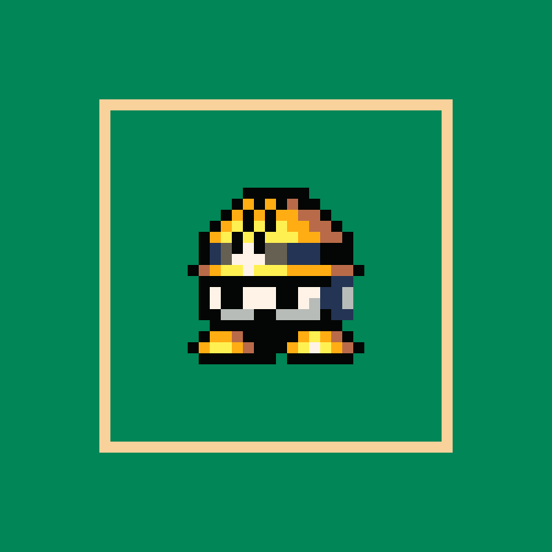

# SpriteCanvas

A static, pixel-perfect drawing studio with a **local, review-first agent collaboration workflow**. No account, cloud storage, API key, external fonts, or embedded AI model.



## Run locally

Requires **Node.js 22 or later**. The app and local bridge have no runtime dependencies:

```powershell
npm start
```

Open **http://127.0.0.1:4173**. Keep the process running while drawing or collaborating. Stop with Ctrl+C. To use a different port:

```powershell
npm start -- --port 4180
```

The browser autosaves to IndexedDB. In local-bridge mode, it also saves the active document to `.spritecanvas\workspace.json`, an ignored, private workspace file. A fresh local workspace starts with a blank canvas. **Open reference artwork** loads the supplied-image reconstruction, or an agent can propose it. Save project downloads a portable editable file; it is not a Git commit.

## What you can draw with

| Area | Tools |
| --- | --- |
| Drawing | Pencil, eraser, exact-color flood fill, composite eyedropper, line, rectangle, ellipse; brush sizes 1-32; filled/outline shapes; horizontal/vertical symmetry |
| Selection | Rectangular marquee, selection-clipped drawing and fills, move, nudge, copy/cut/paste, delete, flip horizontally/vertically, square 90-degree rotation |
| Workspace | Integer zoom, pan, grid, transparency checkerboard, navigator, foreground/secondary colors, editable hex/RGBA colors, custom palette |
| Layers | Add, rename, duplicate, reorder, hide, lock, opacity, merge down, delete; separate pixels per animation frame |
| Animation | Blank/duplicate/delete/reorder frames, individual durations, timed looping preview, previous-frame onion skin |
| Files | Editable project JSON; image import to new layer or project; PNG, SVG, animated GIF, PNG sprite sheet plus frame metadata |
| Collaboration | Local agent API and CLI, portable handoff/proposal JSON, side-by-side/wipe/pixel-difference comparison, accept/dismiss/request changes, reference-image feedback, retained before/after |
| Recovery | Browser autosave, atomic local saves, conflict recovery, bounded undo/redo, download at any time |

Inspired by the drawing, selection, layers, animation, and export workflows documented by [Aseprite](https://www.aseprite.org/docs/). This is **not Aseprite feature parity**: it does not read `.aseprite` files, support tilemaps, indexed-color editing, layer blend modes, or multi-user network editing. GIF import uses the first frame only. GIF export builds one adaptive palette from the animation's composited pixels, independent of the editing swatches: up to 255 opaque colors plus transparency, exact RGB when those pixels fit, otherwise frequency-weighted color quantization without dithering. Alpha below 50% becomes transparent; remaining partial alpha is flattened against white. PNG and project files preserve full RGBA.

Press **?** in the tool rail for shortcuts. Ctrl shortcuts also support Command. Right-click draws with the secondary color; Alt-click picks from visible artwork. Selections constrain the active cel. Layer lock prevents pixel edits, opacity changes, deletion, and merging; layer order/visibility can still change.

The **Working palette** is a chosen set of editing swatches, not a limit on image colors. Its count is shown beside the heading, and large palettes scroll without overlapping. RGBA lighting and transparency can produce additional rendered shades. Palette-only proposals show the original and proposed swatches in Compare versions; accepting one changes the palette without recoloring the artwork, and Undo restores the previous palette.

Limits: 1-256 pixels per dimension, 24 layers, 64 frames, and two million editable cells total. Undo history is capped at 40 operations and approximately four million stored cells. Rotation currently requires a square canvas or selection. Animated playback and GIF exports use frame durations; GIF rounds to 10 ms. GIF export is bounded to 32 million scaled pixels across all frames; reduce the export scale for larger animations.

## Collaborate with this agent

The web app **does not run an AI model**. This CLI agent can read files and call the loopback bridge. You tell the agent what to draw in this chat; the app makes those changes inspectable and safe to accept.

1. Draw in the browser. Click **Prepare agent handoff** to flush saves and see the exact saved revision.
2. Ask the agent to read the canvas and draw on it. The commands below pull editable data and render a PNG for visual inspection.
3. The agent submits a separate proposal. Your drawing remains unchanged.
4. Click **Compare versions**. Review side-by-side, drag a wipe slider, or highlight changed pixels; choose an animation frame if needed.
5. **Accept agent version** adopts the proposal; **Dismiss proposal** keeps your canvas. After acceptance, Compare retains the last before/after, and Undo can restore the prior version.

### Give feedback from the review

Click **Request changes** beside Accept/Dismiss. Write the changes you want and optionally attach a PNG, JPEG, or WebP reference (up to 2 MB). For example:

> Remove all scribbles. Use a clean green background and ivory frame, then recreate the helmet character from this reference.

**Save feedback for agent** persists the note and image on the local bridge without changing either canvas or dismissing the proposal. The review shows **Changes requested**, and acceptance is blocked until a revised proposal arrives. The agent can then replace that specific proposal while keeping your actual drawing protected.

**This does not automatically start or message an AI.** After saving, tell the agent in chat: **"Read my review feedback."** It reads the exact note and attachment from the bridge. On GitHub Pages, **Save & download request** downloads a review packet to share with the agent instead.

The last 12 feedback entries are retained, with addressed/dismissed status. Notes and images stay in the private local workspace or browser storage; they are not part of the public static site. Feedback text is treated as drawing guidance, not authority for unrelated commands.

```powershell
# Inspect the current revision, dimensions, layers, frames, and pending proposal.
npm run agent -- status

# Read what the user actually drew. A handoff contains revision + project.
npm run agent -- pull .spritecanvas\handoff.json
npm run agent -- preview .spritecanvas\preview.png

# Agent edits handoff.project into candidate.json, preserving its project ID.
# --base MUST be the revision actually read, not a newly guessed revision.
npm run agent -- propose .spritecanvas\candidate.json --base 3 --title "Add helmet highlights"
```

Use `--url http://127.0.0.1:4180` on CLI commands if you changed the server port.

To respond to a review request:

```powershell
# Read the exact feedback and extract attached images for visual inspection.
npm run agent -- feedback .spritecanvas\review
npm run agent -- pull .spritecanvas\revision-handoff.json

# Rebase the new candidate on revision-handoff.project, not the previous proposal.
# Use the actual current proposal ID and latest feedback ID from that handoff.
npm run agent -- propose .spritecanvas\revised.json --base 9 --replace <proposal-id> --respond-to <feedback-id> --title "Clean background and centered helmet"
```

`feedback` without a directory prints notes and attachment metadata; with a directory it also writes `feedback.json` and the attached raster files there. `pull` includes the current project, proposal, and feedback history. Neither command accepts the proposal.

The agent may instead submit drawing operations against the read revision:

```json
[
  { "op": "layer", "name": "Agent highlights" },
  { "op": "pixel", "x": 12, "y": 8, "color": "#FFF3E7" },
  { "op": "line", "x": 10, "y": 9, "x2": 14, "y2": 9, "color": "#FFF052" }
]
```

```powershell
npm run agent -- apply .spritecanvas\operations.json --base 3 --title "Add highlights"
```

Operations: `layer`, `pixel`, `line`, `rect`, `ellipse`, `fill`. Drawing operations take `color` (`null` erases), optional zero-based `frame`, and optional `layer` ID or name. Without `layer`, the top layer, or the most recently added layer, is used. Shapes accept `x2`, `y2`, and `filled`. Coordinates must be inside the canvas, and the CLI refuses locked layers.

### Conflict rules

- Saves and proposals require the exact current revision; stale writes receive HTTP 409.
- A proposal includes the full untouched baseline and a separate candidate. Replacing a pending proposal requires an explicit Request changes, the exact proposal ID, and the latest feedback ID. Stale feedback or unrelated replacement attempts are rejected.
- Continuing to draw makes a proposal out of date. It remains viewable, but cannot be accepted. Use Request changes to ask for a fresh proposal on the newest canvas, or dismiss it. There is deliberately no automatic, lossy merge.
- Another tab's changes never silently overwrite unsaved browser work. A conflict banner lets you download your version or explicitly load the disk version.
- Browser recovery survives a reload with unsynced local changes. Clearing browser site data removes the browser backup, not the local workspace file.
- Keep the bridge running for live collaboration. Closing it does not upload anything or permanently connect the agent.

### Local API

Bound only to `127.0.0.1`. It rejects unexpected Host/Origin headers and browser cross-site API or subresource requests; it does not expose arbitrary files or shell commands. **Do not proxy it onto a public network.** Local processes running as you can use this API.

A user-clicked, top-level GET navigation to `/` or `/index.html` may open the public studio page from a local HTML preview. This exception does not permit cross-site API requests, writes, or embedded pages; the artwork API remains same-origin and the studio blocks framing.

| Route | Contract |
| --- | --- |
| `GET /api/health` | Bridge identity |
| `GET /api/workspace` | `{revision, project, proposal, comparison, feedback}` |
| `POST /api/project` | `{expectedRevision, project}` - user autosave |
| `POST /api/proposals` | `{expectedRevision, project, title}` - non-destructive proposal; revisions also require `replacesProposalId` and `respondsTo` |
| `POST /api/feedback` | `{expectedRevision, proposalId, message, reference?}` - request changes, preserving both versions |
| `POST /api/accept` | `{expectedRevision, proposalId}` - explicit acceptance |
| `POST /api/reject` | `{expectedRevision, proposalId}` - dismiss proposal |

POST requests require `Content-Type: application/json` and `X-SpriteCanvas: 1`. JSON bodies are limited to 32 MB. The server validates projects and saves atomically before acknowledging success. Do not manually edit `workspace.json` while the server is running; the server owns that file. Use the API/CLI instead.

Optional feedback `reference` is `{name, type, dataUrl}` with a base64 PNG/JPEG/WebP data URL (maximum 2 MB decoded). Text is limited to 4,000 characters. Feedback does not increment the canvas revision; the proposal and feedback IDs protect the review conversation independently.

## Project format / offline collaboration

Projects are inspectable JSON:

```json
{
  "format": "spritecanvas",
  "version": 1,
  "id": "preserve-this-id-in-proposals",
  "name": "My sprite",
  "width": 2,
  "height": 2,
  "palette": ["#FF0000FF"],
  "layers": [
    { "id": "ink", "name": "Ink", "visible": true, "locked": false, "opacity": 1 }
  ],
  "frames": [
    { "id": "frame-1", "duration": 120, "cels": { "ink": ["#FF0000FF", null, null, null] } }
  ]
}
```

Layers are ordered **bottom to top**. Cels contain row-major pixels: index `y * width + x`. Colors normalize to `#RRGGBBAA`; `null` is transparent. Every frame contains a cel for every layer.

On GitHub Pages, the agent cannot access browser IndexedDB or the user's filesystem directly. Download a handoff, share it with the agent, and import its returned proposal:

```javascript
{
  format: "spritecanvas-proposal",
  version: 1,
  title: "Add details",
  baseProject: handoff.project, // Preserve this entire original snapshot.
  project: candidate          // Edited copy, retaining handoff.project.id.
}
```

The importer compares the entire baseline against the current project. Wrong or stale baselines are rejected, not silently rebased. The same imported-file workflow also works in local mode.

For a requested **revision**, the returned proposal envelope additionally includes:

```javascript
{
  // ...the usual format, version, title, baseProject, project fields
  replacesProposalId: handoff.proposal.id,
  respondsTo: handoff.feedback.filter(f => f.proposalId === handoff.proposal.id && f.status === "open").at(-1).id
}
```

The agent must read all relevant feedback before supplying these IDs. A revised proposal remains pending for the user to compare and accept. If it arrives while the review is open, the view updates; an unsent feedback draft instead stays visible with a **Show latest proposal** button.

## Reference artwork

`web\examples\helmet.spritecanvas.json` is a hand-reconstructed, **editable 50 x 50 project** based on the image supplied in the chat: emerald background, warm ivory frame, and a gold-helmeted pixel character. It uses three layers and a deliberately small palette. It is a reconstruction, not a promise of exact source-image color or compression-noise matching.

`web\examples\helmet.png` is its crisp 800 x 800 export. The original screenshot is not embedded as a flattened canvas or included in the site. Regenerate the sample assets with:

```powershell
npm run reference
```

The sample is included in the public static site; private working projects and local proposals are not.

For a fresh, untouched local workspace, `node scripts\demo-reference.mjs` creates a background-only demo stage, pulls it through the real agent CLI, and submits the helmet as a separate proposal. Open `http://127.0.0.1:4173/?review=1` to compare and accept it. **Both sides of this demo are agent-generated**, not drawings attributed to the user. The script refuses to replace an existing working canvas.

## GitHub Pages

The site uses relative asset URLs, including ES modules and examples, so it works at `https://zanark.github.io/SpriteCanvas/` without a custom build-time base path.

1. In GitHub, select **Settings > Pages > Source > GitHub Actions**.
2. Merge/push this implementation to `main`, or manually run **Deploy static studio to GitHub Pages** once the workflow is available.
3. The workflow runs the core/bridge tests, builds `dist`, and deploys **only the static web files**.

For another static host:

```powershell
npm run build
# Serve/upload the contents of dist.
```

Don't open `index.html` directly with `file://`: browser ES-module rules require HTTP. The Pages site has browser autosave and JSON handoff/import; live filesystem collaboration requires the optional local bridge.

## Development

The app uses native HTML, CSS, Canvas, browser modules, and IndexedDB. Node built-ins provide the local server, CLI, PNG preview writer, and core tests. Playwright is a development-only dependency.

```powershell
npm ci
npm test
npm run build
npx playwright install chromium
npm run test:browser
```

Browser tests exercise real pointer strokes, selections, layer/frame edits, PNG/GIF/sheet downloads, agent CLI pull/propose/compare/accept, stale proposals, concurrent edits, offline JSON collaboration, reload recovery, and repository-subpath hosting.
