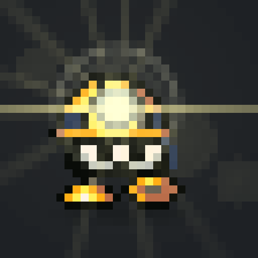
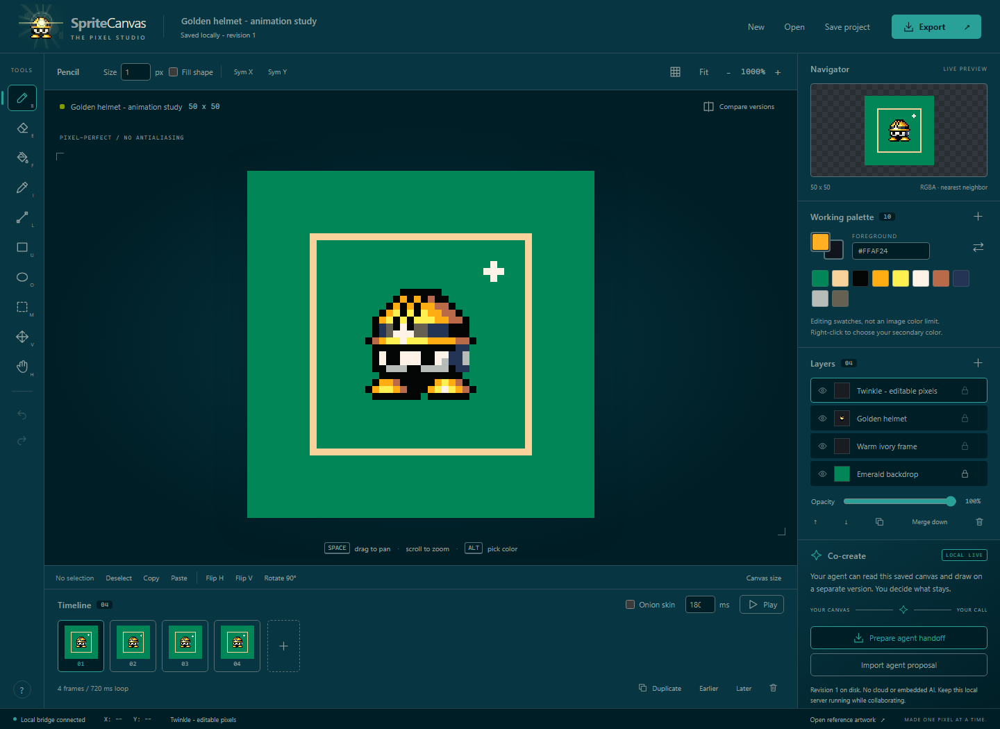
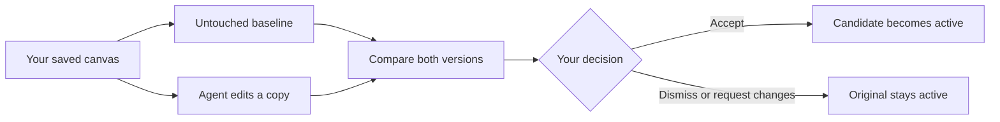
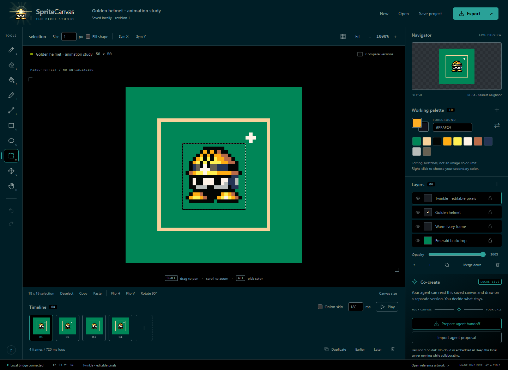
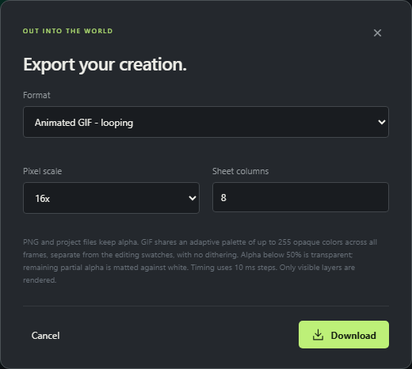
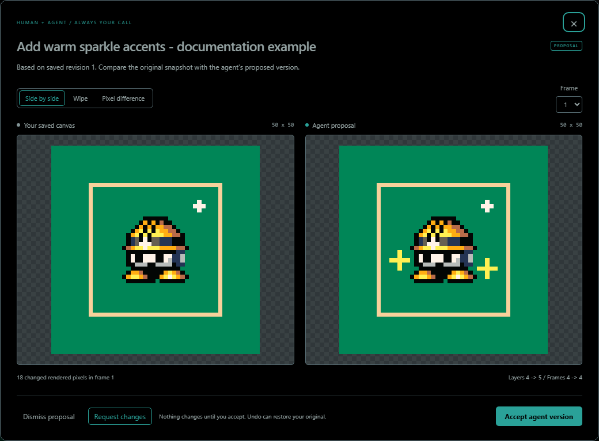
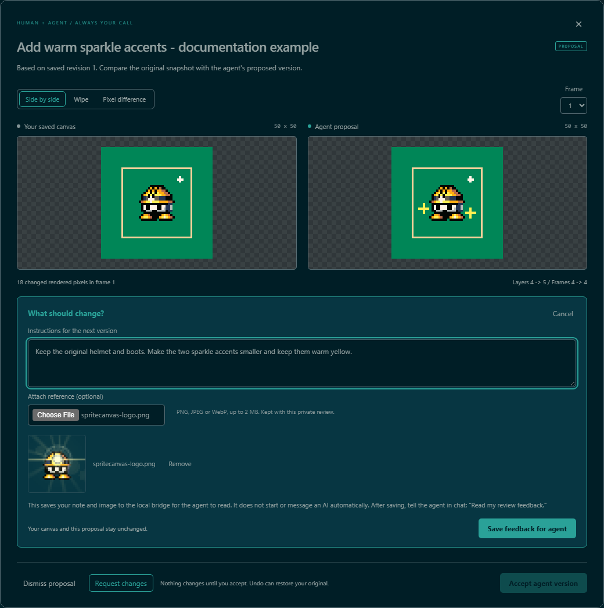
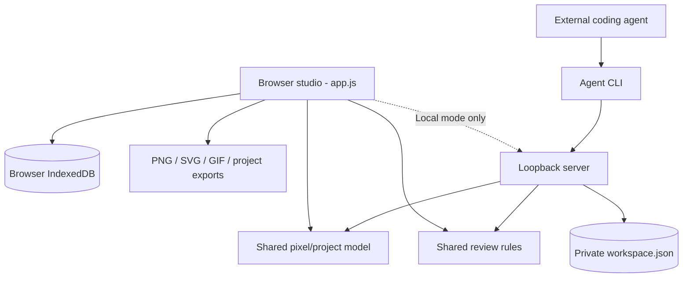

# SpriteCanvas

<p align="center">
  
</p>

**A pixel-art studio where you draw, animate, and review an agent's changes without giving up your original.**

The scout above is the application's own editable character logo, not a screenshot pasted over the editor. Its 16x idle GIF uses a dark presentation backdrop to preserve the warm flare: GIF cannot store partial transparency. The [static PNG](web/assets/spritecanvas-logo.png), application logo and editable source remain transparent. The studio uses native browser modules and Canvas; the optional local bridge uses Node built-ins. There is no account, cloud storage, public AI key, external font, tracking script, or embedded AI model.



**Figure 1 - The actual studio.** Tools live on the left, native-pixel artwork in the middle, layers/palette/navigator on the right, and animation frames below. This image uses the bundled helmet reconstruction plus a generated twinkle study. It is a reproducible documentation fixture, **not the user's private saved workspace**.

**Start here:** [Run locally](#run-locally) to draw, [collaborate safely](#collaborate-with-this-agent) to work with an agent, or open the [illustrated technical handbook](docs/README.md) to learn the implementation.

## Contents

- [What makes SpriteCanvas different](#what-makes-spritecanvas-different)
- [Run locally](#run-locally)
- [Your first sprite and animation](#your-first-sprite-and-animation)
- [What you can draw with](#what-you-can-draw-with)
- [Export formats and limits](#export-formats-and-limits)
- [Collaborate with this agent](#collaborate-with-this-agent)
- [Project format / offline collaboration](#project-format--offline-collaboration)
- [Reference artwork](#reference-artwork)
- [GitHub Pages](#github-pages)
- [Architecture in one picture](#architecture-in-one-picture)
- [Development](#development)
- [Documentation and screenshot maintenance](#documentation-and-screenshot-maintenance)
- [Troubleshooting and known boundaries](#troubleshooting-and-known-boundaries)

## What makes SpriteCanvas different

The important distinction is **editing versus proposing**. A brush stroke changes the active document. An agent proposal does not: it stores an untouched baseline and a separate candidate. You inspect the difference and decide whether to accept it.



You can use either of two modes:

| Mode | Where the studio runs | What persists | How an agent receives artwork |
| --- | --- | --- | --- |
| **Local live** | `npm start`, normally port 4173 | Browser recovery state and private local `workspace.json` | Loopback CLI/API; proposals appear in the UI |
| **Static** | GitHub Pages or any HTTP static host | This browser's IndexedDB | Download a handoff; import the returned proposal JSON |

These are two interfaces to the same project format, not two incompatible editors. Static mode does not require the bridge. A static host cannot directly expose browser IndexedDB to an agent.

Four concepts make the rest of the UI easier to understand:

| Concept | Meaning |
| --- | --- |
| **Project** | Dimensions, palette, layer metadata, animation frames, and every editable pixel |
| **Cel** | One layer's pixels in one frame; drawing affects the active cel |
| **Working palette** | Convenient editing swatches, not a restriction on RGBA artwork colors |
| **Proposal** | A candidate plus the complete original baseline, awaiting human review |

## Run locally

Requires **Node.js 22 or later**. The app and local bridge have no runtime dependencies:

```powershell
npm start
```

Run that command from the repository root, then open **http://127.0.0.1:4173**. A fresh local workspace starts blank. You should see **LOCAL LIVE** in the Co-create panel once the browser detects the bridge.

Keep the process running while drawing or collaborating. Stop with Ctrl+C. To use a different port:

```powershell
npm start -- --port 4180
```

The browser autosaves to IndexedDB. In local-bridge mode, it also saves the active document to `.spritecanvas\workspace.json`, an ignored, private workspace file. A fresh local workspace starts with a blank canvas. **Open reference artwork** loads the supplied-image reconstruction, or an agent can propose it. Save project downloads a portable editable file; it is not a Git commit.

You do not need `npm ci` just to run the studio. Install development dependencies when running the Playwright tests or screenshot tooling; see [Development](#development).

**Before replacing a project:** click **Save project**. Autosave protects the current workspace, but it is not a named-project library. New, Open, and Open reference artwork replace the active document; download files when you want separate durable versions.

## Your first sprite and animation

This exercise deliberately uses a new layer so the sample stays intact.

1. Save any artwork you want to keep. Click **Open reference artwork** in the footer.
2. In Layers, click **Add layer**, name it `My highlights`, and keep it selected.
3. Choose Pencil with **B**, set brush size to **1**, and choose an ivory or yellow swatch.
4. Draw a few highlight pixels. The navigator updates; the editing swatches do not restrict the pixels you can paint.
5. Click **Duplicate** in the timeline. This creates another frame with copies of the current frame's cels.
6. Move or alter the highlight in the second frame. The first frame keeps its own pixels.
7. Set a frame duration, such as **180 ms**, on each frame. Click **Play** or press **Enter**.
8. Pause before drawing again. Export a GIF for playback and save the project JSON for further editing.

Do not use **Add blank frame** when you intend a copy: blank and duplicate are intentionally different actions. Likewise, a layer is shared metadata across the animation, while its cel pixels are different in every frame.



**Figure 2 - Selection is an editing boundary, not a flattened image.** Select an area with **M**, then use Move, nudging, copy/paste or transforms on the active cel. Other layers do not automatically move along with it.

Continue with the [complete user guide](docs/book/01-using-studio/README.md) for selection, symmetry, layers, frame editing, image imports and keyboard workflows.

## What you can draw with

| Area | Tools |
| --- | --- |
| Drawing | Pencil, eraser, exact-color flood fill, composite eyedropper, line, rectangle, ellipse; brush sizes 1-32; filled/outline shapes; horizontal/vertical symmetry |
| Selection | Rectangular marquee, selection-clipped drawing and fills, move, nudge, copy/cut/paste, delete, flip horizontally/vertically, square 90-degree rotation |
| Workspace | Integer zoom, pan, grid, transparency checkerboard, navigator, foreground/secondary colors, editable hex/RGBA colors, custom palette |
| Layers | Add, rename, duplicate, reorder, hide, lock, opacity, merge down, delete; separate pixels per animation frame |
| Animation | Blank/duplicate/delete/reorder frames, individual durations, timed looping preview, previous-frame onion skin |
| Files | Editable project JSON; image import to new layer or project; PNG, SVG, animated GIF, PNG sprite sheet plus frame metadata |
| Collaboration | Local agent API and CLI, portable handoff/proposal JSON, side-by-side/wipe/pixel-difference comparison, accept/dismiss/request changes, reference-image feedback, retained before/after |
| Recovery | Browser autosave, atomic local saves, conflict recovery, bounded undo/redo, download at any time |

Inspired by the drawing, selection, layers, animation, and export workflows documented by [Aseprite](https://www.aseprite.org/docs/). This is **not Aseprite feature parity**: it does not read `.aseprite` files, support tilemaps, indexed-color editing, layer blend modes, or multi-user network editing. GIF import uses the first frame only. GIF export builds one adaptive palette from the animation's composited pixels, independent of the editing swatches: up to 255 opaque colors plus transparency, exact RGB when those pixels fit, otherwise frequency-weighted color quantization without dithering. Alpha below 50% becomes transparent; remaining partial alpha is flattened against white. PNG and project files preserve full RGBA.

Press **?** in the tool rail for shortcuts. Ctrl shortcuts also support Command. Right-click draws with the secondary color; Alt-click picks from visible artwork. Selections constrain the active cel. Layer lock prevents pixel edits, opacity changes, deletion, and merging; layer order/visibility can still change.

### Character logo

The logo uses the **original straight-into-camera pose from frame 8 of the latest character GIF**, not a newly posed character. The app and README retain the warm headlamp lens flare. The favicon uses the same character without the flare. The blue side component is an **earpiece**, and the two frontal boots remain exactly equal and level.

Helmet/face, joined eyes, earpiece, boots, warm headlamp and camera flare remain six separate editable pixel layers in [`spritecanvas-logo.spritecanvas.json`](web/assets/spritecanvas-logo.spritecanvas.json). It is an exact 32 x 32 crop with ten deliberate working swatches: no reposing, resampling or recoloring. The crop keeps the ring, rays and nearby ghost; the full-scene flare beyond the icon boundary is outside this framing. [Extraction provenance](web/assets/spritecanvas-logo-provenance.json) records the GIF/frame and pixel hashes.

The README uses a **16x idle GIF (512 x 512)**: an eight-pose, 880ms bouncy waddle inspired by the supplied motion reference. Alternating planted boots and forward-facing soles, a two-pixel body bob and restrained helmet lean make it a proper pose animation rather than just a blink. Original helmet colors, wide eyes, 2x2 pupils and blue earpiece remain intact; both boots share matching templates for each view.

The [eight-frame editable animation](web/assets/spritecanvas-logo-idle.spritecanvas.json) has eight layers, including separate stepping legs and a soft grounding shadow. The original warm flare follows the lamp without changing color. Only the GIF export receives a dark matte so the flare remains visible; static application branding is unchanged.

Run `npm run brand` to regenerate the idle GIF, static flared SVG/PNG and separate flare-free favicon, then `npm run build`. The app's 64px logo and 20 x 20 native favicon are unchanged. A transparent 32x PNG (1024 x 1024) remains available as a still image. The README declares the GIF's actual 512px dimensions; a Markdown host may fit it to the reading column.

The logo is a **separate project**; changing branding does not replace the scene on your canvas. See [Character anatomy and branding](docs/book/11-character-branding/README.md) for the source, pose, generation path and preservation rules.

The **Working palette** is a chosen set of editing swatches, not a limit on image colors. Its count is shown beside the heading, and large palettes scroll without overlapping. RGBA lighting and transparency can produce additional rendered shades. Palette-only proposals show the original and proposed swatches in Compare versions; accepting one changes the palette without recoloring the artwork, and Undo restores the previous palette.

## Export formats and limits



**Figure 3 - Choose the deliverable, not just a filename.** Project JSON keeps editing structure; image exports render visible layers. GIF has explicit palette, alpha and timing tradeoffs.

| Export | What it contains | What to keep in mind |
| --- | --- | --- |
| SpriteCanvas project | Every layer, frame, swatch and pixel | Best source file for continued editing; not just a preview |
| PNG | Current composited frame with alpha | Lossless RGBA image, but no editable layer/frame structure |
| SVG | Current composited frame as pixel rectangles | Crisp at scale; not the original multilayer project |
| GIF | All frames, looping, one adaptive palette | Up to 255 opaque colors plus transparency; not arbitrary-RGBA lossless |
| PNG sprite sheet + JSON | Frames laid out in a grid plus coordinates/durations | Keep the PNG and metadata together |

Pixel scale enlarges output blocks; it does not add drawing detail. A 50 x 50 sprite at 8x becomes 400 x 400. **Canvas size** instead changes the editable grid and crops or adds space; it does not upscale the pixels.

| Resource | Bound |
| --- | --- |
| Project width / height | 1-256 pixels each |
| Layers / frames | At most 24 / 64 |
| Editable cells | At most 2,000,000: `width * height * layers * frames` |
| Frame duration | 20-10,000 ms |
| Working palette | At most 256 swatches |
| Brush size | 1-32 pixels |
| Undo history | Up to 40 snapshots, additionally pruned by stored-cell weight |
| PNG / sprite-sheet output | At most 16,000,000 pixels; each output dimension at most 16,384 |
| GIF output | At most 32,000,000 scaled pixels across all frames; GIF dimensions are separately validated |
| Imported file / API JSON body | At most 32 MiB |
| Feedback image / text | At most 2 MiB decoded / 4,000 characters |

For example, `100 * 80 * 13 * 16 * 16 = 26,624,000` scaled frame pixels. That thirteen-frame animation fits the GIF limit at 16x. The **same calculation does not include layer count** because GIF sees composited frames; the editable-cell limit does include layers.

Rotation currently requires a square canvas or square selection. GIF rounds durations to 10ms steps; alpha below 50% is transparent, while remaining partial alpha is matted against white. For precise transparency or further edits, retain PNG/project files. The [GIF chapter](docs/book/09-gif-quantization/README.md) explains why animation-wide quantization avoids the old fixed-palette color crushing.

## Collaborate with this agent

The web app **does not run an AI model**. This CLI agent can read files and call the loopback bridge. You tell the agent what to draw in this chat; the app makes those changes inspectable and safe to accept.

1. Draw in the browser. Click **Prepare agent handoff** to flush saves and see the exact saved revision.
2. Ask the agent to read the canvas and draw on it. The commands below pull editable data and render a PNG for visual inspection.
3. The agent submits a separate proposal. Your drawing remains unchanged.
4. Click **Compare versions**. Review side-by-side, drag a wipe slider, or highlight changed pixels; choose an animation frame if needed.
5. **Accept agent version** adopts the proposal; **Dismiss proposal** keeps your canvas. After acceptance, Compare retains the last before/after, and Undo can restore the prior version.



**Figure 4 - A proposal is not an accepted edit.** Both sides here are generated documentation examples. The original stays active while the candidate is reviewed; frame, layer and rendered-pixel differences are inspectable.

The three comparison modes answer different questions:

| Mode | Use it to answer |
| --- | --- |
| Side by side | Does the proposed composition look better as a whole? |
| Wipe | Exactly where does one version differ from the other at the same coordinates? |
| Pixel difference | Which rendered pixels changed? |

Also inspect structural notices. A proposal may change dimensions, layers, frame count, timing, or the working palette without a large visible pixel change.

### Give feedback from the review

Click **Request changes** beside Accept/Dismiss. Write the changes you want and optionally attach a PNG, JPEG, or WebP reference (up to 2 MB). For example:

> Remove all scribbles. Use a clean green background and ivory frame, then recreate the helmet character from this reference.

**Save feedback for agent** persists the note and image on the local bridge without changing either canvas or dismissing the proposal. The review shows **Changes requested**, and acceptance is blocked until a revised proposal arrives. The agent can then replace that specific proposal while keeping your actual drawing protected.

**This does not automatically start or message an AI.** After saving, tell the agent in chat: **"Read my review feedback."** It reads the exact note and attachment from the bridge. On GitHub Pages, **Save & download request** downloads a review packet to share with the agent instead.

The last 12 feedback entries are retained, with addressed/dismissed status. Notes and images stay in the private local workspace or browser storage; they are not part of the public static site. Feedback text is treated as drawing guidance, not authority for unrelated commands.



**Figure 5 - Feedback has its own lifecycle.** This is a draft in an isolated sample review. After saving, tell the agent in chat to read it; the button is not a background AI trigger. The request preserves both artwork versions.

### A safe command-line handoff

These commands inspect and propose; they do not accept an edit. The literal revision numbers in examples below are illustrative. In actual use, read the value from the handoff:

```powershell
npm run agent -- status
npm run agent -- pull .spritecanvas\handoff.json
npm run agent -- preview .spritecanvas\preview.png
$handoff = Get-Content -Raw .spritecanvas\handoff.json | ConvertFrom-Json

# Only after editing a COPY of $handoff.project into candidate.json:
npm run agent -- propose .spritecanvas\candidate.json --base $handoff.revision --title "Add helmet highlights"
```

Inspect the PNG as well as the JSON. Pixel arrays alone do not establish whether a visual change is good. Keep the entire handoff as the protected baseline; do not directly modify the workspace file.

```powershell
# Inspect the current revision, dimensions, layers, frames, and pending proposal.
npm run agent -- status

# Read what the user actually drew. A handoff contains revision + project.
npm run agent -- pull .spritecanvas\handoff.json
npm run agent -- preview .spritecanvas\preview.png

# Agent edits handoff.project into candidate.json, preserving its project ID.
# --base MUST be the revision actually read, not a newly guessed revision.
npm run agent -- propose .spritecanvas\candidate.json --base 3 --title "Add helmet highlights"
```

Use `--url http://127.0.0.1:4180` on CLI commands if you changed the server port.

To respond to a review request:

```powershell
# Read the exact feedback and extract attached images for visual inspection.
npm run agent -- feedback .spritecanvas\review
npm run agent -- pull .spritecanvas\revision-handoff.json

# Rebase the new candidate on revision-handoff.project, not the previous proposal.
# Use the actual current proposal ID and latest feedback ID from that handoff.
npm run agent -- propose .spritecanvas\revised.json --base 9 --replace <proposal-id> --respond-to <feedback-id> --title "Clean background and centered helmet"
```

`feedback` without a directory prints notes and attachment metadata; with a directory it also writes `feedback.json` and the attached raster files there. `pull` includes the current project, proposal, and feedback history. Neither command accepts the proposal.

The agent may instead submit drawing operations against the read revision:

```json
[
  { "op": "layer", "name": "Agent highlights" },
  { "op": "pixel", "x": 12, "y": 8, "color": "#FFF3E7" },
  { "op": "line", "x": 10, "y": 9, "x2": 14, "y2": 9, "color": "#FFF052" }
]
```

```powershell
npm run agent -- apply .spritecanvas\operations.json --base 3 --title "Add highlights"
```

Operations: `layer`, `pixel`, `line`, `rect`, `ellipse`, `fill`. Drawing operations take `color` (`null` erases), optional zero-based `frame`, and optional `layer` ID or name. Without `layer`, the top layer, or the most recently added layer, is used. Shapes accept `x2`, `y2`, and `filled`. Coordinates must be inside the canvas, and the CLI refuses locked layers.

### Conflict rules

- Saves and proposals require the exact current revision; stale writes receive HTTP 409.
- A proposal includes the full untouched baseline and a separate candidate. Replacing a pending proposal requires an explicit Request changes, the exact proposal ID, and the latest feedback ID. Stale feedback or unrelated replacement attempts are rejected.
- Continuing to draw makes a proposal out of date. It remains viewable, but cannot be accepted. Use Request changes to ask for a fresh proposal on the newest canvas, or dismiss it. There is deliberately no automatic, lossy merge.
- Another tab's changes never silently overwrite unsaved browser work. A conflict banner lets you download your version or explicitly load the disk version.
- Browser recovery survives a reload with unsynced local changes. Clearing browser site data removes the browser backup, not the local workspace file.
- Keep the bridge running for live collaboration. Closing it does not upload anything or permanently connect the agent.

### Local API

Bound only to `127.0.0.1`. It rejects unexpected Host/Origin headers and browser cross-site API or subresource requests; it does not expose arbitrary files or shell commands. **Do not proxy it onto a public network.** Local processes running as you can use this API.

A user-clicked, top-level GET navigation to `/` or `/index.html` may open the public studio page from a local HTML preview. This exception does not permit cross-site API requests, writes, or embedded pages; the artwork API remains same-origin and the studio blocks framing.

| Route | Contract |
| --- | --- |
| `GET /api/health` | Bridge identity |
| `GET /api/workspace` | `{revision, project, proposal, comparison, feedback}` |
| `POST /api/project` | `{expectedRevision, project}` - user autosave |
| `POST /api/proposals` | `{expectedRevision, project, title}` - non-destructive proposal; revisions also require `replacesProposalId` and `respondsTo` |
| `POST /api/feedback` | `{expectedRevision, proposalId, message, reference?}` - request changes, preserving both versions |
| `POST /api/accept` | `{expectedRevision, proposalId}` - explicit acceptance |
| `POST /api/reject` | `{expectedRevision, proposalId}` - dismiss proposal |

POST requests require `Content-Type: application/json` and `X-SpriteCanvas: 1`. JSON bodies are limited to 32 MB. The server validates projects and saves atomically before acknowledging success. Do not manually edit `workspace.json` while the server is running; the server owns that file. Use the API/CLI instead.

Optional feedback `reference` is `{name, type, dataUrl}` with a base64 PNG/JPEG/WebP data URL (maximum 2 MB decoded). Text is limited to 4,000 characters. Feedback does not increment the canvas revision; the proposal and feedback IDs protect the review conversation independently.

## Project format / offline collaboration

Projects are inspectable JSON:

```json
{
  "format": "spritecanvas",
  "version": 1,
  "id": "preserve-this-id-in-proposals",
  "name": "My sprite",
  "width": 2,
  "height": 2,
  "palette": ["#FF0000FF"],
  "layers": [
    { "id": "ink", "name": "Ink", "visible": true, "locked": false, "opacity": 1 }
  ],
  "frames": [
    { "id": "frame-1", "duration": 120, "cels": { "ink": ["#FF0000FF", null, null, null] } }
  ]
}
```

Layers are ordered **bottom to top**. Cels contain row-major pixels: index `y * width + x`. Colors normalize to `#RRGGBBAA`; `null` is transparent. Every frame contains a cel for every layer.

On GitHub Pages, the agent cannot access browser IndexedDB or the user's filesystem directly. Download a handoff, share it with the agent, and import its returned proposal:

```javascript
{
  format: "spritecanvas-proposal",
  version: 1,
  title: "Add details",
  baseProject: handoff.project, // Preserve this entire original snapshot.
  project: candidate          // Edited copy, retaining handoff.project.id.
}
```

The importer compares the entire baseline against the current project. Wrong or stale baselines are rejected, not silently rebased. The same imported-file workflow also works in local mode.

For a requested **revision**, the returned proposal envelope additionally includes:

```javascript
{
  // ...the usual format, version, title, baseProject, project fields
  replacesProposalId: handoff.proposal.id,
  respondsTo: handoff.feedback.filter(f => f.proposalId === handoff.proposal.id && f.status === "open").at(-1).id
}
```

The agent must read all relevant feedback before supplying these IDs. A revised proposal remains pending for the user to compare and accept. If it arrives while the review is open, the view updates; an unsent feedback draft instead stays visible with a **Show latest proposal** button.

## Reference artwork

`web\examples\helmet.spritecanvas.json` is a hand-reconstructed, **editable 50 x 50 project** based on the image supplied in the chat: emerald background, warm ivory frame, and a gold-helmeted pixel character. It uses three layers and a deliberately small palette. It is a reconstruction, not a promise of exact source-image color or compression-noise matching.

`web\examples\helmet.png` is its crisp 800 x 800 export. The original screenshot is not embedded as a flattened canvas or included in the site. Regenerate the sample assets with:

```powershell
npm run reference
```

The sample is included in the public static site; private working projects and local proposals are not.

For a fresh, untouched local workspace, `node scripts\demo-reference.mjs` creates a background-only demo stage, pulls it through the real agent CLI, and submits the helmet as a separate proposal. Open `http://127.0.0.1:4173/?review=1` to compare and accept it. **Both sides of this demo are agent-generated**, not drawings attributed to the user. The script refuses to replace an existing working canvas.

## GitHub Pages

**[Open the live pixel editor](https://zanark.github.io/SpriteCanvas/)**. This README stays on the repository's GitHub page; the website publishes `web/index.html`, not this document.

The site uses relative asset URLs, including ES modules and examples, so it works at `https://zanark.github.io/SpriteCanvas/` without a custom build-time base path.

1. In GitHub, select **Settings > Pages > Source > GitHub Actions**.
2. Merge/push this implementation to `main`, or manually run **Deploy static studio to GitHub Pages** once the workflow is available.
3. The workflow checks that Pages uses Actions, runs the core/bridge tests, builds `dist`, and deploys **only the static web files**.
4. After deployment, it opens the public URL in Chromium and checks the editor, drawing, browser persistence, PNG export, mobile layout and the published commit.

**Do not select "Deploy from a branch" with the repository root.** That enables a separate README/Jekyll publisher which can compete with the studio deployment. The canonical Pages setting is **GitHub Actions** (`build_type: workflow`).

To rerun the live-site check independently:

```powershell
npm run test:pages
```

It uses a fresh browser context and generated test artwork, never your existing canvas. `SPRITECANVAS_SITE_URL` can select another HTTP(S) site root ending in `/`; `SPRITECANVAS_EXPECTED_SHA` optionally requires a specific full commit. CI supplies both automatically and waits for the new deployment metadata to propagate.

For another static host:

```powershell
npm run build
# Serve/upload the contents of dist.
```

Don't open `index.html` directly with `file://`: browser ES-module rules require HTTP. The Pages site has browser autosave and JSON handoff/import; live filesystem collaboration requires the optional local bridge.

The generated `build-info.json` records `GITHUB_SHA` in CI (or `null` for a local build), allowing the live check to distinguish the new artifact from a cached older deployment. No Node server, repository README or private project is deployed with the static site.

**Inspect local staging before uploading.** The build copies `web` recursively but does not clean an existing `dist`. Files manually placed in either directory can therefore become public or remain in staging. Use a clean deployment directory and keep private files out of both; the copy step is not a secret scrubber.

## Architecture in one picture



The central insight is that **pixels, review state and authority are separate concerns**. A project is validated data. A proposal records candidate plus baseline. The UI offers the acceptance decision; the server enforces current revision and review conditions. Static mode uses the same data/review concepts without a networked backend.

Start with the [principal-level guide](docs/book/00-onboarding/principal-guide.md) for tradeoffs and source navigation, or the [zero-to-hero path](docs/book/00-onboarding/zero-to-hero.md) for a slower introduction.

| Source | Responsibility |
| --- | --- |
| [`web/app.js`](web/app.js) | UI state, tools, playback, history, autosave coordination, review dialogs |
| [`web/lib/model.js`](web/lib/model.js) | Shared project validation, pixel operations, transforms and compositing |
| [`web/lib/review.js`](web/lib/review.js) | Feedback validation, current request and replacement rules |
| [`web/lib/storage.js`](web/lib/storage.js) | IndexedDB adapter and loopback API helper |
| [`web/lib/export.js`](web/lib/export.js), [`gif.js`](web/lib/gif.js) | Browser export dispatch and adaptive animated-GIF encoder |
| [`server.mjs`](server.mjs) | Static HTTP server, loopback request checks, revisioned workspace persistence |
| [`scripts/agent.mjs`](scripts/agent.mjs) | Inspect, pull, preview, propose, operations and feedback CLI |
| [`scripts/brand.mjs`](scripts/brand.mjs), [`build-brand.mjs`](scripts/build-brand.mjs) | Editable logo to reproducible local assets |

The [source map](docs/appendices/source-map.md) links directly to symbols and their test evidence.

## Development

The app uses native HTML, CSS, Canvas, browser modules, and IndexedDB. Node built-ins provide the local server, CLI, PNG preview writer, and core tests. Playwright is a development-only dependency.

```powershell
npm ci
npm test
npm run build
npx playwright install chromium
npm run test:browser
```

Browser tests exercise real pointer strokes, selections, layer/frame edits, PNG/GIF/sheet downloads, agent CLI pull/propose/compare/accept, stale proposals, concurrent edits, offline JSON collaboration, reload recovery, and repository-subpath hosting.

### Commands and ownership

| Command | Purpose | Important boundary |
| --- | --- | --- |
| `npm start` | Run the local studio and bridge | Uses the private working project; keep the server local |
| `npm test` | Node model/bridge/review/GIF/brand tests | No browser installation needed |
| `npm run build` | Copy the static application into `dist` | Does not deploy it |
| `npm run test:browser` | Isolated editor/browser integration tests | Test servers use 4273 and 4274, not live 4173 |
| `npm run brand` | Regenerate logo SVG/PNG/favicon | Reads the separate public logo project |
| `npm run reference` | Regenerate the bundled public reconstruction | Not a command to redraw the private workspace |
| `npm run docs:screenshots` | Build and capture real documentation UI | Isolated sample server on 4373 |
| `npm run docs:check` | Check local docs links, source ranges, image provenance and catalogue | Does not contact external websites |

### Repository layout

```text
SpriteCanvas
  web
    app.js, index.html, styles.css
    lib                 shared model, review, storage and export modules
    assets              editable tool logo and generated local assets
    examples            public helmet reconstruction
  scripts               bridge CLI, build, reference/brand generation, docs checks
  tests
    browser             interactive regression suite
    docs                reproducible screenshot capture
  docs
    book                numbered learning and engineering chapters
    appendices          glossary, source map and troubleshooting
    assets/screenshots  captioned real UI captures and provenance manifest
  server.mjs            optional loopback bridge plus static server
  .spritecanvas         ignored private artwork, snapshots and proposals
  .agent-context        ignored local session offload, when present
```

When changing a feature, update its related handbook chapter and any affected screenshots. Prefer shared model/review rules over different browser and CLI implementations. Keep explicit errors, stale-revision rejection, separate snapshots, and static-mode support intact.

## Documentation and screenshot maintenance

The [book home](docs/README.md) is the documentation entry point, with beginner, artist and engineering reading paths. Chapters cover actual implementation rather than an imagined future architecture.

Screenshots are **generated by browser interaction**, not mockups or screenshot-shaped overlays. The capture script loads the bundled public example, adds a small deterministic animation/proposal fixture, and opens the real review/export screens.

```powershell
# Requires the development dependencies and Playwright Chromium.
npm run docs:screenshots
npm run docs:check
```

The capture process starts a dedicated bridge on **4373**, with state under `test-results\docs-workspace`. It does not read or replace `.spritecanvas\workspace.json`, use port 4173, or make external requests. Its [manifest](docs/assets/screenshots/manifest.json) records captions, image sizes/checksums, source hashes and isolation.

The checker validates local Markdown/HTML asset links, source-line ranges, screenshot coverage/checksums/source freshness, the documentation catalogue and Mermaid accessibility metadata. It is **not a complete Mermaid renderer or an external-link availability check**. Review diagrams in a Mermaid-capable Markdown viewer and inspect the captured images when making visual changes.

Context offload is separate from product documentation. A local `.agent-context` keeps verified project state and persona continuity; it is ignored by Git and not shipped. A fresh clone gets the public handbook, not another person's private saved drawing or local session history.

## Troubleshooting and known boundaries

| Symptom | First action |
| --- | --- |
| Blank or blocked page after opening a file directly | Use an HTTP server, not `file://` for the application |
| STATIC badge when you expected local collaboration | Verify `npm start`, the address/port, and `/api/health` |
| Drawing does nothing | Pause playback; check active layer visibility/lock and selection bounds |
| A proposal cannot be accepted | Check for a changed canvas or open Request changes feedback; rebase rather than forcing a revision |
| GIF colors or glow differ from PNG | Review quantization and white-matte alpha rules; retain PNG/project for exact RGBA |
| Export is too large | Reduce scale or sprite-sheet dimensions; account for every GIF frame |
| Browser and disk disagree | Download the browser version first; do not clear storage or overwrite the workspace to hide the conflict |
| Logo or screenshots are stale | Regenerate brand assets, recapture screenshots and run docs checks |

Detailed recovery procedures live in [Troubleshooting](docs/appendices/troubleshooting.md). SpriteCanvas intentionally does **not** provide `.aseprite` import, tilemaps, indexed-color mode, arbitrary blend modes, a named-project cloud library, multi-user network editing, automatic agent execution, or a public AI endpoint. Mobile layout coverage is not a claim of exhaustive device/browser certification.
