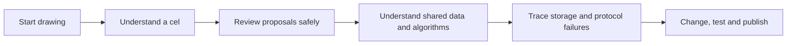

# The SpriteCanvas handbook

> **TL;DR:** SpriteCanvas is a static pixel studio with an optional local bridge. Its defining rule is simple: an agent edits a separate candidate; the original changes only after you accept. This book teaches the UI first, then the data, algorithms and failure paths that keep that promise.


**Figure 1 - The system this book explains.** This is an actual browser capture using public sample artwork. Every visible tool and workflow is documented against source; the private working canvas is not included.

## Read it as a book, not a pile of notes

The chapters progress from concepts to worked interactions, then into engineering detail. Each technical explanation names the implementation it describes and distinguishes behavior from limitations. The diagrams are editable Mermaid source inside Markdown, with accessible titles/descriptions.



## Reading paths

| You want to... | Follow this path |
| --- | --- |
| Make your first sprite | [Zero to hero](book/00-onboarding/zero-to-hero.md) -> [Using the studio](book/01-using-studio/README.md) |
| Collaborate without losing artwork | [Collaboration guide](book/02-agent-collaboration/README.md) -> [Review protocol](book/06-review-protocol/README.md) |
| Understand architectural tradeoffs | [Principal guide](book/00-onboarding/principal-guide.md) -> [Project model](book/03-project-model/README.md) -> [Persistence](book/07-persistence-concurrency/README.md) |
| Change pixel behavior | [Editing algorithms](book/04-editing-algorithms/README.md) -> [Compositing](book/05-rendering-compositing/README.md) -> [Testing](book/10-testing-deployment/README.md) |
| Diagnose an export mismatch | [GIF quantization](book/09-gif-quantization/README.md) -> [Troubleshooting](appendices/troubleshooting.md) |
| Change the icon safely | [Character branding](book/11-character-branding/README.md) |

## Part I - Learn and operate

### 00 - Onboarding

- [Principal-level guide](book/00-onboarding/principal-guide.md): the central architectural insight, domain map, tradeoffs and deep-reading order.
- [Zero-to-hero path](book/00-onboarding/zero-to-hero.md): pixels, cels, frames, browser modules, a first animation and practical exercises.

### 01 - The studio

[Using the studio](book/01-using-studio/README.md) covers every tool family, active-layer/selection boundaries, imports, animation, export decisions and keyboard workflows.

### 02 - Human and agent collaboration

[Safe collaboration](book/02-agent-collaboration/README.md) follows one project from handoff to proposal, comparison, feedback and a genuinely rebased revision in both local and static modes.

## Part II - Understand the engine

### 03 - The project model

[Projects, layers and cels](book/03-project-model/README.md): data layout, validation, stable IDs, RGBA versus swatches, and how to calculate the actual editable-cell budget.

### 04 - Editing algorithms

[Pixel editing](book/04-editing-algorithms/README.md): coordinate mapping, discrete lines/shapes, flood fill, selection clipping, transforms and concrete small-grid walkthroughs.

### 05 - Rendering and compositing

[From layers to an image](book/05-rendering-compositing/README.md): bottom-to-top alpha composition, visibility/opacity, native versus display pixels, and why image exports differ from editable projects.

### 06 - Review protocol

[The proposal state machine](book/06-review-protocol/README.md): current baseline checks, replacement IDs, request status and the failure cases that prevent accidental acceptance.

### 07 - Persistence and concurrency

[Browser and disk state](book/07-persistence-concurrency/README.md): autosave sequencing, recovery copies, atomic file replacement, conflict handling and the limits of those protections.

### 08 - Loopback bridge and CLI

[Protocol reference](book/08-loopback-bridge-cli/README.md): endpoints, request guards, exact command shapes, API errors, trust boundaries and safe agent procedures.

### 09 - GIF quantization

[The animation export pipeline](book/09-gif-quantization/README.md): color histogram, adaptive palette, alpha policy, stable indices, scaling, timing and compression.

## Part III - Maintain and extend

### 10 - Testing and deployment

[Development handbook](book/10-testing-deployment/README.md): isolated tests, reproducible screenshots, build outputs, GitHub Pages and practical contribution recipes.

### 11 - Character anatomy and branding

[The editable scout](book/11-character-branding/README.md): the original camera-facing GIF pose, flared application/32x README logo, flare-free favicon, transparent layered source and reproducible assets.

### 12 - Design principles

- [Static-first](book/12-design-principles/static-first.md): the browser remains a useful application without a backend.
- [Review-first](book/12-design-principles/review-first.md): keep authority separate from a candidate's existence.
- [Editable pixels](book/12-design-principles/editable-pixels.md): source structure is the product, not merely the rendered screenshot.

## Appendices

- [Glossary](appendices/glossary.md): terminology with chapter cross-links.
- [Source map](appendices/source-map.md): symbol-level navigation and test evidence.
- [Troubleshooting](appendices/troubleshooting.md): safe diagnosis and recovery rather than destructive shortcuts.
- [Documentation catalogue](catalogue.json): hierarchical maintenance prompts grounded in source locations.
- [Screenshot provenance](assets/screenshots/manifest.json): public fixtures, image checksums and source freshness.

## How the evidence works

Source links use repository-relative paths and line anchors. They identify implementation evidence; they are not claims that every linked behavior was manually exercised on every browser. Tests name the cases they actually cover.

Screenshots are real UI captures from a dedicated sample bridge. Any image displaying "Your saved canvas" is displaying a generated documentation baseline, not artwork attributed to a particular user.

The handbook contains no live deployment assertion, personal workspace snapshots, external service dependency or automatically executable agent. References to future changes are discussion, not implemented features.

## Maintaining the book

After changing an interface or source cited by screenshots:

```powershell
npm run brand
npm run docs:screenshots
npm run docs:check
```

Run `brand` when the editable logo changes, not as a substitute for updating it. The screenshot command builds the app and uses port4373 with an isolated test workspace; the checker is local and dependency-free.

Keep examples small enough to reason through. Explain why a rule exists, show an example and a failure case, then link deeper. A short accurate limitation is better than a confident invented capability.

[Return to the repository README](../README.md)
