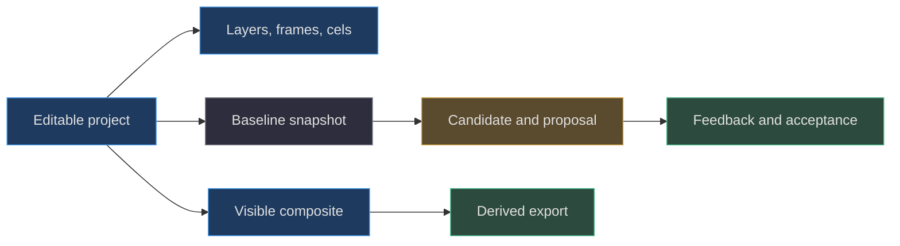
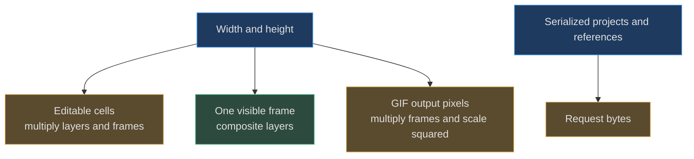

# Glossary

[Book home](../README.md) · [Source map](source-map.md) · [Troubleshooting](troubleshooting.md)

## TL;DR

The most important distinction is between **the editable project**, **a view
of its pixels**, and **a candidate somebody proposes**.
They can resemble one another on screen while having different ownership,
storage, and information content.
([web/lib/model.js:42](../../web/lib/model.js#L42-L117),
[server.mjs:108](../../server.mjs#L108-L127))

## 1. Documents and identity

The definitions in this group follow the validator and constructors.
([web/lib/model.js:9](../../web/lib/model.js#L9-L90))

| Term | Explanation | Read next |
|---|---|---|
| **Project** | The complete editable document: identity, dimensions, swatches, layers, and frames. It is not a rendered image with hidden metadata. | [Model](../book/03-project-model/README.md) |
| **Format marker** | The string `"spritecanvas"` on a project, or a distinct handoff/proposal marker on an envelope. It tells the importer which kind of object it received. | [Protocol](../book/06-review-protocol/README.md) |
| **Version** | The supported format generation, numeric `1` here. It is not a workspace revision or package version. | [Model](../book/03-project-model/README.md) |
| **Project ID** | Stable document identity that a proposal must preserve. Imported IDs may be non-UUID nonblank text; generated IDs use UUIDs. | [Protocol](../book/06-review-protocol/README.md) |
| **UUID** | A generated identifier from `crypto.randomUUID()`. The helper creates project, frame, and layer identities without deriving them from names. | [Model](../book/03-project-model/README.md) |
| **Layer ID** | A safe unique key used to find a layer's cel in every frame. Unlike a display name, it is required to be unique and restricted to safe identifier characters. | [Model](../book/03-project-model/README.md) |
| **Frame ID** | A unique textual identity within the frame array. A frame index is its current array position, which is a different concept. | [Model](../book/03-project-model/README.md) |
| **Cel** | One frame–layer intersection: an array of `width * height` pixel values. It has no separate stored ID in this model. | [Model](../book/03-project-model/README.md) |
| **Dense array** | A representation reserving an entry for every pixel location, including transparent ones. Its allocation cost does not shrink when the drawing is mostly empty. | [Cell budget](../book/03-project-model/README.md#6-the-cell-budget-is-multiplicative) |
| **Cell budget** | `width * height * layers * frames`, limited to two million. It counts editable storage positions, not visible marks or scaled export pixels. | [Cell budget](../book/03-project-model/README.md#6-the-cell-budget-is-multiplicative) |
| **Canonical project** | The fresh object returned by validation after normalizing colors and reconstructing supported fields. Unknown extension fields are not preserved automatically. | [Normalization](../book/03-project-model/README.md#5-normalization-and-equality) |
| **`sameProject`** | Equality of serialized, normalized project documents. It includes hidden data and structure, unlike a screenshot or difference count. | [Protocol](../book/06-review-protocol/README.md) |

An envelope is a wrapper around projects rather than a replacement project
schema. Handoffs carry current artwork and review context; proposals carry
baseline and candidate objects.
([scripts/agent.mjs:38](../../scripts/agent.mjs#L38-L41),
[web/app.js:510](../../web/app.js#L510-L517))

## 2. Pixels, geometry, and editing

These definitions refer to the actual array algorithms, not generic vector
graphics terminology.
([web/lib/model.js:137](../../web/lib/model.js#L137-L238),
[web/app.js:350](../../web/app.js#L350-L477))

| Term | Explanation | Read next |
|---|---|---|
| **Native pixel** | One stored canvas coordinate before editor zoom or export enlargement. A 2 × 2 cel always contains four native pixel entries. | [Coordinates](../book/04-editing-algorithms/README.md#1-three-coordinate-spaces) |
| **Row-major index** | The array location `y * width + x`. Consecutive entries move across a row before advancing to the next row. | [Algorithms](../book/04-editing-algorithms/README.md) |
| **RGBA byte offset** | `4 * (y * width + x)` in a composited byte buffer. It is different from the single-entry index in a cel array. | [Compositing](../book/05-rendering-compositing/README.md) |
| **Bresenham line** | Integer error-accumulation stepping between two endpoints. The editor uses its point list to connect sparse pointer samples. | [Lines](../book/04-editing-algorithms/README.md#2-line-stepping-is-integer-bresenham) |
| **Brush footprint** | The square of cells painted around each point. Size controls its width and height; even sizes have a floor-based center bias. | [Brush](../book/04-editing-algorithms/README.md#4-brush-footprint-mirroring-and-selection) |
| **Mirroring** | Additional destination writes reflected by `width-1-x` and/or `height-1-y`. It does not create a second layer. | [Brush](../book/04-editing-algorithms/README.md#4-brush-footprint-mirroring-and-selection) |
| **Clipping** | Refusing writes outside allowed canvas or selection bounds. Not every low-level helper performs all clipping; transforms trust the supplied area. | [Transforms](../book/04-editing-algorithms/README.md#6-transforms-read-a-copy-then-write-destinations) |
| **Selection** | A rectangular area `{x,y,w,h}`. Its right and bottom bounds are exclusive when testing membership. | [Algorithms](../book/04-editing-algorithms/README.md) |
| **Half-open bounds** | A range that includes its start but excludes its end. `[x, x+w)` contains exactly `w` integer X coordinates. | [Brush](../book/04-editing-algorithms/README.md#4-brush-footprint-mirroring-and-selection) |
| **Flood fill** | Replacing the exact-color four-connected region containing a starting cell. It samples the active cel, not the composite of all layers. | [Fill](../book/04-editing-algorithms/README.md#5-flood-fill-changes-an-exact-color-connected-component) |
| **Four-neighbor connectivity** | Reachability through left, right, up, and down steps. Diagonally touching cells alone do not connect a fill region. | [Fill](../book/04-editing-algorithms/README.md#5-flood-fill-changes-an-exact-color-connected-component) |
| **Transform** | A destination-to-source remapping such as flip or clockwise square rotation. Reading a source copy avoids overwriting values still needed later. | [Transforms](../book/04-editing-algorithms/README.md#6-transforms-read-a-copy-then-write-destinations) |
| **Locked layer** | A layer protected by browser editing guards and operation-batch checks. The lock is not an authentication mechanism or immutable-data guarantee. | [Ownership](../book/12-design-principles/review-first.md) |
| **Studio clipboard** | In-memory copied active-cel pixels and area metadata. It is not a flattened image of every visible layer or a persisted undo archive. | [Clipboard](../book/04-editing-algorithms/README.md#7-move-clipboard-and-gesture-ownership) |
| **Operation batch** | A validated array of at most 20,000 `layer`, `pixel`, `fill`, `line`, `rect`, or `ellipse` instructions. The CLI turns its result into a proposal. | [CLI](../book/08-loopback-bridge-cli/README.md#8-applyoperations-is-a-small-drawing-language) |

## 3. Color and rendering

The compositor and export paths distinguish stored colors from output colors.
([web/lib/model.js:11](../../web/lib/model.js#L11-L18),
[web/lib/model.js:91](../../web/lib/model.js#L91-L136),
[web/lib/export.js:32](../../web/lib/export.js#L32-L75))

| Term | Explanation | Read next |
|---|---|---|
| **RGBA** | Red, green, blue, and alpha. Canonical cel strings use eight hex digits, with alpha last. | [Model](../book/03-project-model/README.md) |
| **Alpha** | Coverage/transparency information, distinct from RGB brightness. Alpha zero normalizes to `null` in project cells. | [Compositing](../book/05-rendering-compositing/README.md#3-source-over-rgba-from-first-principles) |
| **Layer opacity** | A factor in `[0,1]` multiplying each pixel's source alpha during compositing. It does not rewrite stored cel alpha. | [Compositing](../book/05-rendering-compositing/README.md) |
| **Swatch palette** | `project.palette`, a collection of editing choices. Cells store RGBA directly instead of indexing this array. | [Palette](../book/03-project-model/README.md#4-palette-and-pixel-colors-are-different-data-structures) |
| **Source-over** | Blending a source layer over accumulated destination pixels using both alphas. Later layers are sources over earlier ones. | [Formula](../book/05-rendering-compositing/README.md#3-source-over-rgba-from-first-principles) |
| **Composite** | A newly derived visible RGBA frame. Computing it does not flatten or replace the underlying layers. | [Rendering](../book/05-rendering-compositing/README.md) |
| **Straight alpha** | RGB channels stored separately from alpha rather than already multiplied by it. The blend formula accounts for alpha during combination. | [Formula](../book/05-rendering-compositing/README.md#3-source-over-rgba-from-first-principles) |
| **Presentation scale** | How large native pixels appear in the editor. Zoom changes the view rather than allocating a higher-resolution editable project. | [Scale](../book/05-rendering-compositing/README.md#4-native-resolution-versus-presentation-scale) |
| **Onion skin** | A faint previous-frame composite drawn behind the current editor view. It is a viewing aid, not exported cel content. | [Scale](../book/05-rendering-compositing/README.md#4-native-resolution-versus-presentation-scale) |
| **Difference image** | A diagnostic coloring locations with changed composited RGBA. Zero visual difference does not imply project equality. | [Difference](../book/05-rendering-compositing/README.md#5-difference-is-a-rendered-diagnostic-not-a-merge) |
| **Sprite sheet** | A PNG tiling all frames, accompanied by JSON containing frame rectangles, IDs, durations, and scale. It is a delivery artifact, not layered source. | [Exports](../book/05-rendering-compositing/README.md#6-export-contracts-and-alpha-differences) |

## 4. Review and collaboration

These terms follow the proposal branches and shared review helper.
([server.mjs:103](../../server.mjs#L103-L128),
[web/lib/review.js:31](../../web/lib/review.js#L31-L65))

| Term | Explanation | Read next |
|---|---|---|
| **Baseline** | The unchanged project snapshot a candidate targets. It is retained separately so later edits cannot redefine what was proposed. | [Protocol](../book/06-review-protocol/README.md#2-the-two-snapshots) |
| **Candidate** | The agent's edited project object, not yet installed as the current canvas. It remains fully editable data. | [Principal guide](../book/00-onboarding/principal-guide.md) |
| **Proposal** | A review record wrapping baseline, candidate, identity, title, and base revision. Only one active slot exists. | [Protocol](../book/06-review-protocol/README.md) |
| **Handoff** | A saved-state packet for another participant, containing revision, project, proposal, and feedback. It can travel as a file without a bridge. | [Static envelope](../book/06-review-protocol/README.md#7-static-envelope-walkthrough) |
| **Canvas revision** | The current saved-canvas generation. Bridge proposals and feedback leave it unchanged; browser-only edits maintain a local counter. | [Persistence](../book/07-persistence-concurrency/README.md#2-dirty-state-is-not-the-disk-revision) |
| **Expected revision** | A caller's claim about the saved state it read. The bridge rejects a mutation when it does not match current revision. | [API](../book/08-loopback-bridge-cli/README.md#3-shared-request-and-response-rules) |
| **Stale proposal** | A candidate whose baseline no longer matches the current saved canvas/revision. It can be inspected but not accepted as current. | [Staleness](../book/06-review-protocol/README.md#4-staleness-checks-are-intentionally-redundant) |
| **Rebase** | Deliberately rebuilding a candidate from freshly read artwork and review guidance. Changing an old candidate's revision label alone is not a rebase. | [Workflow](../book/08-loopback-bridge-cli/README.md#7-a-safe-full-collaboration-procedure) |
| **Feedback** | A saved request for changes with proposal identity, message, optional reference, revisions, and status. It does not invoke an agent. | [Feedback](../book/06-review-protocol/README.md#5-feedback-fields-and-limits) |
| **Reference image** | A bounded PNG/JPEG/WebP data URL attached as drawing guidance. Validation checks encoding, size, and signature, not complete image semantics. | [Feedback](../book/06-review-protocol/README.md#5-feedback-fields-and-limits) |
| **`respondsTo`** | The exact latest open feedback ID a replacement answers. A current canvas revision cannot substitute for this review identity. | [Replacement](../book/06-review-protocol/README.md#6-exact-replacement-example) |
| **`replacesProposalId`** | The exact active candidate submission being superseded. It prevents an unrelated proposal from silently occupying the review slot. | [Replacement](../book/06-review-protocol/README.md#6-exact-replacement-example) |
| **Addressed** | Feedback status after a replacement responds; `addressedBy` records the new proposal ID. It does not mean user-approved. | [Authority](../book/12-design-principles/review-first.md#4-feedback-identity-is-part-of-authority) |
| **Acceptance** | The explicit review transition installing a current candidate, incrementing revision, and preserving a comparison. Agents are not automatically authorized to perform it. | [Authority](../book/12-design-principles/review-first.md) |
| **Comparison** | The last accepted proposal with its original before/after snapshots. Subsequent canvas edits are not retroactively reflected in it. | [Persistence](../book/07-persistence-concurrency/README.md#7-undo-is-not-the-same-thing-as-recovery) |

## 5. Persistence and transport

The storage helper, save loop, and server define these mechanisms.
([web/lib/storage.js:1](../../web/lib/storage.js#L1-L41),
[web/app.js:81](../../web/app.js#L81-L174),
[server.mjs:19](../../server.mjs#L19-L54))

| Term | Explanation | Read next |
|---|---|---|
| **IndexedDB** | Browser database storing the current recovery workspace under one key. It is not a remote account backup. | [Storage](../book/07-persistence-concurrency/README.md#1-what-is-actually-stored) |
| **Dirty state** | The browser knows there are edits not yet completed through its save path. It must not be cleared by an older save response. | [Save race](../book/07-persistence-concurrency/README.md#4-worked-race-editing-while-a-save-is-in-flight) |
| **Pending cache** | A stored recovery snapshot whose edits may still need synchronization. It carries the revision against which those edits were made. | [Recovery](../book/07-persistence-concurrency/README.md#6-reload-and-recovery-decisions) |
| **Change serial** | A browser-local counter used to recognize edits made during an asynchronous operation. It is not the disk revision. | [Save race](../book/07-persistence-concurrency/README.md#4-worked-race-editing-while-a-save-is-in-flight) |
| **Review epoch** | A browser-local counter helping discard a poll result overtaken by review activity. It is not a server version field. | [Persistence](../book/07-persistence-concurrency/README.md) |
| **Save promise** | The single in-flight browser save task that later flushes wait for. It serializes this session, not other browser tabs or server processes. | [Serialization](../book/07-persistence-concurrency/README.md#3-how-saves-are-serialized) |
| **Conflict** | The browser and disk revisions disagree while local work needs preservation. The app requires an explicit choice rather than silently merging. | [Recovery](../book/07-persistence-concurrency/README.md#6-reload-and-recovery-decisions) |
| **Atomic replacement** | Here, writing a temporary file then renaming it before publishing state. It does not imply a cross-process lock or guaranteed power-loss durability. | [Disk saves](../book/07-persistence-concurrency/README.md#5-server-ordering-and-atomic-save-precisely-stated) |
| **Loopback bridge** | The optional local HTTP server connecting browser review with a disk workspace and CLI. It binds to 127.0.0.1. | [Bridge](../book/08-loopback-bridge-cli/README.md) |
| **Origin check** | Comparing a supplied browser Origin to the exact local origin. It is a browser trust-boundary check, not user authentication. | [Trust](../book/08-loopback-bridge-cli/README.md#1-process-and-trust-boundary) |
| **Fetch Metadata** | Browser context headers such as `Sec-Fetch-Site`. The bridge permits a narrow clicked-shell navigation exception without opening APIs cross-site. | [Navigation](../book/08-loopback-bridge-cli/README.md#2-the-narrow-navigation-exception) |
| **Static-first** | Core editing remains usable without the collaboration API. It does not promise a service-worker-powered offline install. | [Principle](../book/12-design-principles/static-first.md) |
| **Repository subpath** | Hosting beneath a path such as `/SpriteCanvas/` rather than the domain root. Relative URLs keep resources inside that prefix. | [Deployment](../book/10-testing-deployment/README.md#5-pages-subpaths-and-the-optional-api) |

## 6. GIF and derived-artifact terms

These definitions describe the actual encoder, including deliberate quality
and compression tradeoffs.
([web/lib/gif.js:6](../../web/lib/gif.js#L6-L184))

| Term | Explanation | Read next |
|---|---|---|
| **Histogram** | Counts of distinct post-matte native RGB colors across all frames. Counts are pixel frequency, not duration-weighted exposure. | [Histogram](../book/09-gif-quantization/README.md#4-animation-wide-histogram) |
| **Quantization** | Reducing many RGB colors to a bounded representative palette. It affects exported GIF bytes, not the editable project. | [GIF](../book/09-gif-quantization/README.md) |
| **Color box** | A partition of histogram colors with counts, sums, and a best split. It is an algorithmic grouping, not a spatial rectangle on the canvas. | [Partitioning](../book/09-gif-quantization/README.md#5-weighted-partitioning-not-median-cut) |
| **Split gain** | Reduction in the encoder's frequency-weighted RGB squared error from dividing a box. The highest positive gain determines the next split. | [Partitioning](../book/09-gif-quantization/README.md#5-weighted-partitioning-not-median-cut) |
| **White matte** | Combining surviving partial-alpha composite pixels with white before converting them to opaque indexed colors. | [Alpha](../book/09-gif-quantization/README.md#3-composite-threshold-and-matte) |
| **Global palette** | One GIF color table shared by the entire animation, unlike the editor swatches or separate palettes per frame. | [Determinism](../book/09-gif-quantization/README.md#6-nearest-colors-and-determinism) |
| **Transparent index** | GIF table index 0, reserved to mean transparent. Opaque black receives a nonzero index. | [GIF](../book/09-gif-quantization/README.md) |
| **Centisecond** | One hundredth of a second, the unit of GIF frame delays. Millisecond durations are rounded to this unit with a minimum of 2. | [Timing](../book/09-gif-quantization/README.md#7-gif-container-timing-and-disposal) |
| **Disposal method** | An instruction for how a decoder prepares for the next frame. This encoder writes method 2, restore-to-background, with full-frame images. | [Timing](../book/09-gif-quantization/README.md#7-gif-container-timing-and-disposal) |
| **LZW clear code** | Code 256 resets the decoder dictionary. Frequent clears let this implementation remain at 9-bit literal codes. | [LZW](../book/09-gif-quantization/README.md#8-lzw-chooses-simplicity-over-compression-ratio) |
| **Sub-block** | A GIF container chunk of at most 255 data bytes, followed eventually by a zero terminator. It is not the same as the encoder's 250-literal clear interval. | [LZW](../book/09-gif-quantization/README.md#8-lzw-chooses-simplicity-over-compression-ratio) |

## 7. Commonly confused quantities

Two million editable cells, 32 million GIF output pixels, and a 32 MiB
request-body limit are not interchangeable. The first includes layers,
the second includes scale squared, and the third depends on serialized bytes.
([web/lib/model.js:51](../../web/lib/model.js#L51-L53),
[web/lib/gif.js:15](../../web/lib/gif.js#L15-L17),
[server.mjs:59](../../server.mjs#L59-L68))

Likewise, an implemented algorithm, an assertion in a test, and a measurement
from a completed run are different kinds of evidence.
The [source map](source-map.md) locates implementations and test assertions;
run reports must separately state what was actually executed.
