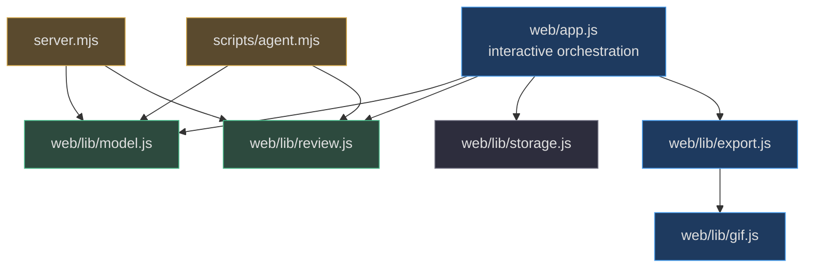
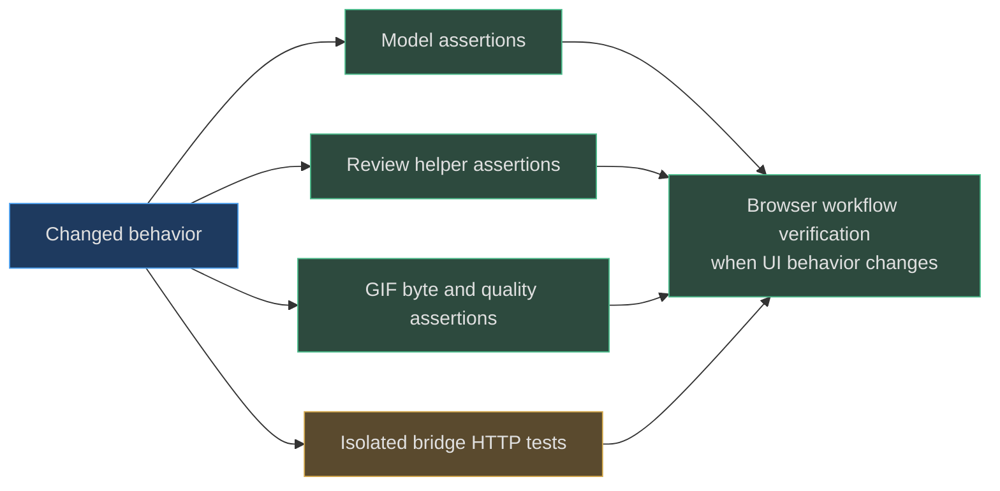

# Source map and test evidence

[Book home](../README.md) · [Glossary](glossary.md) · [Testing guide](../book/10-testing-deployment/README.md)

## TL;DR

Start from the question, then follow the implementation and its regression
assertions. The shared model is the document boundary; browser code owns
interactive state; server/CLI code transports snapshots; export code derives
images. This map is a navigator, not a substitute for reading the linked code.
([web/app.js:1](../../web/app.js#L1-L8),
[server.mjs:6](../../server.mjs#L6-L7),
[scripts/agent.mjs:3](../../scripts/agent.mjs#L3-L5))

## 1. Document shape and pixel algorithms

These symbols answer “what is legal?” and “which exact cells change?”
Read [project model](../book/03-project-model/README.md) for schema teaching
and [algorithms](../book/04-editing-algorithms/README.md) for worked grids.

| Question | Source entry point | What to inspect |
|---|---|---|
| What are the project limits? | [LIMITS](../../web/lib/model.js#L1-L7) | Dimensions, layer/frame caps, total editable cells, default swatches |
| How are colors normalized? | [color](../../web/lib/model.js#L11-L18) | Six/eight hex digits, uppercase, zero alpha to null |
| What does a new project contain? | [createProject](../../web/lib/model.js#L31-L41) | Helper defaults, generated identities, transparent first cel |
| What fields survive import? | [validateProject](../../web/lib/model.js#L42-L87) | Reconstructed fields and normalization; unknown data is omitted |
| What does equality mean? | [sameProject](../../web/lib/model.js#L88-L90) | Validated JSON equality rather than rendered equality |
| How do layers combine? | [composite](../../web/lib/model.js#L99-L117) | Array order, visibility, opacity, source-over formula |
| How is the heatmap counted? | [difference](../../web/lib/model.js#L119-L136) | Union dimensions, last-frame clamping, changed RGBA |
| How are strokes connected? | [linePoints](../../web/lib/model.js#L137-L150) | Integer error accumulator and endpoint termination |
| How are shapes rasterized? | [shapePoints](../../web/lib/model.js#L151-L167) | Inclusive bounding scan, ellipse neighbor-edge test |
| Where does brush clipping occur? | [inSelection / paint](../../web/lib/model.js#L168-L181) | Destination selection check after brush expansion/mirroring |
| What does Fill sample? | [floodFill](../../web/lib/model.js#L182-L195) | Exact active-cel value and four-neighbor stack |
| How do new cels stay complete? | [addLayer / addFrame](../../web/lib/model.js#L196-L213) | Every frame–layer intersection, copies versus blank arrays |
| How is resize centered? | [resizeProject](../../web/lib/model.js#L214-L228) | Floor-based offsets and clipped copy across all cels |
| What rotates and what is rejected? | [transformCel](../../web/lib/model.js#L229-L238) | Source snapshot and square-area precondition |
| What can an operation file express? | [applyOperations](../../web/lib/model.js#L239-L264) | Small operation language, locks, coordinates, fresh validated result |

These links are grounded in the shared implementation, not alternate browser
or server versions of the algorithms.
([web/lib/model.js:42](../../web/lib/model.js#L42-L87))

## 2. Browser ownership and persistence

Use these narrow browser entry points rather than reading the large app file
without a question. The corresponding chapter is
[persistence and concurrency](../book/07-persistence-concurrency/README.md).

| Responsibility | Source entry point | Important boundary |
|---|---|---|
| Mutation guard | [editable](../../web/app.js#L44-L48) | Playback, hidden layer, locked layer |
| History budget | [historyPush](../../web/app.js#L53-L58) | Forty entries/four million weighted cells, retain one |
| Mutation transaction | [change / markChanged](../../web/app.js#L59-L80) | Clone, rollback on error, dirty tracking |
| Recovery envelope | [cacheState / cache](../../web/app.js#L81-L90) | Project/review clones and pending bridge state |
| Save serialization | [flushSave](../../web/app.js#L96-L139) | One promise, serial comparison, separate cache and disk errors |
| Poll race protection | [poll](../../web/app.js#L147-L174) | Recheck change serial/review epoch after fetch |
| Native versus view rendering | [renderCanvas / positionCanvas](../../web/app.js#L276-L300) | Onion skin and zoom do not rewrite cels |
| Coordinate conversion | [point](../../web/app.js#L350-L355) | Client position to floored native coordinate |
| Gesture preview | [pointerMove / finishStroke](../../web/app.js#L408-L437) | Rebuild shapes from captured cel, record completed gesture |
| Clipboard | [copy / clear / paste](../../web/app.js#L453-L477) | Active cel, canvas clipping, new selection extent |
| Recovery initialization | [initialize](../../web/app.js#L1091-L1129) | Bridge detection, pending cache restoration, conflict |
| Explicit disk choice | [reload action](../../web/app.js#L848-L853) | Requires `LOAD`, resets history, caches remote state |
| IndexedDB schema | [openStorage / readStorage](../../web/lib/storage.js#L1-L15) | Database/store/key setup and read errors |
| IndexedDB completion | [writeStorage](../../web/lib/storage.js#L16-L23) | Promise resolves on transaction completion |
| Browser API adapter | [api](../../web/lib/storage.js#L25-L41) | Relative URL, JSON content check, surfaced status |

For example, a report that “a save marked newer edits clean” should start at
`flushSave`'s captured serial, not at the low-level IndexedDB `put`.
That causal path is visible across the two cited layers.
([web/app.js:112](../../web/app.js#L112-L128),
[web/lib/storage.js:16](../../web/lib/storage.js#L16-L23))

## 3. Review protocol and loopback contracts

| Question | Source entry point | Related chapter |
|---|---|---|
| Which reference images are accepted? | [validateReference](../../web/lib/review.js#L3-L29) | [Review](../book/06-review-protocol/README.md) |
| What does feedback record? | [createFeedback](../../web/lib/review.js#L31-L42) | [Review](../book/06-review-protocol/README.md) |
| Which note is the latest open one? | [latestFeedback](../../web/lib/review.js#L43-L45) | [Review](../book/06-review-protocol/README.md) |
| Why must replacement carry two IDs? | [replacementDetails](../../web/lib/review.js#L51-L60) | [Review-first](../book/12-design-principles/review-first.md) |
| How are old notes resolved? | [resolveFeedback](../../web/lib/review.js#L62-L65) | [Review](../book/06-review-protocol/README.md) |
| What does a static proposal require? | [validateProposal / importProposal](../../web/app.js#L510-L535) | [Static-first](../book/12-design-principles/static-first.md) |
| Why is Accept disabled? | [updateCompareSafety](../../web/app.js#L538-L559) | [Review](../book/06-review-protocol/README.md) |
| Does feedback invoke an agent? | [submitFeedback](../../web/app.js#L638-L665) | [Collaboration](../book/02-agent-collaboration/README.md) |
| Who owns acceptance and Undo? | [acceptProposal](../../web/app.js#L704-L720) | [Review-first](../book/12-design-principles/review-first.md) |
| How is disk state replaced? | [persist / commit](../../server.mjs#L19-L50) | [Persistence](../book/07-persistence-concurrency/README.md) |
| How are POSTs constrained? | [requireRevision / bodyJson](../../server.mjs#L51-L74) | [Bridge](../book/08-loopback-bridge-cli/README.md) |
| What is the clicked-link exception? | [Host/Origin/navigation guards](../../server.mjs#L81-L93) | [Bridge](../book/08-loopback-bridge-cli/README.md) |
| Which transitions advance revision? | [API branches](../../server.mjs#L94-L130) | [Review](../book/06-review-protocol/README.md) |
| Can private repository files be served? | [Static path guard](../../server.mjs#L132-L142) | [Bridge](../book/08-loopback-bridge-cli/README.md) |
| What does CLI feedback extraction write? | [feedback branch](../../scripts/agent.mjs#L43-L59) | [CLI](../book/08-loopback-bridge-cli/README.md) |
| Where is the CLI base checked? | [propose/apply branch](../../scripts/agent.mjs#L65-L78) | [CLI](../book/08-loopback-bridge-cli/README.md) |

These are separate enforcement layers: reference validation, review identity,
saved revision, and browser-origin checks do not replace one another.
([web/lib/review.js:51](../../web/lib/review.js#L51-L60),
[server.mjs:51](../../server.mjs#L51-L54))

## 4. Export and GIF internals

| Symbol | Source | Follow when |
|---|---|---|
| `renderPixels`, `projectCanvas` | [export.js](../../web/lib/export.js#L4-L12) | Native RGBA looks different from presentation |
| `exportProject` | [export.js](../../web/lib/export.js#L32-L75) | Format dispatch, PNG/sheet dimensions, SVG alpha, metadata |
| `encodeGif` | [gif.js](../../web/lib/gif.js#L6-L71) | Limits, native histogram input, container/timing/disposal |
| `adaptivePalette` | [gif.js](../../web/lib/gif.js#L74-L94) | Exact-color fast path and highest-gain box selection |
| `colorBox` | [gif.js](../../web/lib/gif.js#L96-L137) | Channel marginal bins and frequency-weighted split mathematics |
| `nearestColor` | [gif.js](../../web/lib/gif.js#L139-L150) | Weighted distance and deterministic ties |
| `scaleIndices` | [gif.js](../../web/lib/gif.js#L152-L165) | Nearest-neighbor enlargement after quantization |
| `lzw` | [gif.js](../../web/lib/gif.js#L167-L184) | Clear intervals, literal 9-bit codes, bit packing |
| `ALPHA_THRESHOLDS`, `ditherAlpha` | [gif.js](../../web/lib/gif.js#L186-L203) | Stable output-space transparency coverage without a background matte |

For the mathematics and resource model, read [GIF quantization](../book/09-gif-quantization/README.md).
For original versus derived alpha, read [compositing](../book/05-rendering-compositing/README.md).
([web/lib/gif.js:96](../../web/lib/gif.js#L96-L137),
[web/lib/export.js:39](../../web/lib/export.js#L39-L57))

## 5. Test evidence matrix

The matrix describes **assertions inspected in source**, not results of a
completed test run. It intentionally separates pure helpers from HTTP tests.

| Contract | Exact test location | What the assertion establishes |
|---|---|---|
| Normalize v1 pixels | [model.test.mjs:11](../../tests/model.test.mjs#L11-L20) | Canonical round trip, color spelling, malformed size/cel rejection |
| IDs and allocation limits | [model.test.mjs:22](../../tests/model.test.mjs#L22-L32) | Unsafe/duplicate IDs, timing, multiplicative cell budget |
| Line stepping and mirrors | [model.test.mjs:34](../../tests/model.test.mjs#L34-L41) | Specific endpoints, reverse diagonal, shallow length, four mirrored marks |
| Selection boundary | [model.test.mjs:43](../../tests/model.test.mjs#L43-L52) | Brush/fill clip and selected flip; nonsquare rotation rejected |
| Fill and ellipse | [model.test.mjs:54](../../tests/model.test.mjs#L54-L68) | Outline-bounded fill, same-color return, ellipse bounds and one-cell case |
| Source-over | [model.test.mjs:70](../../tests/model.test.mjs#L70-L79) | Exact purple blend, hidden layer, opaque upper layer |
| Independent cel storage | [model.test.mjs:81](../../tests/model.test.mjs#L81-L90) | Duplicated frames do not alias pixel arrays |
| Resize | [model.test.mjs:91](../../tests/model.test.mjs#L91-L99) | Preserved centered coordinate and predictable crop |
| Non-destructive operations | [model.test.mjs:101](../../tests/model.test.mjs#L101-L115) | Base layer count preserved, candidate pixels changed, lock/bounds failures |
| Rendered difference | [model.test.mjs:117](../../tests/model.test.mjs#L117-L123) | Changed-pixel count with enlarged transparent extent |
| Feedback fields | [review.test.mjs:12](../../tests/review.test.mjs#L12-L21) | Proposal/canvas revision distinction and trimmed message |
| Reference boundary | [review.test.mjs:23](../../tests/review.test.mjs#L23-L34) | MIME, encoding, signature, and byte-limit rejection |
| Exact latest replacement | [review.test.mjs:35](../../tests/review.test.mjs#L35-L49) | Current proposal, latest open note, addressed linkage, unchanged old object |
| Saved review round trip | [bridge.test.mjs:58](../../tests/bridge.test.mjs#L58-L79) | Non-destructive proposal, acceptance, comparison, persisted current project |
| Stale writes | [bridge.test.mjs:80](../../tests/bridge.test.mjs#L80-L92) | New drawing cannot be overwritten with old revision |
| API and static-file guards | [bridge.test.mjs:93](../../tests/bridge.test.mjs#L93-L107) | Invalid project/body shape and loopback/path boundary cases |
| Clicked shell navigation | [bridge.test.mjs:109](../../tests/bridge.test.mjs#L109-L144) | Narrow exception does not grant API or embedding access |
| Durable revision feedback | [bridge.test.mjs:146](../../tests/bridge.test.mjs#L146-L179) | Open note blocks accept; exact replacement and disk history |
| <=255 GIF RGB colors | [gif.test.mjs:94](../../tests/gif.test.mjs#L94-L110) | Exact post-matte colors, transparent slot, swatch independence |
| Deterministic palette | [gif.test.mjs:112](../../tests/gif.test.mjs#L112-L120) | Repeated encoding and frame-reversal invariants |
| Synthetic dark fidelity | [gif.test.mjs:122](../../tests/gif.test.mjs#L122-L139) | Fixture-specific dark diversity and error thresholds |
| Alpha conversion | [gif.test.mjs:141](../../tests/gif.test.mjs#L141-L151) | Threshold/white matte after visible compositing |
| Scale and metadata | [gif.test.mjs:153](../../tests/gif.test.mjs#L153-L175) | Shared palette, integer blocks, timing, loop and disposal |
| Tiny/empty frame handling | [gif.test.mjs:177](../../tests/gif.test.mjs#L177-L190) | Transparent/one-color cases and centisecond rounding |
| Large valid GIF | [gif.test.mjs:192](../../tests/gif.test.mjs#L192-L199) | A 100 × 80 twelve-frame 16× encoding reaches the trailer |
| Invalid GIF input | [gif.test.mjs:201](../../tests/gif.test.mjs#L201-L215) | Invalid scale/project/dimensions and 32-million-pixel refusal |

The GIF inspector in the unit suite understands this encoder's literal
9-bit stream. That is useful white-box evidence, but should not be confused
with a universal third-party GIF decoder implementation.
([tests/gif.test.mjs:6](../../tests/gif.test.mjs#L6-L61))

## 6. Build and operational entry points

| File | Source link | Boundary to remember |
|---|---|---|
| `package.json` | [Scripts and requirements](../../package.json#L7-L23) | Node 22+, configured commands, development dependency |
| `scripts/build.mjs` | [Copy and fingerprint](../../scripts/build.mjs#L1-L14) | Copies `web`, writes commit metadata; does not clean `dist` |
| `scripts/static-test-server.mjs` | [Pages fixture](../../scripts/static-test-server.mjs#L6-L23) | `/SpriteCanvas/` subpath, no bridge API |
| `playwright.config.js` | [Fixture configuration](../../playwright.config.js#L3-L18) | Test bridge 4273 and static fixture 4274, no server reuse |
| `.github/workflows/pages.yml` | [Workflow](../../.github/workflows/pages.yml#L1-L58) | Actions-only publishing, test/build/upload `dist`, verify actual deployed editor |
| `tests/pages/site.spec.js` | [Live-site check](../../tests/pages/site.spec.js) | Isolated browser, expected commit, drawing/persistence/export and artifact boundary |
| `AGENTS.md` | [Contributor contract](../../AGENTS.md#L1-L40) | Protect artwork, preserve review authority, avoid public secrets/assets dependencies |

For screenshot reproduction and documentation checks, use the configured
commands in [testing and deployment](../book/10-testing-deployment/README.md#7-reproducible-documentation-commands).
For public logo internals, use the separately maintained
[character-branding chapter](../book/11-character-branding/README.md); this
map does not freeze a character pose or private artwork coordinates.

## 7. How to keep this map trustworthy

When a symbol moves, update its line range and nearby chapter anchors together.
When a test changes, describe the assertions it actually makes rather than
copying an overly broad title. For example, a few reversible line examples
do not prove all tie-breaking slopes are exactly reversible.
([tests/model.test.mjs:34](../../tests/model.test.mjs#L34-L41),
[web/lib/model.js:137](../../web/lib/model.js#L137-L150))

When reporting a verification run, add the command and observed result
separately. This map establishes where evidence lives; it does not claim
test completion, performance measurements, or a successful Pages deployment.
