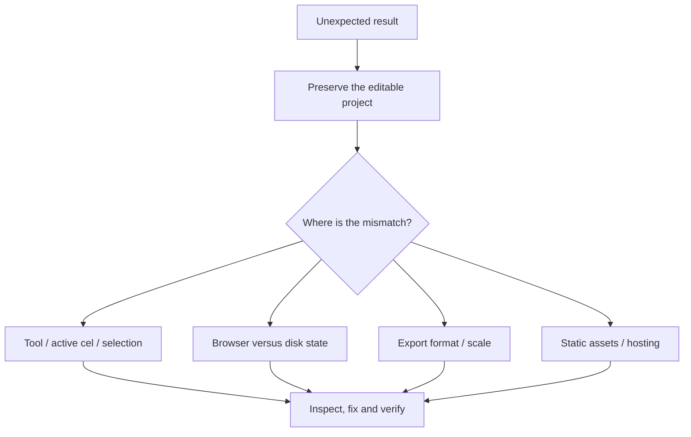

# Troubleshooting and safe recovery

> **TL;DR:** Preserve evidence before trying to remove a warning. Download unsynced artwork, read the actual revision, and distinguish source data, browser presentation, bridge connectivity and export limitations. Do not solve a conflict by overwriting the workspace.

[Book home](../README.md) | [Source map](source-map.md) | [Glossary](glossary.md)

## Start with the right layer of the problem



## The page is blank or modules do not load

Do not open the application directly through `file://`. Use `npm start` or serve the built files over HTTP.

Check the browser's network/console errors. A404 for a relative module path suggests a hosting/base-path issue; a failure on `api/health` does not necessarily mean the static editor cannot work.

The GitHub Pages build expects the contents of `dist`, not the repository directory and not the optional Node bridge. See [deployment](../book/10-testing-deployment/README.md).

## STATIC appears when you expected LOCAL LIVE

1. Verify that the server process is running.
2. Open the exact same host/port printed by the server.
3. Inspect `http://127.0.0.1:4173/api/health` for the default port.
4. If you selected another port, pass the matching `--url` to the agent CLI.

```powershell
npm start -- --port 4180
npm run agent -- status --url http://127.0.0.1:4180
```

A browser opened on a static host cannot use a remote filesystem bridge merely because another machine runs one. Do not expose the loopback bridge publicly to work around that distinction.

## The brush does nothing

Pause playback. Confirm the active layer is visible and unlocked. Check the selected frame and clear an unintended selection.

If the tool is Move or Hand, it is not painting. If the chosen color is transparent or identical to the target, a stroke may produce no visible difference.

Read the explicit notice rather than repeatedly clicking a locked cel. [Using the studio](../book/01-using-studio/README.md) explains the state checks.

## Only one part of the character moved

Move, copy and transforms operate on the active cel. They do not automatically include every layer that contributed to the visible character.

Undo the incomplete move if necessary. Plan the intended layer/frame changes or keep related pieces together when that matches the editing task. Do not merge source layers merely to silence confusion without considering what editability is lost.

## A rotation is rejected

The canvas or selection to rotate must be square. A rectangular region cannot be rotated in place through this control.

Select a square region or deliberately resize/copy into an appropriate area. Preserve a source copy before transformations that may clip pixels.

## Exported GIF looks different from PNG

GIF cannot represent arbitrary RGBA. It uses a shared adaptive palette, transparent-versus-opaque thresholding, white matting for remaining partial alpha and10ms timing steps.

A glow with translucent edge pixels is especially likely to look different when viewed on a dark background after white matting. This is not fixed by changing the working swatches.

Retain PNG for exact rendered RGBA and JSON for editable source. See [GIF quantization](../book/09-gif-quantization/README.md).

## Export is too large

For GIF:

```text
scaled pixels = width * height * frame count * scale * scale
```

The cap is32,000,000. Reducing scale from16 to8 divides that budget by four.

For PNG/sheets, check the full output width and height, not just a single source frame. Sheet column count changes layout; the16million-pixel and16,384-per-dimension limits still apply.

Do not remove a limit in one UI layer while leaving a contradictory encoder limit elsewhere. The GIF encoder is the authoritative guard.

## The palette is smaller but the image still has many colors

That is expected for RGBA artwork. The palette is an editing aid, not an indexed-color constraint.

A palette-only change should not recolor pixels. Actual color reduction would require a deliberate pixel conversion, not a change to the swatch list.

## A proposal cannot be accepted

Check whether the canvas changed since the baseline or whether a Request changes entry is open.

Do not force a current revision onto an old candidate. Request a new proposal based on a fresh handoff, preserving the latest artwork and using the actual current replacement/feedback IDs.

The before/after UI remains useful for inspection, but an old visual comparison does not authorize overwriting newer edits.

## Feedback was saved but the agent did not respond

The feedback button saves guidance and an optional image. It does not start a background assistant or send a chat message.

Tell the agent: **Read my review feedback.** In static mode, share the downloaded review packet. The agent should read it, inspect references, pull the latest source and submit a guarded revision.

## Browser and disk revisions disagree

Download the browser version first if it contains work you want to preserve. The UI deliberately asks for an explicit choice before discarding unsynced browser edits.

Do not clear IndexedDB, hand-edit `workspace.json`, or use a project replacement request as an automatic repair. Those actions can destroy the very version the warning is protecting.

The bridge owns its workspace file while running. For inspection, use `status`, `pull` and the documented API read endpoints.

See [Persistence and concurrency](../book/07-persistence-concurrency/README.md) for the exact recovery paths and their limits.

## The local bridge stopped

The browser may retain a recovery copy, but offline status is not confirmation that a save reached disk. Restart the bridge, inspect status and resolve any revision conflict before preparing a new handoff.

A newly launched process is not enough: verify the HTTP endpoint responds. Avoid killing every Node process by name; other applications may share the machine.

## The icon looks different from the editable source

Regenerate assets from the source:

```powershell
npm run brand
npm run build
```

Check both header and favicon, not only the PNG. If a browser retains a favicon, refresh or open a fresh browser context before concluding the generator is wrong.

The logo is a separate project. Never replace the active scene with it to make the header update.

## Documentation screenshots are stale

Run:

```powershell
npm run docs:screenshots
npm run docs:check
```

This uses a dedicated sample bridge on4373 and public fixtures. It should not read private `.spritecanvas` art or make external requests.

If the checker reports a changed source hash, do not merely replace the hash by hand. Recapture the UI and inspect the images. Source hashes normalize text line endings so a normal Git checkout is not itself a visual change.

## When reporting a bug

Include the action, expected result, actual result, browser/runtime version if known, relevant error text and a minimal non-sensitive project demonstrating the problem.

Say whether the issue occurs in static or local mode. If a proposal is involved, distinguish canvas revision from proposal/feedback IDs. Avoid attaching a whole private workspace when a tiny example reproduces the issue.

Keep screenshots and source projects distinct: an image can show a visual mismatch, but it cannot always reveal the hidden layers or review state that caused it.
