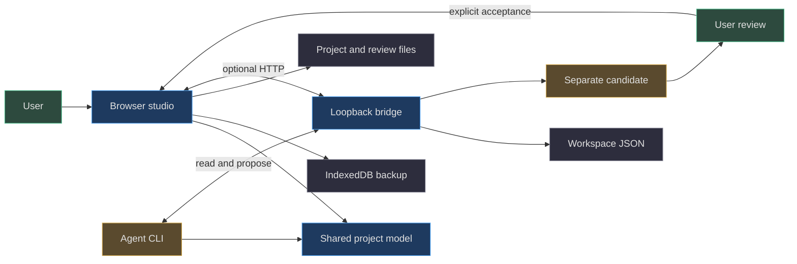
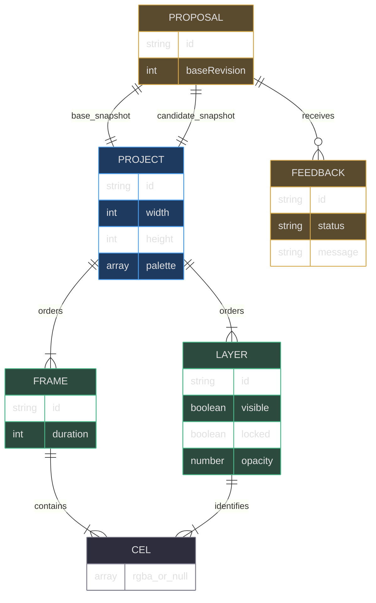

# Principal guide: snapshots, not shared mutable artwork

[Book home](../../README.md) · [Contributor path](zero-to-hero.md) · [Project model](../03-project-model/README.md)

## TL;DR

**The central architectural insight is to make an agent's output a separately
reviewable snapshot, not a write into the user's current document.**
The browser, CLI, and bridge share the same project validator, but only an
explicit acceptance transition installs a candidate through the review workflow.
Snapshot equality and revision checks answer different questions: “is this
the document I reviewed?” and “has the saved canvas advanced?”
([server.mjs:100](../../../server.mjs#L100-L128),
[web/lib/model.js:88](../../../web/lib/model.js#L88-L90))



The boundaries above are implemented by shared imports, browser storage, and
file handoffs—not by a hosted collaboration service.
([scripts/agent.mjs:1](../../../scripts/agent.mjs#L1-L5),
[web/lib/storage.js:1](../../../web/lib/storage.js#L1-L41),
[web/app.js:734](../../../web/app.js#L734-L743))

## 1. Start with ownership, not rendering

A pixel editor could expose “set current project” to every collaborator.
That is easy to implement but makes a late agent response indistinguishable
from the user's next edit. SpriteCanvas instead stores three project roles:

| Role | Meaning | What changes it |
|---|---|---|
| `state.project` | Current saved artwork | A browser save or accepted proposal |
| `proposal.baseProject` | Frozen artwork the candidate targets | Creating a new proposal |
| `proposal.project` | Candidate artwork | Creating or explicitly replacing a proposal |

Acceptance also preserves the proposal as `comparison`, with `acceptedAt`.
This is a historical before/after record, not a live view that follows subsequent
edits. There is one active proposal and one last accepted comparison, not an
unbounded review database.
([server.mjs:108](../../../server.mjs#L108-L128),
[web/app.js:538](../../../web/app.js#L538-L575))

Why retain both complete documents? A candidate may change dimensions, frames,
layer order, names, opacity, and palette—not just some colored cells.
A list of changed screen pixels cannot represent all those changes.
The validator and acceptance path operate on complete editable projects.
([web/lib/model.js:42](../../../web/lib/model.js#L42-L87),
[server.mjs:105](../../../server.mjs#L105-L127))

## 2. Domain model: a cel is a frame–layer intersection



This is a conceptual ER diagram, not SQL tables. In JSON, a cel has no separate
ID: its address is `frames[frameIndex].cels[layerId]`. A layer definition is
shared across frames, but each cel array is independent.
([web/lib/model.js:54](../../../web/lib/model.js#L54-L79),
[tests/model.test.mjs:81](../../../tests/model.test.mjs#L81-L90))

Each pixel is `null` or a canonical `#RRGGBBAA` string.
The palette is a swatch collection, not an index table for the artwork.
The distinction explains why a palette-only proposal can preserve every
rendered pixel and why GIF builds its own animation-wide palette.
([web/lib/model.js:11](../../../web/lib/model.js#L11-L18),
[web/lib/model.js:80](../../../web/lib/model.js#L80-L86),
[web/lib/gif.js:16](../../../web/lib/gif.js#L16-L35))

## 3. The insight in Python

The following is **cross-language explanatory pseudocode, not runnable
repository code**. It omits HTTP, timestamps, caching, and validation details.
Its purpose is to expose the actual separation between submission and acceptance.

```python
# Explanatory pseudocode only; SpriteCanvas is JavaScript.
def propose(workspace, candidate, revision_read):
    require(revision_read == workspace.revision)
    require(candidate.id == workspace.project.id)
    require_replacement_contract_if_a_proposal_exists(workspace)
    workspace.proposal = {
        "base_revision": workspace.revision,
        "base_project": deep_copy(workspace.project),
        "candidate": normalize(candidate),
    }
    # workspace.project and workspace.revision do not change.


def accept_from_user_review(workspace, revision_read):
    require(revision_read == workspace.revision)
    pending = workspace.proposal
    require(no_open_feedback(pending))
    require(pending["base_revision"] == workspace.revision)
    require(normalize(pending["base_project"]) ==
            normalize(workspace.project))
    workspace.comparison = deep_copy(pending)
    workspace.project = deep_copy(pending["candidate"])
    workspace.revision += 1
    workspace.proposal = None
```

The JavaScript equivalent is the proposal and acceptance branches.
`sameProject` normalizes with `validateProject` and compares JSON serialization;
it does not compare rendered images or compute a semantic merge.
([server.mjs:103](../../../server.mjs#L103-L128),
[web/lib/model.js:88](../../../web/lib/model.js#L88-L90))

Suppose sample revision **12** is read, then the user saves a stroke as **13**.
The agent must pull revision 13 and rebuild its candidate from that document.
Relabeling an old candidate “13” may pass the numeric submission check but
does not constitute a genuine rebase: the server cannot infer the agent's
creative intent. The agent contract therefore requires preserving and
re-reading the baseline, not merely supplying a current number.
([scripts/agent.mjs:65](../../../scripts/agent.mjs#L65-L77),
[AGENTS.md:18](../../../AGENTS.md#L18-L25))

## 4. Where each boundary lives

| Boundary | Implementation | Principal-level implication |
|---|---|---|
| Input normalization | `validateProject` | All callers can agree on one canonical document shape |
| Browser mutation | `change`, `markChanged` | Undo and dirty tracking belong to the interactive session |
| Disk mutation | `requireRevision`, `commit` | Saved revisions are checked before synchronous persistence |
| Review replacement | `replacementDetails` | Feedback identity matters even when canvas revision is unchanged |
| Export | `composite`, `encodeGif` | Delivery formats are derived artifacts, not source documents |

Sources: ([web/lib/model.js:42](../../../web/lib/model.js#L42-L90),
[web/app.js:53](../../../web/app.js#L53-L80),
[server.mjs:47](../../../server.mjs#L47-L54),
[web/lib/review.js:51](../../../web/lib/review.js#L51-L65),
[web/lib/gif.js:7](../../../web/lib/gif.js#L7-L35)).

## 5. Real tradeoffs

**Whole snapshots favor legibility over storage efficiency.**
Validation, cloning, undo, proposal baselines, and comparison records can all
hold copies of the cell arrays. The two-million-cell project limit and
browser undo budget bound specific dimensions of that cost; neither is a
promise about exact JavaScript heap usage.
([web/lib/model.js:51](../../../web/lib/model.js#L51-L53),
[web/app.js:53](../../../web/app.js#L53-L58))

**Rejecting stale work favors ownership over automatic convergence.**
There is no three-way pixel merge, CRDT, or operation replay during acceptance.
The benefit is a reviewable before/after pair. The cost is that an agent must
genuinely rebase after intervening edits.
([server.mjs:121](../../../server.mjs#L121-L127))

**Static-first favors portability over automatic rendezvous.**
The browser can exchange handoff and proposal files without an API.
A local bridge makes that exchange convenient, but saving feedback does not
start or wake a chat agent. The user must tell the agent to read it.
([web/app.js:653](../../../web/app.js#L653-L660),
[web/app.js:734](../../../web/app.js#L734-L743))

**Loopback checks are not collaborator authentication.**
The bridge restricts bind address, Host, Origin, and Fetch Metadata, while
the CLI restricts its target URL. There are no user accounts or secret tokens
in these paths. A trusted local environment remains an assumption.
([server.mjs:81](../../../server.mjs#L81-L95),
[server.mjs:150](../../../server.mjs#L150-L153),
[scripts/agent.mjs:9](../../../scripts/agent.mjs#L9-L18))

## 6. Reading orders

For a design review, follow [project model](../03-project-model/README.md) →
[review protocol](../06-review-protocol/README.md) →
[persistence](../07-persistence-concurrency/README.md) →
[bridge contracts](../08-loopback-bridge-cli/README.md).
This order moves from the unit of ownership to its transition rules, then to
the mechanisms that transport and save it.

For graphics work, follow [editing algorithms](../04-editing-algorithms/README.md) →
[compositing](../05-rendering-compositing/README.md) →
[GIF quantization](../09-gif-quantization/README.md).
Do not start by treating the editor palette as the output palette.

For an implementation change, read [testing and deployment](../10-testing-deployment/README.md)
and use the [source map](../../appendices/source-map.md) to choose evidence.
The [static-first](../12-design-principles/static-first.md) and
[review-first](../12-design-principles/review-first.md) chapters explain which
tradeoffs should remain visible when adding features.

## 7. Implemented, measured, and not claimed

- **Implemented:** separate baseline/candidate snapshots, explicit acceptance,
  stale-revision rejection, and guarded feedback replacement.
  ([server.mjs:99](../../../server.mjs#L99-L128))
- **Test evidence:** round-trip and stale-save tests assert these contracts.
  A test definition is evidence of an intended regression check, not a claim
  that this documentation session executed it.
  ([tests/bridge.test.mjs:58](../../../tests/bridge.test.mjs#L58-L92))
- **Not measured here:** throughput, latency, heap ceilings, or crash durability.
  The implementation uses synchronous file writes and rename; it contains no
  cross-process lock or explicit filesystem sync call.
  ([server.mjs:19](../../../server.mjs#L19-L23))
- **Not an implemented roadmap:** hosted multi-user editing, automatic agent
  notification, and automatic merging. Do not infer them from the diagrams.

Next: [the exact project contract](../03-project-model/README.md).
