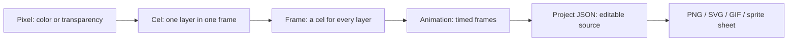

# 00 - From a pixel to a working animation

> **TL;DR:** You do not need to know graphics programming to use SpriteCanvas. Start with one editable pixel, then separate artwork into layers, copy cels into animation frames, and keep the project JSON as your source. An agent proposal is an optional second version, not permission to overwrite the first.

[Book home](../../README.md) | [Principal-level alternative](principal-guide.md) | [Next: Using the studio](../01-using-studio/README.md)

## The picture before the terminology



Imagine a tiny sheet of graph paper. Each square is either transparent or has a color. You are choosing individual squares rather than drawing a smooth vector curve.

The canvas may display one square as a large block because you are zoomed in. That does not make it several source pixels. A 16 x 16 drawing has 256 pixel locations at every zoom setting.

## Part I - Foundations

### 1. Color has a fourth component

RGB means red, green and blue. RGBA adds alpha: opacity. `#FFAD13FF` is fully opaque orange; `#FFAD1380` is partly transparent orange.

A transparent pixel is represented as `null` in a cel. It lets lower visible layers show through. It is not the same thing as opaque black.

This distinction matters for the scout: dark face and pupil pixels are part of the character. Erasing all dark pixels to "remove a background" would erase its anatomy.

### 2. A layer is not a frame

A layer answers **which part of the composition?** A frame answers **which moment?**

Suppose a project has two layers, `Background` and `Character`, and three animation frames. It needs six cels:

| Frame | Background cel | Character cel |
| --- | --- | --- |
| 1 | Background pixels for moment 1 | Character pixels for moment 1 |
| 2 | Background pixels for moment 2 | Character pixels for moment 2 |
| 3 | Background pixels for moment 3 | Character pixels for moment 3 |

Layer name, visibility and opacity belong to the layer metadata shared across frames. Painting belongs to the currently selected layer's cel in the currently selected frame.

### 3. Swatches are conveniences, not an image format

The Working palette is a set of colors you intend to use while editing. It does not make the document indexed-color.

You can have a small set of editing swatches while composited light, translucent pixels and imported artwork produce more rendered colors. Deleting or replacing swatches alone does not recolor the drawing.

### 4. Rendering combines the visible cels

The browser draws layers from bottom to top. Visibility, pixel alpha and layer opacity affect the result. The final picture is called a composite.

PNG and SVG exports describe a rendered frame. The project file retains the pieces that created that frame. Keep the project when you might want to move the character independently from its background later.

### 5. Native browser modules are the application's packaging

For readers new to the implementation, the browser loads JavaScript modules directly from the static site. There is no framework component compiler or application bundle to build.

`import { composite } from './lib/model.js'` imports a named function. The same model module can also be imported by Node. Compare this with Python's `from module import function`: both express a dependency, but they are not interchangeable runtime syntax.

The application must be served over HTTP. Opening `index.html` as a local `file://` page can conflict with browser module-loading rules.

## Part II - Your first complete workflow

### Step 1 - Open a safe practice workspace

From the repository root:

```powershell
npm start
```

Open `http://127.0.0.1:4173`. Look for **LOCAL LIVE**. If you already have artwork, use **Save project** before opening an example or starting a new project.

The local server stores one active workspace, not a collection of named documents. The downloaded project file is how you keep a separate source version.

### Step 2 - Understand the screen


**Figure 1 - The workspace as a map.** Left: choose an editing tool. Center: edit native pixels at an enlarged display scale. Right: select a layer and color. Bottom: select the moment in the animation. This is a generated sample capture.

Read the active layer and selected frame before painting. Many apparent tool problems are simply edits going to a different cel than the one you intended.

### Step 3 - Add a separate layer

Open the reference artwork, then add a layer named `Practice sparkle`. Choose Pencil, brush size1, and an ivory color.

Draw a five-pixel cross: a center pixel and its four direct neighbors. This small object is easy to recognize, move and compare.

The new layer isolates the exercise from the bundled helmet. If you dislike the experiment, you can hide or delete the added layer rather than trying to reconstruct the original.

### Step 4 - Make time visible

Click timeline **Duplicate**, not **Add blank frame**. In the duplicate, erase and redraw the sparkle one pixel higher. Duplicate again and move it one pixel to the right.

Set each frame to180ms. Three such frames have a nominal total duration of540ms. The UI schedules frames using their durations; this is not a promise of hard real-time browser playback.

Press Enter to play. Pause before editing. If movement is too abrupt, add intermediate positions rather than increasing export scale.

### Step 5 - Keep source and delivery separate

Download the project JSON first. Then export a looping GIF.

The GIF is useful for showing movement, but it does not contain editable layers. It may quantize colors and uses different partial-alpha rules from PNG. The JSON is your source of truth for future edits.

### Step 6 - Try a harmless proposal

Prepare an agent handoff and ask:

> On a separate layer, add two small warm sparkle accents. Keep the character and existing animation unchanged. Submit a proposal, not an accepted edit.

Compare the candidate with the saved baseline. Check more than the image: layer count and frame timing are part of the proposal too.

If the sparkle is too large, use Request changes. The note is saved for the agent, but you must still tell the agent in chat to read it.

## Part III - Becoming a contributor

### The first source files to read

1. [UI state and edit guards](../../../web/app.js#L18-L75): find the active project/frame/layer and see how failed edits roll back.
2. [Pointer handling](../../../web/app.js#L345-L438): follow a mouse coordinate into source-pixel coordinates.
3. [Copy/paste and playback](../../../web/app.js#L453-L500): separate cel editing from frame scheduling.
4. [Project model chapter](../03-project-model/README.md): learn the shared validation and data contract.
5. [Review protocol chapter](../06-review-protocol/README.md): understand why accepting a stale candidate is rejected.

Do not start by changing unrelated systems. Pick a small behavior, trace its UI entry point to the shared model, identify the test that should fail, then make the smallest complete change.

### Set up development tooling

```powershell
npm ci
npx playwright install chromium
npm test
npm run build
npm run test:browser
```

Node is sufficient to run the editor. Playwright is needed for browser tests and screenshot capture, not for serving the static application.

Never run test fixture writes against your real4173 bridge. Existing browser and documentation configurations give tests their own ports and workspaces.

## Exercises with checks

### Exercise A - A transparent corner

Create a4x4 project and paint one corner orange. Export PNG and keep project JSON.

**Check:** one cel entry is orange; the other15 remain transparent. Enlarging the PNG must produce solid rectangular blocks, not new source pixels.

### Exercise B - One metadata change, several moments

Create two frames with different character pixels. Hide the character layer.

**Check:** the character disappears from both frames because visibility is layer metadata. Re-enable it; the frames still contain different cels.

### Exercise C - A safe disagreement

Import a valid proposal, continue drawing, then try to accept it.

**Check:** the stale baseline is not silently merged. Preserve the new drawing and request a rebased proposal.

### Exercise D - An output budget

Calculate whether a100x80,13-frame animation fits at16x.

**Answer:** 26,624,000 composited output pixels, below the32,000,000 GIF cap. Layer count belongs in the editable-cell calculation, not this GIF calculation.

## What "ready" looks like

You can identify the active cel, preserve a source file, distinguish blank from duplicate frames, explain palette versus pixels, and review a proposal without confusing it with an accepted edit.

You do not need to memorize every function. Use the [glossary](../../appendices/glossary.md), [source map](../../appendices/source-map.md) and [troubleshooting guide](../../appendices/troubleshooting.md) as you go.
