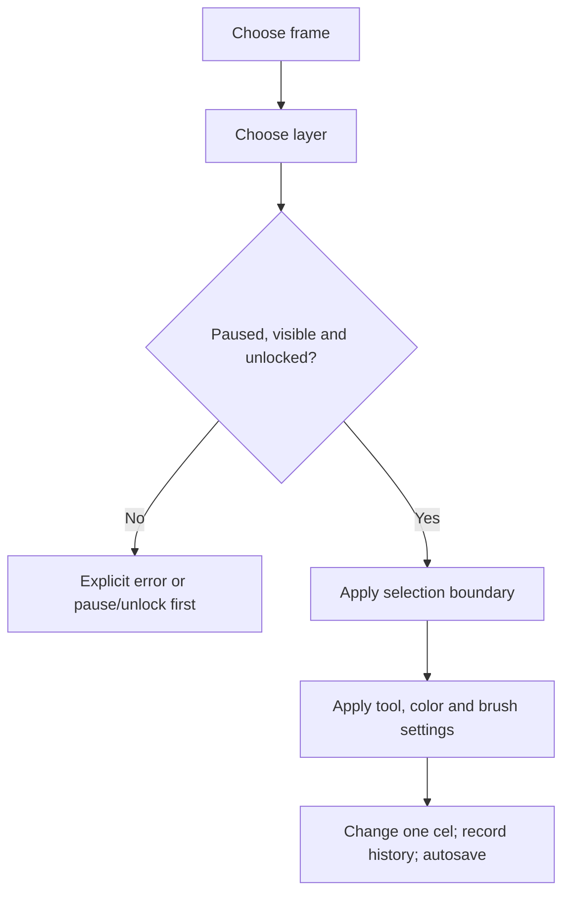
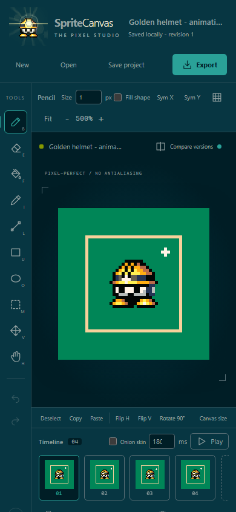

# 01 - Using the pixel studio

> **TL;DR:** Select a frame and layer, then a tool. Selections constrain edits on that active cel; they do not combine layers. Save the project for editable source, and export images for delivery. Pause animation before editing.

[Book home](../../README.md) | [Previous: Zero to hero](../00-onboarding/zero-to-hero.md) | [Next: Collaboration](../02-agent-collaboration/README.md)

## The edit you are about to make

This is the most useful troubleshooting model in the editor. A tool can be working correctly while targeting a hidden layer, an unexpected frame, or a small selection left over from earlier work.

The [edit guards](../../../web/app.js#L40-L75) and [pointer handlers](../../../web/app.js#L379-L438) are the source for this behavior.

## A guided tour of the interface

**Figure 1 - Four areas, one active cel.** This real screenshot uses public sample artwork and a generated four-frame study. It is not a rendering of private work.

### Solarized Dark interface

The studio uses [Ethan Schoonover's Solarized palette](https://ethanschoonover.com/solarized/) with a custom darker base: `#001E26` instead of the standard Base03 `#002B36`. Raised panels, text and accent colors retain their Solarized values. The theme is the same in local and static modes, including narrow layouts, modal dialogs, proposal review and feedback history. It is an interface setting, not an artwork filter or a new working palette.

| Role | Solarized color | Where to see it |
| --- | --- | --- |
| Main background and input wells | Darkened Base03 `#001E26` | Stage edges, inputs, selected frames and dialogs |
| Raised surfaces | Base02 `#073642` | Header, tool rail, inspector and timeline |
| Text and supporting labels | Base1 `#93A1A1` | Controls and explanatory text |
| Primary actions and focus | Cyan `#2AA198` | Export, selected-tool outlines, focus rings and wipe divider |
| Warnings and errors | Yellow `#B58900` / red `#DC322F` | Conflict borders and error indicators, with readable neutral text |

For example, enabling symmetry adds a cyan guide above the art. It does not turn a gold pixel cyan, rewrite a saved cel, or add the guide to a PNG. The main transparency checkerboard and neutral thumbnail/review wells stay separate from the theme so the surroundings do not acquire a strong blue-green cast. The green pixel-difference visualization keeps its existing diagnostic meaning.

The [CSS tokens](../../../web/styles.css#L1-L15) are the source of interface colors; [review styles](../../../web/review.css#L1-L23) reuse them. [Canvas overlays](../../../web/app.js#L301-L327) and the [wipe divider](../../../web/app.js#L666-L683) read those same tokens. Artwork colors, the bundled samples and branding remain unchanged. Screenshots in this book are recaptured through the isolated public-sample workflow, never from a user's live workspace.

### Header and document actions

The header contains the tool logo, project name, save state and New/Open/Save project/Export actions.

Click the project name to rename it. Renaming changes metadata; it is not "Save as" into a project library. **Save project** downloads JSON to a file. **New** and **Open** replace the active document, so download an existing project you want to keep first.

### Tool rail and options

Select tools using the rail or keyboard. The options bar exposes brush size, shape fill, symmetry, grid and zoom controls as appropriate to the workflow.

Brush size is measured in source pixels, not screen pixels. A size1 brush stays one source pixel wide even when the canvas fills most of the screen.

### Canvas stage and navigator

The stage displays the source grid enlarged without smoothing. The navigator shows the same composite at a smaller presentation size.

Use the mouse wheel or zoom buttons to change zoom. **0** fits the canvas. **Space+drag**, Hand, or the middle mouse button pans. Panning moves the view, not the pixels.

### Inspector and timeline

The inspector holds palette, layers and collaboration controls. The timeline holds frame selection, durations, playback and frame operations.

A layer's visibility/opacity applies across the animation. Selecting a frame changes which cel you paint for that layer. The model stores one cel per layer per frame.

## Drawing tools

| Tool | Shortcut | Behavior and useful boundary |
| --- | --- | --- |
| Pencil | B | Paints source pixels; connects points along a drag rather than leaving event-rate gaps |
| Eraser | E | Writes transparency, revealing lower visible layers |
| Fill | F | Replaces a connected exact-color region in the active cel, constrained by selection |
| Eyedropper | I | Samples the visible composite, not just the active layer |
| Line | L | Previews a discrete line from press to drag position |
| Rectangle | U | Outlined or filled rectangular shape |
| Ellipse | O | Discrete ellipse, outlined or filled |
| Marquee selection | M | Defines an inclusive rectangular editing area |
| Move | V | Moves the selection, or the entire active cel if nothing is selected |
| Hand | H | Pans the presentation view |

**Alt+click** temporarily samples visible artwork. **Right-click** paints with the secondary color; in the palette it selects the secondary swatch.

Shapes are recalculated from the stroke's starting snapshot while dragging. They are not repeatedly stamped at every pointer update. Cancelled/lost-pointer strokes restore their previous data rather than half-committing the preview.

For the discrete algorithms behind these tools, continue to [Editing algorithms](../04-editing-algorithms/README.md).

## Foreground, secondary color and working swatches

The foreground is your normal paint color. The secondary is used by right-click drawing. **X** swaps the two. The hex field accepts normalized RGB/RGBA colors; a color can contain alpha.

The Working palette is editable swatch metadata. It is not an indexed-color map into which every pixel must fit. Adding a swatch gives you a convenient color button. A palette-only change leaves the artwork pixels alone.

The eyedropper reads the composite. A sampled result can therefore include lower-layer color and opacity effects. That is different from copying the literal stored RGBA value from the active cel.

Keep a deliberate working palette. Hundreds of incidental lighting shades make color selection harder and do not improve the accuracy of the underlying RGBA image.

## Selections, movement and the studio clipboard

**Figure 2 - Select the area, then select the operation.** The rectangle bounds an operation on the active cel. It does not gather matching pixels from every layer.

### Select and clear the boundary

Drag with **M**. Endpoints are included: selecting from coordinate4 to coordinate7 covers four pixel columns, not three.

**Ctrl+A** selects the entire canvas. **Ctrl+D**, Escape or Deselect removes the boundary. Deselecting does not delete the selected pixels.

### Move versus pan

Move changes pixel locations. It clears the original region, copies pixels to the offset destination and clips anything moved outside the canvas. Hand/Space moves only the view.

Arrow keys nudge the active selection or cel by one pixel; Shift+Arrow uses eight pixels. If an accidental move clips artwork, undo promptly rather than trying to repaint it from the visible fragment.

### Copy, cut and paste

The application uses its **own in-memory studio clipboard**, not arbitrary system image clipboard import. Copy takes pixels from the active cel; Cut copies and then clears the area. Paste places the copied block at a selection origin or its remembered location, clips to the canvas, selects the pasted block and switches to Move.

Without a selection, Copy/Cut use the entire active cel. A transparent pasted pixel is still data and may clear the corresponding destination pixel; this is not a "paste only nonempty pixels" operation.

These details are visible in [copy/paste](../../../web/app.js#L453-L475) and [movement](../../../web/app.js#L365-L376).

### Flip and rotate

Flip H and Flip V transform the active selection, or active cel without a selection. Rotation requires a square area and turns it90degrees. It does not rotate all frames or layers as one assembled object.

To move a multicomponent character together, plan the layer/frame edits deliberately. The editor does not expose a group-transform system.

## Layer workflows

Add a new layer for an independent addition such as highlights, atmosphere or an agent contribution. Use a meaningful name so a later reviewer can identify ownership and purpose.

Double-click the layer name to rename it. Move up/down changes compositing order. Duplicate layer copies its cels across frames. Delete removes that layer from all frames, not merely from the selected frame.

Lock prevents pixel editing, opacity changes, deletion and merging in the applicable UI actions. Visibility and order are still separately adjustable. If drawing fails, check both the lock and eye icon before changing tool settings.

### Merge down is a structural edit

Merge down composites the current layer with the layer underneath for every frame, writes the result into the lower layer, restores that layer's opacity to1 and removes the upper layer.

Both layers must be visible and unlocked. You cannot merge the bottom layer downward. The result remains editable pixels, but the separate upper/lower structure is gone unless you undo.

See [layer actions](../../../web/app.js#L795-L837) and [Compositing](../05-rendering-compositing/README.md).

## Animation workflows

Select a frame to edit its cels. **Add blank frame** creates empty cels. **Duplicate** starts from the selected frame's pixels, which is usually the better choice for a small pose change.

Every frame has its own duration. The input accepts20-10,000ms. Playback uses those durations and loops; browsers can delay timers under load, so this is not a frame-accurate video-timeline guarantee.

Onion skin shows a previous-frame reference for drawing. It is a presentation aid, not a new saved art layer.

Pause before editing. Earlier/Later reorder the selected frame. Delete frame removes one moment but keeps at least one frame in the project.

### A simple timing example

For an idle cycle, duplicate a frame and change only a few pixels:

| Frame | Visual change | Duration |
| --- | --- | --- |
| 1 | Resting pose | 400ms |
| 2 | Slight movement | 120ms |
| 3 | Hold the new pose | 240ms |
| 4 | Return | 120ms |

The nominal cycle is880ms. Increasing export scale will enlarge each pose; it will not make the movement smoother. Add meaningful intermediate poses if needed.

## Imports and canvas size

Open accepts project/handoff JSON and supported raster images. A proposal JSON is routed through proposal import rather than silently becoming an accepted project.

For an image, choose a new layer fitted to the current canvas or a new project with dimensions you select. Resampling uses nearest neighbor. Animated images import only their first frame.

Canvas size changes every cel's dimensions without scaling the pixels. With center anchoring, the existing artwork is repositioned relative to the new center. Shrinking crops; Undo can restore the previous project snapshot.

If you want a16x16 character in a larger environment, expand the canvas rather than enlarging its pixels. If you want a larger PNG of that same sprite, choose a higher export scale instead.

## Export choices

**Figure 3 - Output scale is not source resolution.** A GIF at16x magnifies each native block. It still uses the animation's frame count, timing and shared limited-color output palette.

Keep JSON for continued editing. Use PNG for exact RGBA on one frame, GIF for convenient looping playback, and a sheet plus metadata when another tool needs frame coordinates.

SVG exports pixel rectangles for the composite, not layered source structure. PNG/sheet/GIF render visible layers; hidden editable content still belongs in the project JSON.

For a large GIF, multiply source width, height, frame count and scale squared. The limit is32million output pixels. PNG and sprite sheets have their own16million-pixel and dimension limits.

The [GIF chapter](../09-gif-quantization/README.md) explains quantization, alpha matting, disposal and timing in detail.

## Smaller screens

**Figure 4 - Responsive layout, not a different document.** The same sample project is displayed in a narrow viewport. Panels continue vertically; the screenshot does not establish support on every touch device or mobile browser.

Use fit and pan when the source grid exceeds the visible area. The underlying project dimensions and pixel data are unchanged by the viewport.

## Keyboard reference

| Action | Key |
| --- | --- |
| Pencil / Eraser / Fill / Picker | B / E / F / I |
| Line / Rectangle / Ellipse | L / U / O |
| Select / Move / Hand | M / V / H |
| Brush smaller / larger | `[` / `]` |
| Swap colors / Grid / Fit | X / G / 0 |
| Undo / Redo | Ctrl+Z / Ctrl+Shift+Z or Ctrl+Y |
| Copy / Cut / Paste | Ctrl+C / Ctrl+X / Ctrl+V |
| Select all / Deselect | Ctrl+A / Ctrl+D |
| Clear selection or cel | Delete or Backspace |
| Nudge / larger nudge | Arrow / Shift+Arrow |
| Play / pause | Enter |
| Download project | Ctrl+S |

Command acts as the modifier on macOS. Shortcuts are suppressed while typing into form controls or while a dialog is open; this prevents a project command from firing when you are entering text.

Source: [keyboard dispatch](../../../web/app.js#L1037-L1087) and the [in-app help](../../../web/index.html#L169).

## Recovery habits

Watch save status, download named project versions before replacements, and preserve the browser version before resolving a conflict. Autosave is recovery, not unlimited historical versioning.

Undo is bounded and lives in the UI session. Do not rely on it as a substitute for a downloaded source file after reloading or closing the application.

[Next: Safe collaboration](../02-agent-collaboration/README.md) | [Troubleshooting](../../appendices/troubleshooting.md)
