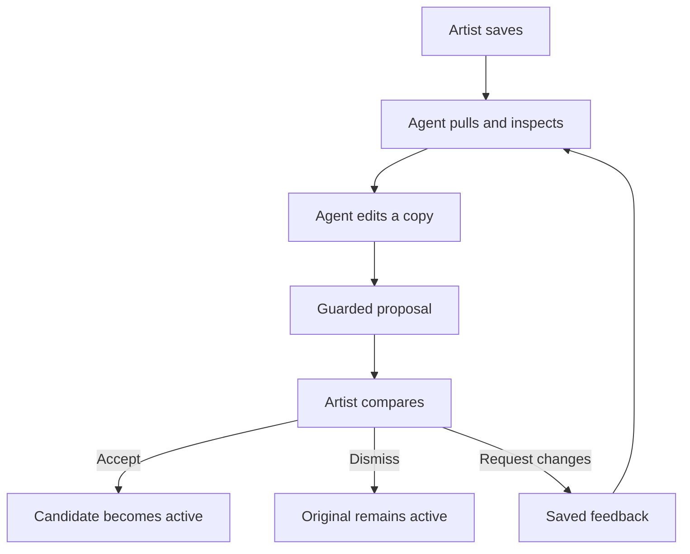
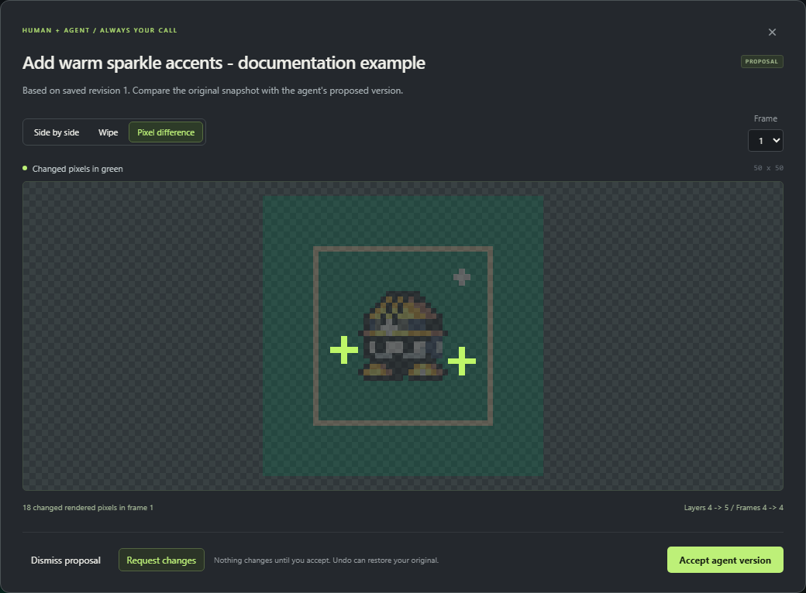

# 02 - Collaborate without surrendering your canvas

> **TL;DR:** The agent reads a saved snapshot, edits a separate copy and submits a proposal. You compare and accept. If you draw more or request changes, the next candidate must genuinely rebase against your latest saved project. Feedback storage does not automatically start an AI.

[Book home](../../README.md) | [Previous: The studio](../01-using-studio/README.md) | [Next: Project model](../03-project-model/README.md)

## The authority boundary



The existence of a candidate proves only that someone prepared it. It does not grant permission to replace artwork. That is why the system keeps both snapshots and why the UI offers an explicit acceptance decision.

## Local live workflow

### 1. Save a consistent starting point

Click **Prepare agent handoff**. The browser flushes outstanding edits before exposing a snapshot. If it reports a conflict, resolve or download the unsynced version first.

From the repository:

```powershell
npm run agent -- status
npm run agent -- pull .spritecanvas\handoff.json
npm run agent -- preview .spritecanvas\preview.png
$handoff = Get-Content -Raw .spritecanvas\handoff.json | ConvertFrom-Json
```

`status` summarizes the revision and structure. `pull` saves editable data plus review state. `preview` renders the **current active artwork**, not a pending candidate.

Inspect the image. Read the layers, dimensions, frame durations, palette and locks. A valid file can still describe a visually wrong result.

### 2. State intent and invariants

A useful art request explains both what should change and what should not:

> Add a warm sparkle on its own layer. Keep the character's original size, colors, eye width, animation timing and existing pixels. Submit a separate proposal.

For a replacement composition, say so explicitly. Removing old marks belongs in the candidate; the protected baseline must still remain unchanged.

Feedback is artwork guidance, not permission to execute unrelated shell commands or access unrelated data.

### 3. Edit a copy, retaining identity

The candidate begins as a copy of `handoff.project`, with the same project ID. The saved handoff stays untouched.

Prefer a separate agent-owned layer for an addition. Do not edit locked layers or bulk-expand the palette just because generated lighting contains many RGBA values.

For a revision, read fresh artwork and current feedback. Copying an old candidate and changing only its revision number is not a rebase.

### 4. Propose against the revision actually read

```powershell
npm run agent -- propose .spritecanvas\candidate.json --base $handoff.revision --title "Add warm sparkle accents"
```

The proposal's base revision must match the saved state. If the canvas advanced during the work, the server rejects the stale submission. Pull again and integrate the user's newer work rather than bypassing the check.

Do not call the project-replacement or acceptance endpoint as an art shortcut.

### 5. Review the result


**Figure 1 - Two snapshots, one explicit decision.** Both versions here are generated documentation fixtures. The sample proposal adds a layer; the active sample canvas is unchanged during review.

Check the whole composition in Side by side, align details in Wipe, and isolate changed rendered pixels with Pixel difference.



**Figure 2 - Visible differences are only one part of review.** The green marks show changed rendered pixels in the selected frame. Read structural notices as well: dimensions, layers, frames, timing and palette can change independently.

For animations, choose each relevant frame. If one version has fewer frames, comparison can show its last available frame; do not mistake that fallback for equal animation structure.

### 6. Accept, dismiss or request another pass

**Accept agent version** makes the candidate active and retains a before/after comparison. Undo can restore the prior source in the current session.

**Dismiss proposal** keeps the active project. **Request changes** preserves the proposal and both artwork snapshots while recording guidance for the next revision.

If the canvas changed, acceptance is blocked. If there is an open feedback request, acceptance is also blocked until a revised proposal addresses it.

## Feedback as an explicit conversation


**Figure 3 - Save the request, then tell the agent.** The UI says what it actually does: save a note/reference for retrieval. It does not wake or message a coding assistant automatically.

A request may contain up to4,000 characters and an optional PNG/JPEG/WebP reference of up to2MiB decoded. The reference remains local to the review workflow; it is not an automatic cloud upload.

After saving, tell the agent: **Read my review feedback.**

```powershell
npm run agent -- feedback .spritecanvas\review
npm run agent -- pull .spritecanvas\revision-handoff.json
$fresh = Get-Content -Raw .spritecanvas\revision-handoff.json | ConvertFrom-Json
$openRequest = $fresh.feedback |
  Where-Object { $_.proposalId -eq $fresh.proposal.id -and $_.status -eq 'open' } |
  Select-Object -Last 1
```

Read the exact message and extracted images before writing another candidate. The next submission must identify the pending proposal being replaced and its latest open request:

```powershell
# Use only after producing revised.json from the freshly read project.
npm run agent -- propose .spritecanvas\revised.json --base $fresh.revision --replace $fresh.proposal.id --respond-to $openRequest.id --title "Smaller warm sparkle accents"
```

If there is no current proposal or no matching open request, do not invent IDs. Start from the actual state and use the workflow it supports.

The system keeps a bounded recent feedback history, including addressed/dismissed status. A reference to an old proposal is not permission to replace a different current candidate.

## Static-hosted workflow

Static mode uses files because an agent cannot directly read your browser's IndexedDB.

1. Prepare and download a handoff.
2. Share the JSON and drawing instructions with the agent.
3. Receive a proposal JSON with both complete snapshots.
4. Use **Import agent proposal**, not ordinary project replacement.
5. Compare and decide in the browser.

The envelope is:

```javascript
{
  format: "spritecanvas-proposal",
  version: 1,
  title: "Add warm accents",
  baseProject: handoff.project, // The unchanged original object.
  project: candidate          // An edited copy retaining the same project ID.
}
```

This is a JavaScript-shaped explanation, not a literal JSON file until the objects are filled in and comments removed. An actual proposal contains the full objects, not strings naming files.

For a requested revision, the envelope also supplies `replacesProposalId` and `respondsTo` from the handoff's actual proposal and open feedback.

In static mode, saving feedback downloads a review packet. Share that packet with the agent. The browser does not suddenly gain a filesystem bridge merely because a request exists.

## Three common failure stories

### The user keeps drawing during the agent's work

The candidate was built from revision7. The active document is now revision8. The old candidate remains inspectable but is not safe to accept directly.

Correct response: pull revision8, identify the new edits, preserve them, then reconstruct the intended candidate against that baseline. Incorrect response: relabel revision7's candidate as revision8.

### Feedback arrives while another proposal is being prepared

The next request ID is part of the review conversation. Replacing against an earlier request may discard newer guidance, so the protocol checks the current proposal and latest open request independently from canvas revision.

Correct response: reread feedback before submission and address the current request. Do not dismiss the request merely to make acceptance available.

### Another tab has unsynced edits

The server's current project and one browser's recovery copy can disagree. Download the browser version before deliberately loading the disk version. Do not clear browser data or overwrite the workspace to make the warning disappear.

See [Persistence and concurrency](../07-persistence-concurrency/README.md) for how this state is detected and recovered.

## Checklist before delivering artwork

- Actual baseline read and rendered; project identity retained.
- User's unrelated edits and locks respected.
- Candidate inspected visually at native and enlarged scales.
- Frames, dimensions, layers, timing and palette changes deliberately reviewed.
- Proposal submitted using the revision that was actually read.
- Required current feedback IDs included for a revision.
- Delivery described as **ready to compare**, not accepted.

For exact protocol types and guards, read [Review protocol](../06-review-protocol/README.md) and [Bridge/CLI reference](../08-loopback-bridge-cli/README.md).

Sources: [handoff and acceptance](../../../web/app.js#L712-L758), [feedback submission](../../../web/app.js#L633-L665), and [review UI](../../../web/index.html#L139-L165).
