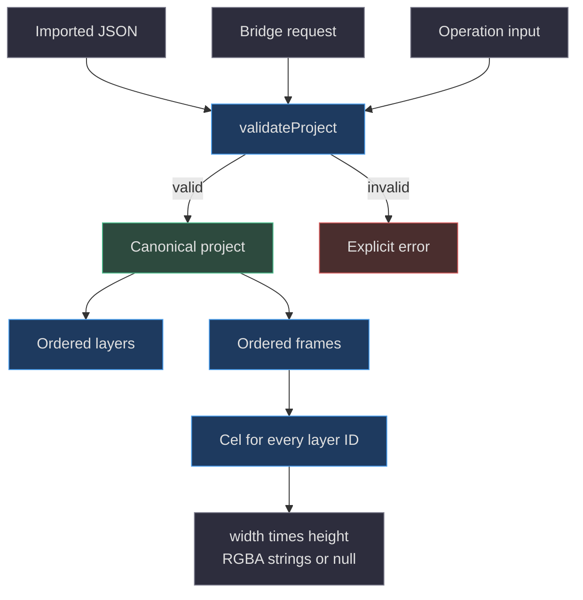

# 03. The editable project model

[Book home](../../README.md) · [Previous: agent collaboration](../02-agent-collaboration/README.md) · [Next: editing algorithms](../04-editing-algorithms/README.md)

## TL;DR

A SpriteCanvas project is a complete editable document, not a PNG with metadata.
Every frame contains one row-major pixel array for every layer.
`validateProject` returns a fresh, normalized document and rejects unsupported
sizes, missing cels, malformed colors, and invalid identities.
Its limits apply to allocated cells, including transparent and hidden ones.
([web/lib/model.js:42](../../../web/lib/model.js#L42-L87))



The bridge and CLI call this same function instead of maintaining their own
project schemas. That prevents an operation script from producing a document
the browser cannot interpret.
([server.mjs:100](../../../server.mjs#L100-L106),
[scripts/agent.mjs:70](../../../scripts/agent.mjs#L70-L75))

## 1. Required JSON fields

The executable schema is the validator; there is no separate JSON Schema file
in this path. The following tables describe what it accepts and returns.
Fields labeled required are not silently populated during validation.
([web/lib/model.js:42](../../../web/lib/model.js#L42-L87))

| Project field | Accepted value | Normalized behavior |
|---|---|---|
| `format` | Exactly `"spritecanvas"` | Returned unchanged |
| `version` | Numeric `1` | String `"1"` is not accepted |
| `id` | Nonblank string, at most 80 characters | Preserved; not required to be a UUID |
| `name` | Nonblank string, at most 120 characters | Preserved, including surrounding whitespace |
| `width`, `height` | Integers from 1 through 256 | No numeric-string coercion |
| `palette` | Array of at most 256 color values | Normalize colors, remove transparent entries and duplicates |
| `layers` | Array of 1–24 layer objects | Preserve ordering |
| `frames` | Array of 1–64 frame objects | Preserve ordering |

| Layer field | Requirement |
|---|---|
| `id` | Nonblank string up to 80 characters; only `\w` and `-`; unique within layers |
| `name` | Nonblank string up to 120 characters |
| `visible` | Boolean, not `0`, `1`, or text |
| `locked` | Boolean |
| `opacity` | Finite number in `[0, 1]` |

Layer IDs additionally reject the exact values `__proto__`, `constructor`,
and `prototype`. Frame and project IDs do **not** share this regular-expression
restriction. Frame IDs must be unique within frames and use the same nonblank,
80-character text constraint; uniqueness is not checked across entity kinds.
Layer names need not be unique.
([web/lib/model.js:54](../../../web/lib/model.js#L54-L72))

| Frame field | Requirement |
|---|---|
| `id` | Nonblank string up to 80 characters; unique within frames |
| `duration` | Integer milliseconds from 20 through 10,000 |
| `cels` | Must provide an array at each declared layer ID |
| `cels[layerId]` | Exactly `width * height` pixel entries |

The validator reconstructs project, layer, frame, and cel objects.
Unknown top-level properties and cel entries for undeclared layers are omitted,
not preserved as arbitrary extension data.
([web/lib/model.js:65](../../../web/lib/model.js#L65-L86))

## 2. Defaults belong to construction, not validation

`createProject()` defaults to **32 × 32**, name `"Untitled sprite"`,
one `"Ink"` layer, and one 120 ms frame. It generates IDs through
`crypto.randomUUID`, creates transparent cells, and normalizes the default
swatches to eight-digit colors.
([web/lib/model.js:9](../../../web/lib/model.js#L9-L10),
[web/lib/model.js:31](../../../web/lib/model.js#L31-L41))

The initial bridge workspace deliberately calls `createProject(50, 50, ...)`,
so a fresh server document is **50 × 50**, not the helper's 32 × 32 default.
Do not confuse a constructor default, an application entry point, and a loaded
user document.
([server.mjs:38](../../../server.mjs#L38-L40))

The sixteen six-digit source swatches are:

```text
#11131D #FFFFFF #B8C0D0 #555A73 #243B65 #448DE7 #70D6FF #008657
#41C691 #C2F078 #FFE65B #FFAF24 #D97543 #8E483F #F27D9A #AA79E6
```

Construction appends opaque alpha through `color`; validation does not insert
this palette when `palette` is missing.
([web/lib/model.js:3](../../../web/lib/model.js#L3-L7),
[web/lib/model.js:37](../../../web/lib/model.js#L37-L39))

## 3. Worked 2 × 2 document

This is a complete, valid sample with intentionally simple IDs.
It is not a handoff, proposal envelope, or an actual user's workspace.

```json
{
  "format": "spritecanvas",
  "version": 1,
  "id": "sample-project",
  "name": "Two by two",
  "width": 2,
  "height": 2,
  "palette": ["#FF0000", "#0000FF"],
  "layers": [
    {
      "id": "ink",
      "name": "Ink",
      "visible": true,
      "locked": false,
      "opacity": 1
    }
  ],
  "frames": [
    {
      "id": "frame-1",
      "duration": 120,
      "cels": {
        "ink": ["#FF0000", null, "#0000FF80", "#FFFFFF"]
      }
    }
  ]
}
```

Validation returns the red and white pixels with `FF` alpha, keeps the blue
pixel's `80` alpha, and leaves the top-right pixel transparent.
The blue pixel is legal even though that exact RGBA value is not in the palette.
([web/lib/model.js:11](../../../web/lib/model.js#L11-L18),
[web/lib/model.js:74](../../../web/lib/model.js#L74-L86))

```text
Coordinate      Array index      Stored normalized value
(0, 0)          0                #FF0000FF
(1, 0)          1                null
(0, 1)          2                #0000FF80
(1, 1)          3                #FFFFFFFF
```

For width `W`, `index = y * W + x`.
The compositor uses `index * 4` for the corresponding RGBA byte offset.
Adding a second layer requires another four-entry array in this frame;
adding a second frame requires a cel for every existing layer.
([web/lib/model.js:99](../../../web/lib/model.js#L99-L117),
[web/lib/model.js:196](../../../web/lib/model.js#L196-L213))

## 4. Palette and pixel colors are different data structures

```mermaid
flowchart LR
    accTitle: Swatches do not index the document
    accDescr: Editing swatches and direct RGBA cells are independent; output quantization creates a new palette.
    Swatches["project.palette<br>editing choices"] -.->|may suggest a color| Cells["Cel RGBA values"]
    Cells --> Composite["Visible RGBA composite"]
    Composite --> Histogram["GIF histogram"]
    Histogram --> Palette["Animation output palette"]
    style Swatches fill:#5a4a2e,stroke:#d4a84b,color:#e0e0e0
    style Cells fill:#1e3a5f,stroke:#4a9eed,color:#e0e0e0
    style Composite fill:#1e3a5f,stroke:#4a9eed,color:#e0e0e0
    style Histogram fill:#2d4a3e,stroke:#4aba8a,color:#e0e0e0
    style Palette fill:#2d4a3e,stroke:#4aba8a,color:#e0e0e0
```



Replacing `project.palette` alone cannot recolor existing cells: cels contain
color strings rather than palette indices. `applyOperations` opportunistically
adds a used color to the swatches while there is capacity, but still paints
when the palette already contains 256 entries.
([web/lib/model.js:251](../../../web/lib/model.js#L251-L264))

GIF proves the separation: it builds a histogram from composited pixels.
The exact-color test empties the editor palette and requires identical GIF
bytes. This is not a claim that all RGBA colors survive GIF conversion;
alpha reduction and quantization are separate operations.
([web/lib/gif.js:16](../../../web/lib/gif.js#L16-L35),
[tests/gif.test.mjs:94](../../../tests/gif.test.mjs#L94-L110))

## 5. Normalization and equality

`color` accepts only `null`, `#RRGGBB`, or `#RRGGBBAA`, case-insensitively.
It uppercases strings, appends `FF` when alpha is absent, and converts any
`00`-alpha color to `null`. CSS names, three-digit shorthand, and `rgb(...)`
are not accepted project pixels.
([web/lib/model.js:11](../../../web/lib/model.js#L11-L18))

`sameProject(a, b)` validates both arguments, then compares their serialized
normalized documents. Thus case or six-versus-eight-digit opaque spelling can
normalize away, while palette order, layer order, names, duration, and hidden
pixels still matter. Equality is neither object identity nor screenshot equality.
([web/lib/model.js:80](../../../web/lib/model.js#L80-L90))

This is why a proposal with identical visible pixels can still be structurally
different. Read [review protocol](../06-review-protocol/README.md) before using
a zero-pixel difference count as evidence that two projects are interchangeable.

## 6. The cell budget is multiplicative

```text
editable cells = width × height × number of layers × number of frames
maximum        = 2,000,000
```

Transparent cells count. Hidden layers count. Locked layers count.
The formula bounds the dense editable structure, not the number of visible
marks, number of palette colors, GIF output pixels, or serialized byte length.
([web/lib/model.js:51](../../../web/lib/model.js#L51-L53))

A 256 × 256 project with 24 layers and one frame uses **1,572,864** cells.
A second frame would require **3,145,728**, so `addFrame` refuses it even though
the frame count would be far below 64. The test constructs this exact pressure
case.
([web/lib/model.js:204](../../../web/lib/model.js#L204-L207),
[tests/model.test.mjs:22](../../../tests/model.test.mjs#L22-L32))

`addLayer`, `addFrame`, and `resizeProject` check the projected count before
allocating their new cel arrays. They do not silently crop layers or drop
frames to fit the limit.
([web/lib/model.js:196](../../../web/lib/model.js#L196-L228))

## 7. Errors and caller responsibilities

| Invalid input | Representative error | Correct response |
|---|---|---|
| Width `0`, `257`, or `"32"` | `Width must be an integer...` | Supply a numeric integer in range |
| Wrong cel length | `A cel has the wrong pixel count.` | Rebuild all affected frame–layer arrays |
| Unsafe or duplicate layer ID | `Layer IDs must be unique safe identifiers.` | Choose a safe unique key and update cel keys |
| Duration outside 20–10,000 | `Frame duration must be an integer...` | Correct milliseconds before export |
| Missing/oversized palette | `Palette must contain at most 256 colors.` | Supply an array; empty is allowed |
| Allocation over budget | `Project is too large...` | Reduce dimensions, layers, or frames |

These are JavaScript `Error` messages, not a typed domain-error hierarchy.
Malformed nested objects can also trigger native exceptions; callers should
handle failure rather than depend on every invalid shape having one exact
message. Bridge route handling maps ordinary validation errors to HTTP 400.
([web/lib/model.js:19](../../../web/lib/model.js#L19-L87),
[server.mjs:143](../../../server.mjs#L143-L147))

Tests cover normalization, unsafe identities, cell counts, independent frames,
and preservation of the base during operations. They are a useful starting
point for a format change, not permission to change v1 without considering
existing files.
([tests/model.test.mjs:11](../../../tests/model.test.mjs#L11-L32),
[tests/model.test.mjs:81](../../../tests/model.test.mjs#L81-L115))

Continue with [coordinate-level algorithms](../04-editing-algorithms/README.md),
[compositing](../05-rendering-compositing/README.md), or the
[glossary](../../appendices/glossary.md).
