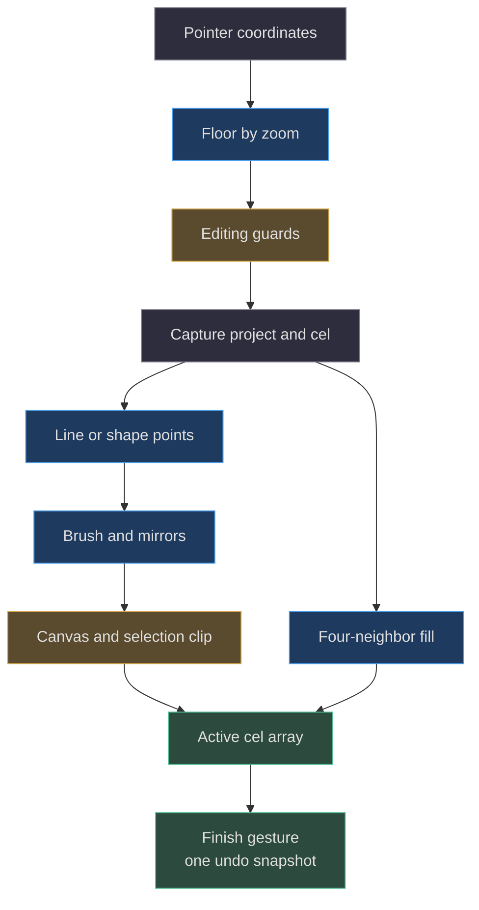
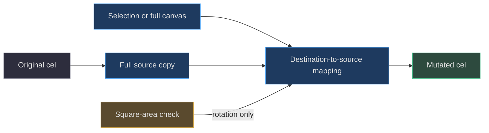

# 04. Editing algorithms and coordinate systems

[Book home](../../README.md) · [Previous: project model](../03-project-model/README.md) · [Next: compositing](../05-rendering-compositing/README.md)

## TL;DR

Editing mutates the active cel's dense row-major array.
Geometry produces integer points; `paint` expands brush footprints, mirrors
coordinates, and clips writes. Fill and transforms use different paths.
The browser owns gesture snapshots and undo, while `applyOperations` validates
and edits a fresh project for a proposal.
([web/lib/model.js:137](../../../web/lib/model.js#L137-L195),
[web/app.js:379](../../../web/app.js#L379-L437),
[scripts/agent.mjs:70](../../../scripts/agent.mjs#L70-L76))



## 1. Three coordinate spaces

The pointer arrives in browser client coordinates. `point` subtracts the
overlay's bounding rectangle and divides by zoom, using `Math.floor`.
Dragging non-pan tools requests additional clamping to the native canvas.
Cel coordinates then become `y * width + x`.
([web/app.js:350](../../../web/app.js#L350-L355),
[web/app.js:408](../../../web/app.js#L408-L409),
[web/lib/model.js:178](../../../web/lib/model.js#L178-L179))

For width 4, row-major indexing is:

```text
          x=0 x=1 x=2 x=3
y=0        0   1   2   3
y=1        4   5   6   7
y=2        8   9  10  11
```

At zoom 10, a pointer 27 CSS pixels right and 16 down from the overlay origin
maps to native `(2, 1)`, then index `6`. Changing zoom does not resize the
stored cel. RGBA output uses four bytes per cell, so the compositor's byte
offset is `4 * 6 = 24`.
([web/app.js:350](../../../web/app.js#L350-L355),
[web/lib/model.js:106](../../../web/lib/model.js#L106-L114))

## 2. Line stepping is integer Bresenham

`linePoints` tracks signed X/Y directions and one error accumulator.
On each iteration it emits the current point, tests for the endpoint, and
uses twice the error to decide which axes advance.
This avoids floating-point interpolation and includes both endpoints.
([web/lib/model.js:137](../../../web/lib/model.js#L137-L150))

For `(0,0)` to `(4,2)`, the emitted points are:

```text
(0,0), (1,1), (2,1), (3,2), (4,2)

X....
.XX..
...XX
```

The pencil joins successive pointer positions with these lines, so a skipped
browser pointer event need not leave a hole between samples.
Shape tools instead restore the captured cel before repainting the latest
preview, preventing a dragged rectangle from accumulating earlier outlines.
([web/app.js:417](../../../web/app.js#L417-L422))

The tests check diagonal forward/reverse examples and shallow-line length.
Do not generalize their “reversible” title into a guarantee that every
tie-breaking slope returns the exact reverse list: the actual inequalities
in `linePoints` are the contract.
([tests/model.test.mjs:34](../../../tests/model.test.mjs#L34-L41))

## 3. Rectangles and ellipses scan an inclusive bounding box

`shapePoints` normalizes the two corners into left/right/top/bottom.
Rectangle outlines include cells on any of the four edges; filled rectangles
include the entire box.
([web/lib/model.js:151](../../../web/lib/model.js#L151-L166))

Ellipse radii are `(right-left+1)/2` and `(bottom-top+1)/2`, with center
`((left+right)/2, (top+bottom)/2)`.
A cell is inside when its normalized squared distance is at most 1.
An outline cell must be inside and have at least one four-neighbor outside.
This is a bounding-box scan with an inside test, not a midpoint-ellipse
algorithm or antialiased vector path.
([web/lib/model.js:156](../../../web/lib/model.js#L156-L164))

For a 5 × 5 box from `(0,0)` to `(4,4)`:

```text
Filled ellipse       Outline ellipse
.XXX.                .XXX.
XXXXX                X...X
XXXXX                X...X
XXXXX                X...X
.XXX.                .XXX.
```

The inclusive `+1` radius makes a one-cell ellipse meaningful instead of
creating a zero denominator. Single-pixel and bounded ellipse cases have
dedicated tests.
([tests/model.test.mjs:63](../../../tests/model.test.mjs#L63-L68))

## 4. Brush footprint, mirroring, and selection

For brush size `s`, `paint` places an `s × s` square around each point using
offset `floor(s/2)`. Even sizes therefore have an asymmetric integer footprint:
size 2 around `(2,2)` covers X/Y values 1 and 2, not 2 and 3.
([web/lib/model.js:171](../../../web/lib/model.js#L171-L180))

For each footprint coordinate `(x,y)`, X mirroring adds `width-1-x`,
and Y mirroring adds `height-1-y`. The combinations are then checked against
the canvas and the selection. Repeated coordinates at a symmetry axis are
not deduplicated; assigning the same color again is harmless.
([web/lib/model.js:175](../../../web/lib/model.js#L175-L179))

Selections use half-open bounds:

```text
x >= selection.x        x < selection.x + selection.w
y >= selection.y        y < selection.y + selection.h
```

This convention includes exactly `w*h` cells and avoids double-counting a
right or bottom edge. The selection test is applied to the **destination**
after mirroring, so mirrored paint does not escape the selected rectangle.
([web/lib/model.js:168](../../../web/lib/model.js#L168-L180))

## 5. Flood fill changes an exact-color connected component

The fill starts only inside the canvas and selection.
It returns immediately if the target value already equals the replacement.
Otherwise an explicit stack explores left, right, up, and down.
Writing the replacement marks a cell visited; no separate visited bitmap
is needed because the replacement differs from the target.
([web/lib/model.js:182](../../../web/lib/model.js#L182-L195))

```text
Before: fill "." at (1,1)       After
#####                         #####
#...#                         #RRR#
#.#.#                         #R#R#
#...#                         #RRR#
#####                         #####
```

There is no tolerance, diagonal connectivity, or “sample all visible layers”
in this fill implementation. It compares stored cel values, not composited
screen colors. Two cells with different alpha strings can render similarly
but remain different fill targets.
([web/lib/model.js:184](../../../web/lib/model.js#L184-L193),
[web/app.js:398](../../../web/app.js#L398-L400))

## 6. Transforms read a copy, then write destinations



Within a local area of width `w`, height `h`, destination `(x,y)` reads:

| Operation | Source X | Source Y |
|---|---|---|
| `flip-x` | `w - 1 - x` | `y` |
| `flip-y` | `x` | `h - 1 - y` |
| `rotate` | `y` | `h - 1 - x` |

Thus clockwise rotation maps the 2 × 2 grid `AB / CD` to `CA / DB`.
Rotation requires a square canvas or square selection.
`transformCel` trusts the caller's selection bounds; unlike `paint`, its
inner loop does not clip arbitrary out-of-range selection coordinates.
([web/lib/model.js:229](../../../web/lib/model.js#L229-L238))

Resize is different: it visits **every frame and layer**, allocates new arrays,
and copies surviving coordinates. Centering uses `floor((new-old)/2)`,
so odd dimension changes have a deliberate integer bias; cropping discards
cells outside the new dimensions.
([web/lib/model.js:214](../../../web/lib/model.js#L214-L228))

## 7. Move, clipboard, and gesture ownership

`movePixels` copies the source cel, clears the old rectangle, then pastes
the source rectangle at an offset with canvas clipping.
Transparent source cells are copied too; they can erase destination marks.
The selection's visible rectangle is clipped separately.
([web/app.js:365](../../../web/app.js#L365-L377))

Copy uses the active cel, not a flattened image of all visible layers.
Cut calls the regular clear operation. Paste starts at the selection origin
when one exists, otherwise near the original copied origin; it clips at
the canvas edge, not to the previous selection's width and height.
It then selects the pasted extent and activates Move.
([web/app.js:453](../../../web/app.js#L453-L477))

Browser `editable()` blocks drawing during playback, on a locked layer,
or on a hidden layer. These are UI guards, not properties of raw array
assignment. `applyOperations` checks locks but does not reject hidden layers.
A directly authored candidate project is validated structurally; validation
does not enforce “never change cells on a previously locked layer.”
Respect for protected artwork also depends on the agent workflow.
([web/app.js:44](../../../web/app.js#L44-L48),
[web/lib/model.js:239](../../../web/lib/model.js#L239-L255),
[AGENTS.md:18](../../../AGENTS.md#L18-L24))

## 8. Honest complexity bounds

Let `N=W*H`, `A` be selected/bounding-box area, `P` the emitted point count,
`s` brush size, `F` frame count, and `L` layer count.
These are bounds derived from loops, **not measured timings**.

| Operation | Time | Additional storage | Why |
|---|---|---|---|
| Line points | `O(max(abs(dx),abs(dy))+1)` | `O(P)` | One point per stepping iteration |
| Rectangle/ellipse points | `O(A)` | `O(A)` worst case | Scan entire bounding box |
| Paint | `O(P*s²)` | Constant besides supplied points | At most four mirrored assignments per brush cell |
| Flood fill | `O(A)` within reachable region bound | `O(A)` worst case | A changed cell pushes four neighbors |
| Cel transform | `O(N+A)` | `O(N)` | Copies full cel even for small selection |
| Resize | `O(FL*(old N + new N))` | New cel storage | Allocate and scan each cel |
| Browser move | `O(N+A)` | `O(N)` | Copy plus clear-and-paste loops |

Sources: ([web/lib/model.js:137](../../../web/lib/model.js#L137-L238),
[web/app.js:365](../../../web/app.js#L365-L377)).
Whole-project validation, history snapshots, redraw, and autosave add costs
outside these primitive bounds.
([web/app.js:53](../../../web/app.js#L53-L80),
[web/lib/export.js:4](../../../web/lib/export.js#L4-L12))

## 9. Regression entry points

Start with the model tests for exact point sets, fill boundaries, selection
clipping, transforms, and independent frame arrays. Then check browser gesture
behavior in an isolated fixture; never use a live artwork workspace as a test.
([tests/model.test.mjs:34](../../../tests/model.test.mjs#L34-L99),
[playwright.config.js:15](../../../playwright.config.js#L15-L18))

For scripted drawing syntax see [bridge and CLI](../08-loopback-bridge-cli/README.md).
For why a screen pixel may not match a cel value, continue to
[rendering and compositing](../05-rendering-compositing/README.md).
