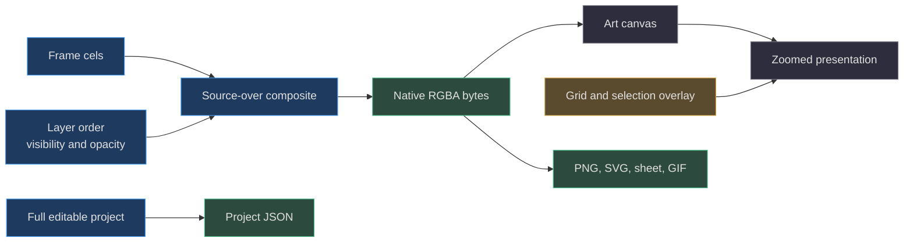
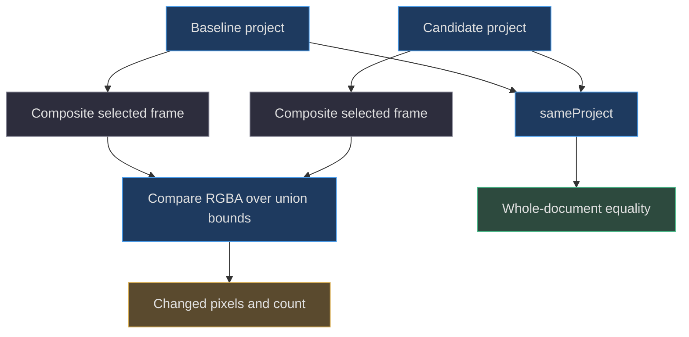

# 05. Rendering, compositing, and export

[Book home](../../README.md) · [Previous: editing algorithms](../04-editing-algorithms/README.md) · [Next: review protocol](../06-review-protocol/README.md)

## TL;DR

`composite` visits layers in array order, blending later layers over earlier
ones with source-over alpha. Native project pixels are separate from zoom,
grid, onion skin, and selection decoration. Exports derive from the project
composite, not a screenshot of the studio.
PNG/SVG can retain partial alpha; GIF intentionally cannot.
([web/lib/model.js:99](../../../web/lib/model.js#L99-L117),
[web/app.js:276](../../../web/app.js#L276-L327),
[web/lib/export.js:32](../../../web/lib/export.js#L32-L75))



## 1. Why compositing is not editing

A cel stores the marks for one layer at one time.
The screen must combine those marks to answer “what is visible here?”
`composite` creates a new `Uint8ClampedArray`; it never rewrites the cel arrays
with the blended result. Hiding or reducing a layer therefore does not destroy
its stored colors.
([web/lib/model.js:99](../../../web/lib/model.js#L99-L117))

This distinction is foundational to editability. A flattened screenshot has
already discarded layer identity and obscured pixels.
The actual model retains every frame–layer array even when a layer contributes
nothing to the current image.
([web/lib/model.js:73](../../../web/lib/model.js#L73-L79))

## 2. Layer order, visibility, and opacity

The first layer in `project.layers` is composited first.
Each subsequent visible layer is a source placed over the accumulated result.
Invisible layers and layers whose opacity is zero are skipped completely.
Null cel entries are skipped at the pixel level.
([web/lib/model.js:102](../../../web/lib/model.js#L102-L108))

`locked` does not affect rendering. It is an editing guard, not a visibility
flag. Likewise, frame duration does not alter color blending; it is consumed
by animation playback/export.
([web/lib/model.js:99](../../../web/lib/model.js#L99-L117),
[web/app.js:44](../../../web/app.js#L44-L48),
[web/lib/gif.js:56](../../../web/lib/gif.js#L56-L62))

| Change | Stored cel values change? | Composite can change? |
|---|---|---|
| Layer opacity | No | Yes |
| Layer visibility | No | Yes |
| Layer order | No | Yes |
| Layer lock | No | No |
| Palette swatches only | No | No |

The table follows directly from the fields read by `composite`.
It is not a statement that these operations are equivalent under project
equality; `sameProject` includes all validated project fields.
([web/lib/model.js:88](../../../web/lib/model.js#L88-L117))

## 3. Source-over RGBA from first principles

Let `Cs` be a source color channel, `Cd` the accumulated destination channel,
`As` source alpha, and `Ad` accumulated destination alpha, all alphas in `[0,1]`.
The implementation first multiplies pixel alpha by layer opacity:

```text
As = source_alpha_byte / 255 * layer.opacity
Ad = destination_alpha_byte / 255
Aout = As + Ad * (1 - As)
Cout = (Cs * As + Cd * Ad * (1 - As)) / Aout
```

If `Aout` is zero, no division occurs.
The output stores straight/unassociated RGB channels and an alpha byte,
not premultiplied channels in the project model.
Assignments into `Uint8ClampedArray` quantize the accumulated values to bytes
after each layer.
([web/lib/model.js:109](../../../web/lib/model.js#L109-L114))

The calculation is performed on the stored numeric RGB bytes.
There is no explicit conversion to linear-light color space.
Consequently, describe it as the implemented byte-space source-over blend,
not as a colorimetrically accurate light-transport simulation.
([web/lib/model.js:91](../../../web/lib/model.js#L91-L117))

### Worked one-pixel stack

Start with an opaque blue lower layer, `#0000FFFF`.
Place opaque red, `#FF0000FF`, on an upper layer with opacity 0.5.

```text
As = 1 * 0.5 = 0.5
Ad = 1
Aout = 0.5 + 1 * 0.5 = 1
Rout = (255 * 0.5 + 0 * 1 * 0.5) / 1 = 127.5
Gout = 0
Bout = (0 * 0.5 + 255 * 1 * 0.5) / 1 = 127.5
Stored output = [128, 0, 128, 255]
```

The model test asserts this exact output, then hides the upper layer and
expects blue, then restores full upper opacity and expects red.
([tests/model.test.mjs:70](../../../tests/model.test.mjs#L70-L79))

If red instead sits over transparency, the output is approximately red with
half alpha, not dark red with full alpha. A later display background determines
how that translucent red looks; the project has not painted that background.
([web/lib/model.js:109](../../../web/lib/model.js#L109-L114))

## 4. Native resolution versus presentation scale

`renderPixels` keeps a canvas's bitmap at the supplied native width and height
and writes an `ImageData` object. `projectCanvas` constructs a fresh native
canvas directly from `composite`.
([web/lib/export.js:4](../../../web/lib/export.js#L4-L12))

The editor's wrapper uses `project.width * zoom` and `project.height * zoom`
for presentation dimensions. The overlay is resized to those presentation
dimensions for crisp grid and selection strokes.
Thus a 20 × 20 project at 10× is still a 400-cell cel, not a 40,000-cell cel.
([web/app.js:292](../../../web/app.js#L292-L300))

Onion skin is drawn behind the art canvas using the preceding frame,
`destination-over`, and `globalAlpha = 0.25`, only when not playing and when
more than one frame exists. The preview uses the unmodified current-frame
composite. Onion skin is not painted into project data.
([web/app.js:276](../../../web/app.js#L276-L290))

The grid, mirror guides, selection border, and brush preview are overlay
operations. Exporting the project does not capture those controls.
([web/app.js:301](../../../web/app.js#L301-L327),
[web/lib/export.js:32](../../../web/lib/export.js#L32-L75))

## 5. Difference is a rendered diagnostic, not a merge



`difference` composites each project, clamping an overly large requested
frame index to its last frame. It compares over the maximum width and height,
treating locations outside either canvas as transparent.
Changed locations become `[190,246,104,255]`; unchanged locations retain the
candidate RGB with alpha reduced to about 22%.
([web/lib/model.js:119](../../../web/lib/model.js#L119-L136))

A larger but entirely transparent canvas can produce zero changed pixels.
A hidden-layer edit or palette reorder can also leave the displayed image
unchanged. Acceptance therefore checks complete baseline equality and
revision, not the difference count.
([tests/model.test.mjs:117](../../../tests/model.test.mjs#L117-L123),
[server.mjs:123](../../../server.mjs#L123-L125))

## 6. Export contracts and alpha differences

| Format | What is exported | Transparency | Retains editable layers? |
|---|---|---|---|
| Project JSON | Full project object | Original RGBA/null cells | Yes |
| PNG | Selected composited frame at scale | Partial alpha via canvas PNG | No |
| SVG | One unit rectangle per nontransparent composited pixel | Per-rectangle opacity | No |
| Sprite sheet | All composited frames tiled into PNG plus JSON | Partial alpha via canvas PNG | No |
| GIF | All frames through indexed encoder | Transparent index or opaque white-matted RGB | No |

Sources: ([web/lib/export.js:32](../../../web/lib/export.js#L32-L75),
[web/lib/gif.js:20](../../../web/lib/gif.js#L20-L35)).

PNG and sprite-sheet enlargement disable image smoothing.
For sheets, `cols=min(columns,frames)` and `rows=ceil(frames/cols)`;
metadata records scaled rectangles, frame IDs, scale, and durations.
Empty trailing sheet slots remain empty canvas pixels.
([web/lib/export.js:54](../../../web/lib/export.js#L54-L70))

SVG uses native coordinates in its `viewBox` while scaling its declared
width and height. The rectangles are derived from the composite; they are
not original per-layer objects suitable for reconstructing hidden artwork.
([web/lib/export.js:43](../../../web/lib/export.js#L43-L52))

GIF applies its alpha threshold only **after** layer compositing.
Alpha below 0.5 becomes transparent; remaining partial alpha is matted over
white before RGB quantization. PNG is the safer choice when translucent edges
must remain translucent on arbitrary backgrounds.
([web/lib/gif.js:18](../../../web/lib/gif.js#L18-L28),
[tests/gif.test.mjs:141](../../../tests/gif.test.mjs#L141-L151))

## 7. Limits and failure paths

The PNG/sheet canvas path rejects more than **16,000,000** output pixels or
either dimension above **16,384**. GIF branches earlier and delegates its
separate **32,000,000 total frame pixels** budget to `encodeGif`.
Do not apply the PNG/sheet limit to GIF.
([web/lib/export.js:39](../../../web/lib/export.js#L39-L57),
[web/lib/gif.js:7](../../../web/lib/gif.js#L7-L15))

A PNG `toBlob` failure raises an explicit smaller-export suggestion.
Downloaded blobs use object URLs that are revoked after 30 seconds.
These mechanisms are output handling, not project persistence.
([web/lib/export.js:17](../../../web/lib/export.js#L17-L30))

Compositing one frame is `O(W*H*L)` in the worst case with `O(W*H)` output
storage. The function scans every pixel of each contributing layer;
there is no dirty-rectangle cache in this implementation.
That is a loop-derived bound, not a measured frame-rate promise.
([web/lib/model.js:99](../../../web/lib/model.js#L99-L117))

For exact GIF mathematics continue to [quantization](../09-gif-quantization/README.md).
For why a candidate remains editable until accepted, read
[review protocol](../06-review-protocol/README.md).
