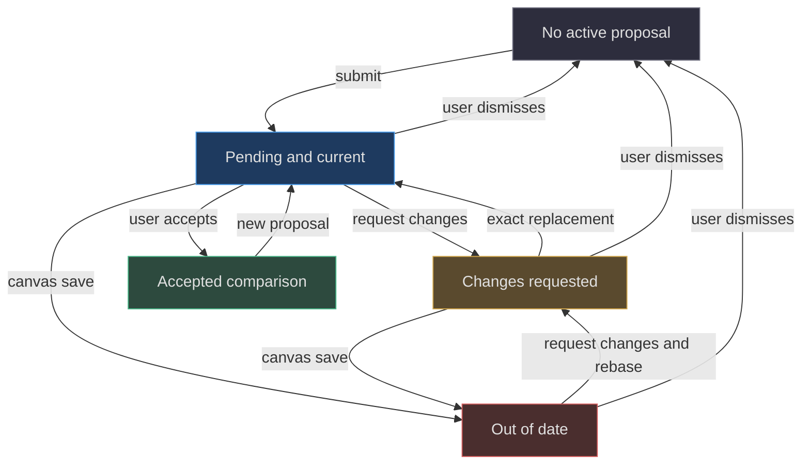
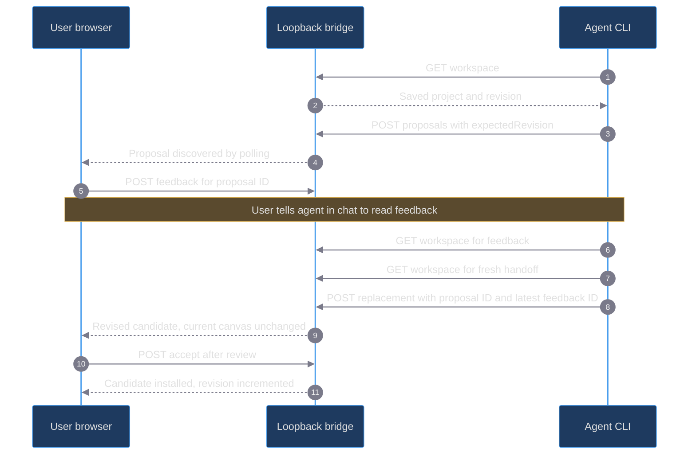

# 06. The review protocol

[Book home](../../README.md) · [Previous: compositing](../05-rendering-compositing/README.md) · [Next: persistence](../07-persistence-concurrency/README.md)

## TL;DR

A proposal never replaces current artwork on arrival.
The user can inspect it, request changes, dismiss it, or explicitly accept it.
Acceptance requires the current proposal, no open feedback, the original
canvas revision, and the same normalized baseline.
Revisions must replace the exact active proposal and answer its latest open
feedback ID. Feedback is saved guidance; it does not wake a chat agent.
([server.mjs:103](../../../server.mjs#L103-L128),
[web/lib/review.js:51](../../../web/lib/review.js#L51-L65),
[web/app.js:657](../../../web/app.js#L657-L660))



This is a conceptual finite-state view, not a stored `proposal.status` enum.
Staleness and open feedback can coexist. The browser derives badges from
current snapshots, revisions, dirty state, and feedback; “changes requested”
takes display precedence over “out of date.”
([web/app.js:538](../../../web/app.js#L538-L559))

## 1. Four identities that must not be conflated

| Value | Identifies | Changes when |
|---|---|---|
| `project.id` | The editable document | Loading/creating a different project |
| `revision` | Saved current-canvas generation | A different project is saved, or a proposal is accepted |
| `proposal.id` | One particular candidate submission | Every new/replacement proposal |
| `feedback.id` | One saved request for changes | Every feedback submission |

The server requires a proposal to retain `project.id`.
Its `baseRevision` is assigned from server state; it is not a client-chosen
revision field copied into the proposal record.
([server.mjs:105](../../../server.mjs#L105-L111))

Creating a proposal, saving feedback, replacing a proposal, and rejecting a
proposal do not increment the canvas revision.
Therefore `expectedRevision` alone cannot detect a newer feedback request.
The proposal and feedback IDs close that separate review race.
([server.mjs:102](../../../server.mjs#L102-L128),
[web/lib/review.js:51](../../../web/lib/review.js#L51-L60))

## 2. The two snapshots

On local submission, the server validates the candidate and clones current
artwork into `baseProject`. The active `state.project` remains untouched.
The complete proposal contains:

```text
id, baseRevision, baseProject, project, title, createdAt
optional: replacesProposalId, respondsTo
```

`title` must be nonblank text of at most 160 characters.
The server preserves the supplied title rather than trimming it.
([server.mjs:103](../../../server.mjs#L103-L114))

At acceptance, the candidate is cloned into the current project.
The previous proposal becomes `comparison` with `acceptedAt`.
Later drawing does not rewrite either side of that accepted comparison.
The browser opens a cloned `currentComparison` so an open review can remain
inspectable even if it has been superseded.
([server.mjs:126](../../../server.mjs#L126-L127),
[web/app.js:560](../../../web/app.js#L560-L575))

## 3. Local sequence: request, revise, then accept



The “discovered by polling” arrows summarize browser GET requests, not server
push. The browser schedules a poll every 1,800 ms and skips it during
conflicting local activity. There is no feedback-to-agent notification channel.
([web/app.js:147](../../../web/app.js#L147-L174),
[web/app.js:1125](../../../web/app.js#L1125-L1127),
[scripts/agent.mjs:24](../../../scripts/agent.mjs#L24-L59))

## 4. Staleness checks are intentionally redundant

The bridge first requires every API POST to carry the current
`expectedRevision`. Accept then requires:

1. The submitted `proposalId` is still the active proposal.
2. There is no latest open feedback for that proposal.
3. `proposal.baseRevision === state.revision`.
4. `sameProject(proposal.baseProject, state.project)` is true.

These checks protect different transitions. A fresh request revision does not
make an old proposal current. A matching numeric baseline does not substitute
for matching normalized document content.
([server.mjs:99](../../../server.mjs#L99-L99),
[server.mjs:119](../../../server.mjs#L119-L127))

`sameProject` includes structure, swatch order, timing, hidden cells, and names.
It is not the visual-difference count from the compare view.
See [compositing](../05-rendering-compositing/README.md#5-difference-is-a-rendered-diagnostic-not-a-merge).
([web/lib/model.js:88](../../../web/lib/model.js#L88-L90))

A stale proposal remains inspectable. To proceed, the user can request changes
and the agent can rebase with the exact replacement IDs, or the user can dismiss
the old proposal before a fresh submission. The server does not merge candidate
pixels with newer user marks.
([web/lib/review.js:51](../../../web/lib/review.js#L51-L60),
[web/app.js:538](../../../web/app.js#L538-L559))

## 5. Feedback fields and limits

`createFeedback` returns:

| Field | Meaning |
|---|---|
| `id` | Newly generated review-entry UUID |
| `proposalId`, `proposalTitle` | Candidate being discussed |
| `proposalBaseRevision` | Candidate's original canvas revision |
| `canvasRevision` | Canvas revision when feedback is recorded |
| `message` | Trimmed, nonblank text, 1–4,000 characters |
| `reference` | Validated image object or `null` |
| `status` | Initially `"open"` |
| `createdAt` | ISO timestamp |

The two revision fields may differ: the user can request changes on a proposal
after continuing to draw. That is information for rebasing, not permission to
overwrite the new canvas.
([web/lib/review.js:31](../../../web/lib/review.js#L31-L42),
[tests/review.test.mjs:12](../../../tests/review.test.mjs#L12-L21))

References accept only PNG, JPEG, or WebP MIME types.
They require a matching `data:<mime>;base64,` prefix, valid padded base64,
nonempty decoded bytes, and a matching PNG/JPEG/WebP header signature.
The decoded byte limit is **2 × 1024 × 1024** and filename length is 1–180.
This is header/signature validation, not full image decoding or sanitization.
([web/lib/review.js:3](../../../web/lib/review.js#L3-L29))

At most the most recent **12 feedback entries** are retained in the workspace.
The cap is global history, not twelve entries per proposal.
It is enforced when appending by slicing the array's tail.
([server.mjs:115](../../../server.mjs#L115-L118),
[web/app.js:653](../../../web/app.js#L653-L653))

Open entries become `"addressed"` when their proposal is replaced, with
`addressedBy` set to the new proposal ID. Dismissal changes open entries to
`"dismissed"` with `addressedBy: null`. Already resolved entries are unchanged.
There is no separate accepted-feedback status in this implementation.
([web/lib/review.js:62](../../../web/lib/review.js#L62-L65),
[server.mjs:112](../../../server.mjs#L112-L128))

## 6. Exact replacement example

Assume an illustrative workspace at revision **7** with active proposal
`sample-proposal-A`. The user creates feedback `sample-feedback-1`, then
adds `sample-feedback-2`.
These are explanatory sample IDs, not values to use against a live workspace.

```json
{
  "expectedRevision": 7,
  "title": "Revise the edge highlights",
  "replacesProposalId": "sample-proposal-A",
  "respondsTo": "sample-feedback-2",
  "project": "<complete candidate object in a real request>"
}
```

The string placeholder above is explanatory, not a valid project.
Using feedback 1 fails with HTTP 409 even though revision 7 is unchanged.
Omitting the proposal ID also fails.
On success, all open feedback for proposal A becomes addressed, and a newly
generated proposal ID identifies the revised candidate.
([web/lib/review.js:51](../../../web/lib/review.js#L51-L65),
[tests/review.test.mjs:35](../../../tests/review.test.mjs#L35-L49))

## 7. Static envelope walkthrough

Without a bridge, the browser downloads a handoff containing:

```text
format: "spritecanvas-handoff"
version: 1
revision: the browser's current revision
project: the current complete project
proposal: active proposal or null
feedback: current bounded feedback history
```

The agent returns a file with `format: "spritecanvas-proposal"`, `version: 1`,
`title`, unchanged `baseProject`, and edited `project`.
A revision file also carries `replacesProposalId` and `respondsTo`.
The browser validates both projects, checks baseline equality and project ID,
and applies the same replacement helper.
([web/app.js:510](../../../web/app.js#L510-L535),
[web/app.js:600](../../../web/app.js#L600-L604))

Do not send only an edited PNG or only a claimed revision number:
the static importer requires the baseline project object.
It assigns a new local proposal ID and current `baseRevision` after validation;
arbitrary supplied proposal metadata is not trusted as the active record.
([web/app.js:510](../../../web/app.js#L510-L517))

Static feedback is cached and a review handoff is downloaded for the user to
share. Local feedback is saved through the bridge and later read by the CLI.
Both are explicit handoffs of guidance, not automatic agent invocation.
([web/app.js:638](../../../web/app.js#L638-L665))

## 8. User authority and test evidence

The browser acceptance action first flushes edits, repeats review safety
checks, and preserves a before snapshot for Undo.
The CLI exposes proposal submission, not acceptance or rejection commands.
An HTTP acceptance endpoint existing does not grant an agent permission to
call it on the user's behalf.
([web/app.js:704](../../../web/app.js#L704-L720),
[scripts/agent.mjs:20](../../../scripts/agent.mjs#L20-L23),
[AGENTS.md:23](../../../AGENTS.md#L23-L24))

The bridge tests cover non-destructive submission, stale acceptance, durable
feedback, latest-ID replacement, and rejection of feedback on a superseded
proposal. These are source-inspected regression assertions, not test-run
results from this writing session.
([tests/bridge.test.mjs:58](../../../tests/bridge.test.mjs#L58-L92),
[tests/bridge.test.mjs:146](../../../tests/bridge.test.mjs#L146-L179))

Continue to [persistence and concurrency](../07-persistence-concurrency/README.md),
or read the distinct rationale in [review-first design](../12-design-principles/review-first.md).
