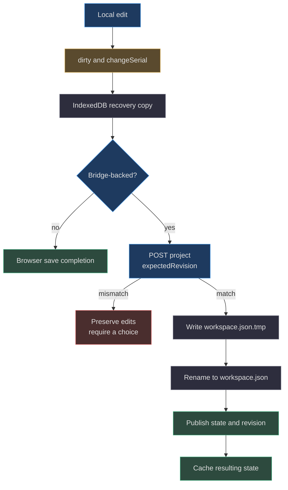
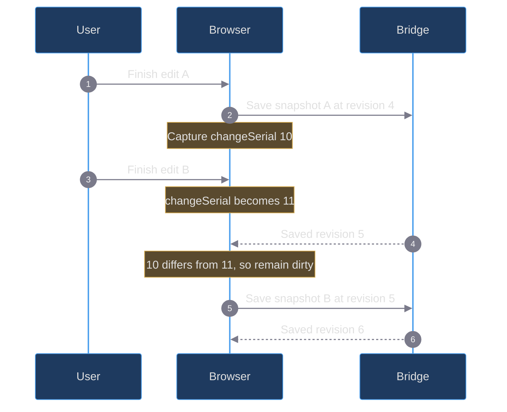

# 07. Persistence, concurrency, and recovery

[Book home](../../README.md) · [Previous: review protocol](../06-review-protocol/README.md) · [Next: bridge and CLI](../08-loopback-bridge-cli/README.md)

## TL;DR

The browser caches recovery state in IndexedDB.
With a bridge, the disk workspace has revision-checked saves; without it,
the browser is the working store. A single browser save promise serializes
requests, while a change serial prevents an old save response from declaring
newer edits clean. Disk commits write a temporary file, rename it, then
publish the new in-memory state.
None of this is a cross-process lock or a distributed transaction.
([web/app.js:81](../../../web/app.js#L81-L145),
[web/lib/storage.js:1](../../../web/lib/storage.js#L1-L23),
[server.mjs:19](../../../server.mjs#L19-L23))

The diagram shows the successful intended flow.
Browser-cache errors and disk errors are handled separately; the code does
not atomically commit IndexedDB and the filesystem together.
([web/app.js:103](../../../web/app.js#L103-L138))

## 1. What is actually stored

IndexedDB database **`spritecanvas-studio`**, version **1**, contains object
store **`workspace`**, using key **`current`**.
Opening creates the store during upgrade; reads fetch that one key.
([web/lib/storage.js:1](../../../web/lib/storage.js#L1-L15))

The browser cache includes clones of `project`, `proposal`, `comparison`,
and `feedback`, plus `revision`, `bridge`, and `pending`.
It does not include the undo/redo arrays, current selection, clipboard,
zoom, or the full interactive gesture state.
([web/app.js:18](../../../web/app.js#L18-L28),
[web/app.js:81](../../../web/app.js#L81-L83))

`writeStorage` resolves on **transaction completion**, not simply on the
individual `put` request's success. Transaction error and abort reject with
explicit advice to download a project.
That distinction prevents a queued write from being reported as completed.
([web/lib/storage.js:16](../../../web/lib/storage.js#L16-L23))

The bridge stores `{revision, project, proposal, comparison, feedback}` in
`workspace.json`. Its default directory is `.spritecanvas` under the repository,
with `--workspace` allowing a different directory.
It serves static content only from `web`, not from that storage directory.
([server.mjs:14](../../../server.mjs#L14-L17),
[server.mjs:38](../../../server.mjs#L38-L40),
[server.mjs:135](../../../server.mjs#L135-L142))

## 2. Dirty state is not the disk revision

`markChanged` compares before/after project serialization, optionally adds undo
history, increments `changeSerial`, and marks the browser dirty.
In browser-only mode it also increments the local revision.
With a bridge, the saved revision advances only after the server changes the
current project.
([web/app.js:59](../../../web/app.js#L59-L65),
[server.mjs:100](../../../server.mjs#L100-L102))

This avoids inventing a disk revision for every mouse movement.
A completed gesture can contain many pixel assignments but still produce one
history snapshot and one eventual save.
The save timer debounces for **400 ms**.
([web/app.js:91](../../../web/app.js#L91-L95),
[web/app.js:431](../../../web/app.js#L431-L437))

## 3. How saves are serialized

If `flushSave` sees an existing `savePromise`, it waits.
If edits are still dirty afterward and there is no conflict, it flushes again.
Otherwise it creates the one in-flight promise for this browser session.
([web/app.js:96](../../../web/app.js#L96-L103))

Within that promise it:

1. Attempts to cache a pending recovery snapshot.
2. Refuses to continue if a conflict is already known.
3. Captures `changeSerial`.
4. Posts a cloned project with `expectedRevision` when bridge-backed.
5. Adopts the returned revision and review state.
6. Clears dirty only if the serial has not changed.
7. Attempts another cache write and updates connection status.

This ordering is visible in `flushSave`; it is not an imagined job queue or
database transaction.
([web/app.js:103](../../../web/app.js#L103-L138))

## 4. Worked race: editing while a save is in flight

Numbers are illustrative. The important comparison is serial equality, not
the elapsed time between requests. On HTTP 409, the browser sets `conflict`;
on other API failures it marks the bridge offline and retains dirty work.
([web/app.js:112](../../../web/app.js#L112-L128))

Polling captures both `changeSerial` and `reviewEpoch`, then rechecks them
after its GET returns. It also checks active save, drag, and review activity.
This prevents an already-started poll from adopting obsolete state after a
local edit or review transition.
([web/app.js:147](../../../web/app.js#L147-L169))

If polling finds a changed remote revision while local work is dirty, it
signals conflict. If the browser is clean, it adopts the remote document and
clears undo history for that synchronization.
([web/app.js:155](../../../web/app.js#L155-L161))

## 5. Server ordering and “atomic save” precisely stated

Each request body is read asynchronously. After body parsing, revision checks,
validation, `persist`, and publication of the new state execute synchronously.
Within one Node process, no `await` splits that commit sequence.
Two saves based on the same old revision cannot both install different
documents after one has advanced it.
([server.mjs:59](../../../server.mjs#L59-L74),
[server.mjs:96](../../../server.mjs#L96-L114))

`persist(next)` writes JSON to `workspace.json.tmp` in the same directory,
then renames that temporary path to `workspace.json`.
`commit(next)` assigns `state = next` only after persistence returns.
An I/O exception therefore does not publish the proposed new in-memory state.
([server.mjs:19](../../../server.mjs#L19-L23),
[server.mjs:47](../../../server.mjs#L47-L50))

This is a **temporary-file replacement mechanism**, not all of the following:

- No inter-process lock or lease is acquired.
- No external edit watcher reloads manually changed workspace files.
- No explicit `fsync`/directory sync establishes power-loss durability.
- No historical journal or backup chain is maintained.
- No two-phase transaction spans browser cache and disk.

These are limits inferred from the complete persistence and startup paths.
Do not run multiple bridge processes against the same workspace or edit its
JSON behind a running server; the agent contract explicitly forbids direct
workspace overwrites.
([server.mjs:19](../../../server.mjs#L19-L40),
[AGENTS.md:22](../../../AGENTS.md#L22-L23))

## 6. Reload and recovery decisions

Initialization opens browser storage, probes a bridge only on localhost or
127.0.0.1, and fetches the remote workspace if one is detected.
It initially adopts remote state, then considers a pending bridge-backed
browser recovery copy.
([web/app.js:1091](../../../web/app.js#L1091-L1111))

| Recovered state | Behavior |
|---|---|
| Pending bridge cache, same revision as disk | Restore browser project and schedule a save |
| Pending bridge cache, different disk revision | Restore browser project but signal conflict |
| No live bridge, existing bridge-backed cache | Retain bridge identity and pending state |
| Browser-only saved state | Restore its project, revision, and review state |
| No saved state and no bridge | Create a blank32x32 project with one transparent cel; reference loading is explicit |

Keeping `saved.bridge` matters: losing a bridge must not silently convert
unsynced recovery work into a fresh unrelated static document.
([web/app.js:1103](../../../web/app.js#L1103-L1120))

The explicit disk-reload action asks the user to type **`LOAD`**.
Only that exact confirmation adopts the disk project, resets history, and
caches the disk state. Downloading the browser version first preserves a
separate artifact before making that destructive choice.
([web/app.js:848](../../../web/app.js#L848-L853))

## 7. Undo is not the same thing as recovery

Undo stacks are in-memory project snapshots.
History is trimmed while more than one entry remains if it exceeds 40 entries
or four million weighted cells; the latest remaining entry is retained.
Weights count width × height × layers × frames, not bytes.
([web/app.js:53](../../../web/app.js#L53-L58))

Acceptance pushes the pre-accept project onto undo history and retains a
separate accepted `comparison`. Undo restores artwork through the normal
dirty/save path; it does not rewind the server's numeric revision.
Historical comparison remains its original before/after pair.
([web/app.js:439](../../../web/app.js#L439-L452),
[web/app.js:704](../../../web/app.js#L704-L720))

Reload does not restore the undo stack from IndexedDB.
A cached project or accepted comparison is therefore not a promise of an
arbitrarily long recoverable editing timeline.
([web/app.js:81](../../../web/app.js#L81-L83))

## 8. Malformed data and failure cases

An existing disk workspace is parsed and validated at startup.
Its project, proposal snapshots, and comparison snapshots are normalized;
revision must be a nonnegative safe integer. Missing feedback is defaulted
to an empty array, but historical feedback entries are not comprehensively
revalidated by this startup code.
([server.mjs:25](../../../server.mjs#L25-L37))

A parse or validation failure is not replaced with a new blank workspace.
The new-workspace branch runs only when the file does not exist.
There is no automatic fallback from a malformed `workspace.json` to `.tmp`.
([server.mjs:25](../../../server.mjs#L25-L40))

| Failure | What the code does | Useful response |
|---|---|---|
| Browser storage cannot open | Reports unavailability | Download project files deliberately |
| IndexedDB write aborts | Rejects transaction with download advice | Preserve a file copy |
| Stale server revision | HTTP 409; browser conflict | Download local version, inspect disk, choose/rebase |
| Disk write/rename fails | HTTP 500 I/O message | Keep current browser copy; resolve disk issue |
| Unsaved edits on exit | Requests unload confirmation | Save/export before leaving |

Sources: ([web/lib/storage.js:1](../../../web/lib/storage.js#L1-L23),
[server.mjs:51](../../../server.mjs#L51-L54),
[server.mjs:143](../../../server.mjs#L143-L147),
[web/app.js:1084](../../../web/app.js#L1084-L1088)).

The bridge tests assert disk persistence after acceptance and durable feedback,
and show stale saves cannot overwrite newer drawings. They do not establish
power-failure durability or cross-process coordination.
([tests/bridge.test.mjs:58](../../../tests/bridge.test.mjs#L58-L92),
[tests/bridge.test.mjs:174](../../../tests/bridge.test.mjs#L174-L179))

Next: [bridge contracts](../08-loopback-bridge-cli/README.md).
For recovery-oriented user instructions see [troubleshooting](../../appendices/troubleshooting.md).
