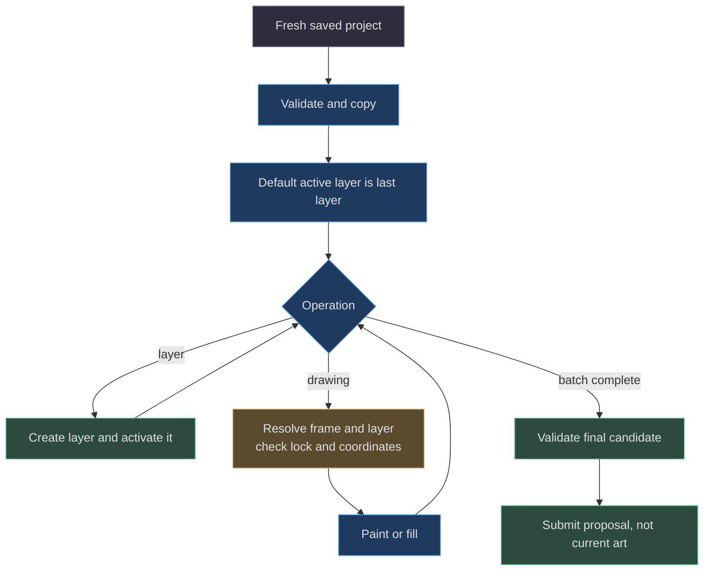

# 08. Loopback bridge and agent CLI

[Book home](../../README.md) · [Previous: persistence](../07-persistence-concurrency/README.md) · [Next: GIF](../09-gif-quantization/README.md)

## TL;DR

The bridge is an optional local HTTP process, bound to `127.0.0.1`.
The CLI reads the saved workspace and submits candidates; it has no accept
command. All API mutations require JSON, `X-SpriteCanvas: 1`, and an exact
saved revision. Host/Origin/Fetch-Metadata checks reduce browser cross-site
exposure; they are **not authentication of a user or agent**.
([server.mjs:51](../../../server.mjs#L51-L74),
[server.mjs:81](../../../server.mjs#L81-L99),
[scripts/agent.mjs:20](../../../scripts/agent.mjs#L20-L24))


## 1. Process and trust boundary

`npm start` invokes `node server.mjs`.
The port is `--port`, then `PORT`, then 4173; it must be an integer 1–65535.
`--workspace` overrides the storage directory, otherwise the bridge uses
the repository's `.spritecanvas` directory.
([package.json:7](../../../package.json#L7-L15),
[server.mjs:9](../../../server.mjs#L9-L17))

The listener binds to `127.0.0.1`, not all interfaces.
Allowed Host values are exactly `127.0.0.1:<port>` and `localhost:<port>`.
An Origin, when present, must equal `http://<Host>`.
No account, password, bearer token, or permission scope is checked here.
The custom header is a request-shape guard, not a secret.
([server.mjs:81](../../../server.mjs#L81-L93),
[server.mjs:150](../../../server.mjs#L150-L153))

The CLI independently accepts only HTTP URLs whose hostname is `localhost`
or `127.0.0.1`. Do not expose this bridge as a network service by treating
these checks as an authentication system.
([scripts/agent.mjs:9](../../../scripts/agent.mjs#L9-L18))

## 2. The narrow navigation exception

Cross-site Fetch Metadata normally causes HTTP 403.
There is one exception for an intentional browser navigation to the public
studio shell:

| Condition | Required value |
|---|---|
| Method | `GET` |
| Pathname | `/` or `/index.html` |
| `Sec-Fetch-Mode` | `navigate` |
| `Sec-Fetch-Dest` | `document` |
| `Sec-Fetch-User` | `?1` |

A query such as `?review=1` does not change the pathname check.
Host and Origin checks still apply. The exception does not cover APIs,
embedded iframes, images, scripts, POST, or HEAD.
([server.mjs:85](../../../server.mjs#L85-L93))

The boundary tests use raw HTTP because a fetch implementation may normalize
Fetch Metadata headers. They explicitly assert that a clicked HTML navigation
does not relax API or embedding protection.
([tests/bridge.test.mjs:109](../../../tests/bridge.test.mjs#L109-L144))

## 3. Shared request and response rules

Every `/api/` POST is parsed only when Content-Type starts with
`application/json` and `X-SpriteCanvas` is exactly `"1"`.
The body is read into memory with a **32 × 1024 × 1024 byte** limit.
Malformed JSON is HTTP 400; over-limit bodies are HTTP 413.
([server.mjs:17](../../../server.mjs#L17-L17),
[server.mjs:59](../../../server.mjs#L59-L74))

The parsed body must be a non-null object and include `expectedRevision`
as a JavaScript safe integer equal to current state.
Missing/noninteger values are HTTP 400; a mismatch is HTTP 409.
These checks run before POST route dispatch, even for an unknown API route.
([server.mjs:51](../../../server.mjs#L51-L54),
[server.mjs:96](../../../server.mjs#L96-L100))

Successful mutation responses return the **whole workspace state**, not just
the changed object. API responses are JSON with `Cache-Control: no-store`;
errors have shape `{ "error": "message" }`.
([server.mjs:55](../../../server.mjs#L55-L58),
[server.mjs:129](../../../server.mjs#L129-L147))

## 4. Endpoint contracts

All paths below are bridge paths at its root, not hosted Pages endpoints.

| Endpoint | Request-specific fields | Successful effect |
|---|---|---|
| `GET /api/health` | None | `{service:"spritecanvas", version:1}` |
| `GET /api/workspace` | None | Current revision, project, proposal, comparison, feedback |
| `POST /api/project` | `project` | Validate; if different, replace current project and increment revision |
| `POST /api/proposals` | `project`, `title`, optional replacement IDs | Create candidate with server-cloned baseline; leave canvas revision unchanged |
| `POST /api/feedback` | `proposalId`, `message`, optional `reference` | Append bounded feedback; leave project and revision unchanged |
| `POST /api/accept` | `proposalId` | Check review guards; install candidate, increment revision, preserve comparison |
| `POST /api/reject` | `proposalId` | Clear active proposal and dismiss its open feedback; preserve canvas |

Every POST additionally requires `expectedRevision` and the headers above.
The acceptance/rejection endpoints describe the **user review surface**;
their existence does not authorize agent use.
([server.mjs:94](../../../server.mjs#L94-L130),
[AGENTS.md:23](../../../AGENTS.md#L23-L24))

Saving an identical normalized project is a no-op and does not increment
revision. Saving a changed project does not automatically delete an existing
proposal; it can leave that proposal out of date.
([server.mjs:100](../../../server.mjs#L100-L102),
[tests/bridge.test.mjs:80](../../../tests/bridge.test.mjs#L80-L92))

### Error guide

| Status | Representative cause |
|---|---|
| 400 | Invalid project, invalid JSON, missing revision, wrong proposal project ID/title |
| 403 | Host/Origin/cross-site rejection or forbidden static path |
| 404 | Unknown API route or missing static file |
| 405 | Unsupported method on a non-API path |
| 409 | Stale revision, wrong active proposal, open feedback, mismatched replacement IDs |
| 413 | Request body above 32 MiB |
| 415 | Missing JSON Content-Type or custom header |
| 500 | I/O error identified by an error code |

I/O failures return the generic message that the previous save was not
replaced; raw filesystem details are logged server-side.
This mapping is implemented in the catch block rather than a general error
taxonomy shared with the model.
([server.mjs:143](../../../server.mjs#L143-L147))

## 5. Static files and response headers

Only files under `web` are served. Decoded paths containing a backslash,
NUL, or a segment beginning with `.` are forbidden; resolution must remain
under the web root. Static GET and HEAD are supported, and files receive
`Cache-Control: no-cache`.
([server.mjs:132](../../../server.mjs#L132-L142))

All responses receive `X-Content-Type-Options: nosniff`,
`Referrer-Policy: no-referrer`, and a Content Security Policy.
The policy restricts scripts/connections to self, permits data/blob images,
and denies framing with `frame-ancestors 'none'`.
The server does not emit an `Access-Control-Allow-Origin` permission.
([server.mjs:77](../../../server.mjs#L77-L80),
[tests/bridge.test.mjs:116](../../../tests/bridge.test.mjs#L116-L122))

These are bridge response headers. Do not assume GitHub Pages reproduces
them merely because it hosts the same static files.
See [testing and deployment](../10-testing-deployment/README.md).

## 6. CLI commands: what each really reads

Each invocation first fetches `/api/workspace`.
Even `status` begins with the whole saved state, then prints a summary.
It does not read unsaved browser strokes.
([scripts/agent.mjs:24](../../../scripts/agent.mjs#L24-L35))

| Command | Behavior |
|---|---|
| `status` | Summary of saved revision, layers, frames, proposal, and matching feedback |
| `pull <file.json>` | Writes a `spritecanvas-handoff` v1 with project, proposal, feedback, revision |
| `preview <file.png>` | Renders current saved project, frame 0, scale 8 |
| `feedback [directory]` | Prints all saved feedback; optionally extracts references and writes `feedback.json` |
| `propose <file.json> --base N` | Validates `input.project` or the input itself, then submits a proposal |
| `apply <operations.json> --base N` | Applies operations to the freshly fetched project, then submits a proposal |

Put the command and positional filename before options.
The parser reads the first two arguments as those positions; it is not a
general positional-argument parser.
`--url`, `--title`, `--replace`, and `--respond-to` provide explicit options.
([scripts/agent.mjs:7](../../../scripts/agent.mjs#L7-L22),
[scripts/agent.mjs:36](../../../scripts/agent.mjs#L36-L78))

`preview` is not a candidate-file renderer or a guarantee that its image is
the exact earlier handoff revision: every invocation reads current saved
state again. Re-read if the canvas changes between inspection and submission.
([scripts/agent.mjs:24](../../../scripts/agent.mjs#L24-L24),
[scripts/agent.mjs:60](../../../scripts/agent.mjs#L60-L69))

## 7. A safe full collaboration procedure

These commands are a documented workflow, **not instructions executed while
writing this book**. Never use tests or examples to mutate protected live art.

```powershell
# Read-only bridge requests; output files are your own handoff artifacts.
npm run agent -- status
npm run agent -- pull handoff.json
npm run agent -- preview preview.png
```

Inspect both the JSON and rendered artwork. Keep `handoff.project` unchanged.
Edit a separate candidate, preserve its project ID, and prefer an added
agent-owned layer for additive work. Respect locks and the user's requested
scope. Do not write `workspace.json` directly.
([AGENTS.md:16](../../../AGENTS.md#L16-L25))

```powershell
# After creating and reviewing a genuine candidate from this handoff:
$handoff = Get-Content -Raw handoff.json | ConvertFrom-Json
npm run agent -- propose candidate.json --base $handoff.revision --title "Add edge highlights"
```

A successful response means “ready for the user to compare,” not “accepted.”
The CLI checks the base against its freshly read state, and the bridge checks
again at submission, covering a change between those two reads.
([scripts/agent.mjs:65](../../../scripts/agent.mjs#L65-L77),
[server.mjs:51](../../../server.mjs#L51-L54))

When changes are requested:

```powershell
npm run agent -- feedback review-output
npm run agent -- pull revised-handoff.json
```

Read the text and extracted references, then rebuild from the fresh baseline.
The extraction names files `reference-1.png`, `reference-2.jpg`, etc. according
to history position and validated MIME type, not untrusted original filenames.
([scripts/agent.mjs:43](../../../scripts/agent.mjs#L43-L59))

For illustration only, a handoff might contain revision **18**, proposal
`sample-proposal-A`, and latest open feedback `sample-feedback-B`:

```text
npm run agent -- propose revised-candidate.json --base 18 --title "Revise highlights" --replace sample-proposal-A --respond-to sample-feedback-B
```

Use the actual freshly read values, **never those samples**.
If either identity or revision has changed, pull and understand the new state.
Do not bypass a review request by dismissing it or changing only a stale
candidate's revision number.
([web/lib/review.js:51](../../../web/lib/review.js#L51-L60),
[AGENTS.md:25](../../../AGENTS.md#L25-L31))

## 8. `applyOperations` is a small drawing language



The input must be an array with at most **20,000** operations.
An empty batch is allowed. Validation returns a new project before any
operations run, so failure does not partially mutate the caller's baseline.
([web/lib/model.js:239](../../../web/lib/model.js#L239-L264),
[tests/model.test.mjs:101](../../../tests/model.test.mjs#L101-L115))

| `op` | Required fields | Optional behavior |
|---|---|---|
| `layer` | `name` | Adds a layer across all frames and makes it active |
| `pixel` | `x`, `y` | `color`, `frame`, `layer` |
| `fill` | `x`, `y` | Exact-color four-neighbor fill |
| `line` | `x`, `y`, `x2`, `y2` | Endpoint-inclusive line |
| `rect` | `x`, `y`, `x2`, `y2` | `filled` truthiness selects interior |
| `ellipse` | `x`, `y`, `x2`, `y2` | Same bounding-box and `filled` rules |

All drawing coordinates must be in-range integers.
`frame` defaults to zero. `layer` matches either ID or name using the first
match in layer order; IDs are safer when names repeat.
Missing/null `color` means erase.
The language does not expose frame creation, transforms, brush sizes, mirrors,
or selection clipping.
([web/lib/model.js:242](../../../web/lib/model.js#L242-L264))

For a sample 8 × 8 project:

```json
[
  { "op": "layer", "name": "Agent highlights" },
  { "op": "rect", "x": 1, "y": 1, "x2": 6, "y2": 6, "color": "#243B65" },
  { "op": "fill", "x": 2, "y": 2, "color": "#70D6FF" },
  { "op": "line", "x": 2, "y": 2, "x2": 5, "y2": 2, "color": "#FFFFFF" },
  { "op": "pixel", "x": 1, "y": 1, "color": null }
]
```

The new layer is transparent on all frames, but these operations paint frame
zero unless specified otherwise. Layer locks are enforced by the interpreter;
hidden layers are not rejected here as they are by browser `editable()`.
([web/lib/model.js:196](../../../web/lib/model.js#L196-L203),
[web/lib/model.js:248](../../../web/lib/model.js#L248-L252),
[web/app.js:44](../../../web/app.js#L44-L48))

Continue to [review replacement rules](../06-review-protocol/README.md),
[algorithm details](../04-editing-algorithms/README.md), or
[isolated testing](../10-testing-deployment/README.md).
