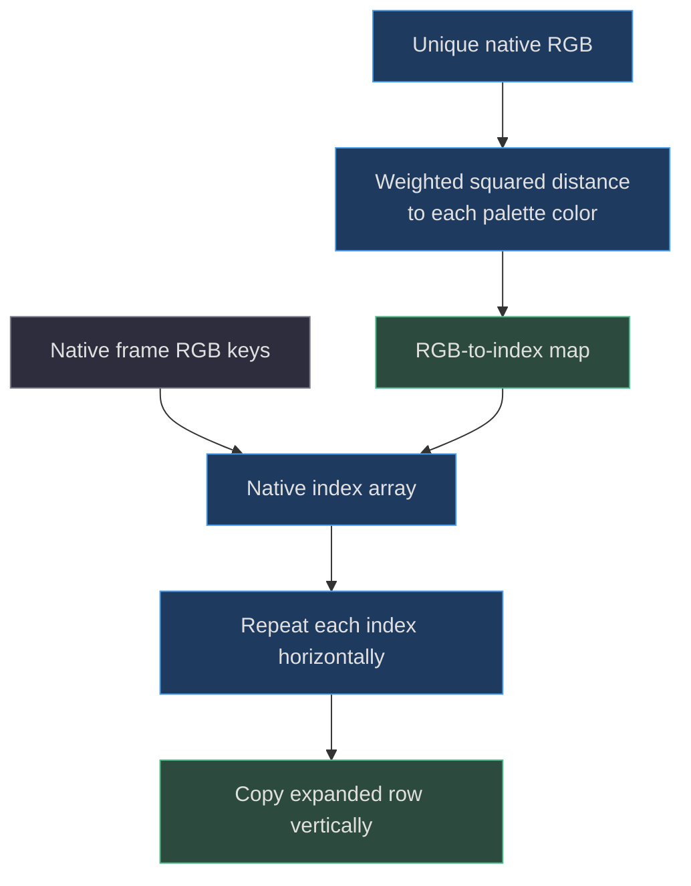

# 09. GIF quantization and encoding

[Book home](../../README.md) · [Previous: bridge and CLI](../08-loopback-bridge-cli/README.md) · [Next: testing and deployment](../10-testing-deployment/README.md)

## TL;DR

GIF export composites native frames, reduces alpha, builds one
animation-wide RGB histogram, and selects up to **255 opaque colors plus
transparent index 0**. Palette selection uses frequency-weighted RGB error
reduction, not the editor's swatches or a fixed color cube.
Only then are indices enlarged and written with a simple valid literal-code
LZW stream. The encoder owns the **32-million total output-frame-pixel** limit.
([web/lib/gif.js:6](../../../web/lib/gif.js#L6-L71),
[web/lib/gif.js:96](../../../web/lib/gif.js#L96-L137))

The diagram shows the studio's default threshold/white-matte alpha policy.
The README animation uses the opt-in transparent dither path described below.

```mermaid
flowchart LR
    accTitle: Native colors before scaled bytes
    accDescr: Quantization happens at native resolution across all frames; scaling repeats already indexed pixels.
    Project["Validated project"] --> Composite["Composite every frame"]
    Composite --> Alpha["Threshold alpha<br>white matte"]
    Alpha --> Hist["Animation histogram"]
    Hist --> Boxes["Weighted RGB partitions"]
    Boxes --> Palette["Up to 255 RGB colors"]
    Palette --> Index["Nearest palette indices"]
    Alpha --> Index
    Index --> Scale["Repeat indexed blocks"]
    Scale --> LZW["Literal LZW codes"]
    LZW --> GIF["GIF89a bytes"]
    style Project fill:#1e3a5f,stroke:#4a9eed,color:#e0e0e0
    style Composite fill:#1e3a5f,stroke:#4a9eed,color:#e0e0e0
    style Alpha fill:#5a4a2e,stroke:#d4a84b,color:#e0e0e0
    style Hist fill:#1e3a5f,stroke:#4a9eed,color:#e0e0e0
    style Boxes fill:#1e3a5f,stroke:#4a9eed,color:#e0e0e0
    style Palette fill:#2d4a3e,stroke:#4aba8a,color:#e0e0e0
    style Index fill:#1e3a5f,stroke:#4a9eed,color:#e0e0e0
    style Scale fill:#1e3a5f,stroke:#4a9eed,color:#e0e0e0
    style LZW fill:#2d2d3d,stroke:#7a7a8a,color:#e0e0e0
    style GIF fill:#2d4a3e,stroke:#4aba8a,color:#e0e0e0
```



## 1. Why GIF needs its own algorithm

The editable model stores direct RGBA strings, potentially many more than
256 distinct visible colors. Compositing can introduce additional colors
through layer opacity. A GIF global table has 256 slots here, and one is
reserved for transparency.
The editing swatches therefore cannot serve as a lossless lookup table.
([web/lib/model.js:99](../../../web/lib/model.js#L99-L117),
[web/lib/gif.js:52](../../../web/lib/gif.js#L52-L57))

The encoder never uses `project.palette` for quantization.
The exact-color regression empties that array and expects identical output.
Changing a project's swatches does not recolor its GIF unless actual rendered
pixels also change.
([tests/gif.test.mjs:94](../../../tests/gif.test.mjs#L94-L110))

## 2. Validation and authoritative limits

`encodeGif(project, scale=1)` validates an integer scale from 1 through 65,535,
then normalizes the full project.
Scaled width and height must each be integers 1–65,535.
Finally:

```text
output frame pixels = (native width * scale)
                    * (native height * scale)
                    * frame count
maximum             = 32,000,000
```

These checks run before histogram/frame allocation.
Project validation still separately enforces the two-million editable-cell
budget, which includes layers.
([web/lib/gif.js:6](../../../web/lib/gif.js#L6-L17),
[web/lib/model.js:51](../../../web/lib/model.js#L51-L53))

### Worked UI-size example

A **100 × 80**, **13-frame** animation at **16×** has:

```text
100 * 80 * 13 * 16^2 = 26,624,000 total frame pixels
per-frame dimensions = 1600 * 1280
```

It is below the GIF output budget and both GIF dimension limits, assuming
the project itself is valid. It must not be rejected by the PNG/sheet
16-million-pixel rule. `exportProject` dispatches GIF before that canvas check.
This is a source-derived limit example, not a timing measurement.
([web/lib/export.js:39](../../../web/lib/export.js#L39-L57),
[web/lib/gif.js:12](../../../web/lib/gif.js#L12-L17))

For comparison, 16 frames of the same size at 16× would require
32,768,000 pixels and be rejected. The inspected unit suite contains a
12-frame 16× acceptance case, distinct from the 13-frame arithmetic above.
([tests/gif.test.mjs:192](../../../tests/gif.test.mjs#L192-L199))

## 3. Composite, threshold, and matte

Each frame is composited at **native** resolution first.
The encoder stores its resulting RGB keys in an `Int32Array`, initialized
to `-1` for transparency. Pixel alpha is normalized from the composite byte.
([web/lib/gif.js:18](../../../web/lib/gif.js#L18-L25))

In the default `alphaMode: 'threshold'`, alpha below0.5 stays transparent.
Otherwise each output color channel becomes:

```text
matte_channel = round(composite_channel * alpha + 255 * (1 - alpha))
```

That is a white matte followed by opaque indexed color.
It is not partial GIF alpha.
For `#1234567F`, alpha is below the threshold; `#12345680` crosses it and
becomes approximately `[136,153,170]` before quantization.
([web/lib/gif.js:24](../../../web/lib/gif.js#L24-L32),
[tests/gif.test.mjs:141](../../../tests/gif.test.mjs#L141-L151))

Thresholding occurs after layer blending, so two partial layers must not
be independently thresholded before compositing.
For soft translucent edges on arbitrary backgrounds, use
[PNG/SVG export](../05-rendering-compositing/README.md#6-export-contracts-and-alpha-differences).

## 4. Animation-wide histogram

### Transparent alpha-dither mode

`encodeGif(project, scale, { alphaMode: 'dither' })` preserves un-matted
composite RGB and stores alpha separately. After nearest-neighbor scaling,
a fixed16x16 ordered mask chooses between that indexed color and transparent
index0. At16x, an alpha byte `a` keeps exactly `round(a * 256 / 255)` samples
per native-pixel block: alpha0 keeps none,255 keeps all, and64 keeps64.

This preserves faint lens-flare rays without an opaque backdrop or a white
fringe. It is spatial transparency dithering, not color-error diffusion or
true partial GIF alpha. Opaque artwork remains in solid scale blocks; only
partial-alpha regions become stippled. The output-space pattern stays fixed
across frames, and disposal-to-background clears old transparent regions.
The [branding exporter](../../../scripts/brand-idle.mjs) opts in; the editor's
normal GIF export is unchanged.

### Histogram weights

Opaque RGB is packed as `(r << 16) | (g << 8) | b`.
A `Map` counts each occurrence across all frames.
Counts are native-pixel frequency, **not weighted by frame duration**.
A slow frame and a fast frame of equal size contribute equally many samples.
In dither mode, each occurrence is instead weighted by its visible sample
coverage, so faint glow colors do not displace frequently visible opaque colors.
([web/lib/gif.js:18](../../../web/lib/gif.js#L18-L35))

`adaptivePalette` sorts distinct packed RGB keys numerically.
If there are at most 255, it keeps each exact RGB without partitioning.
Thus a <=255-color animation retains exact post-matte colors, not necessarily
the original partial-alpha RGBA values.
([web/lib/gif.js:74](../../../web/lib/gif.js#L74-L79))

Sorting establishes deterministic starting order independent of frame order.
The tests require an identical palette after reversing frames and require
repeated encoding of cloned input to produce identical bytes.
([tests/gif.test.mjs:112](../../../tests/gif.test.mjs#L112-L120))

## 5. Weighted partitioning, not median cut

When more than 255 distinct colors remain, each “box” holds a set of RGB
samples with occurrence counts. For each axis it builds 256 bins.
Every bin stores a count and the weighted sums of **all three** channels,
not only the selected axis.
([web/lib/gif.js:96](../../../web/lib/gif.js#L96-L114))

The channel weights are:

```text
red: 0.299     green: 0.587     blue: 0.114
```

They define the implemented weighted RGB squared error.
They do not make this a CIELAB metric or gamma-correct perceptual model.
([web/lib/gif.js:3](../../../web/lib/gif.js#L3-L3),
[web/lib/gif.js:119](../../../web/lib/gif.js#L119-L136))

Let a box contain samples with frequencies `n_i`, total count `N`, and
channel sums `S_c = sum(n_i * color_i,c)`.
The representative color is the rounded frequency-weighted mean `S_c/N`.
For choosing a split, the implementation evaluates:

```text
score(S, N) = sum_over_channels(weight_c * S_c^2 / N)
gain = score(leftSum, leftCount)
     + score(rightSum, rightCount)
     - score(parentSum, parentCount)
```

Why does that help? Expanding weighted squared error around a mean produces
a sum of squared samples minus `S²/N`.
The squared-sample terms are constant for the parent and its two children,
so they cancel when calculating error reduction.
The code can rank splits using counts and sums alone.
([web/lib/gif.js:116](../../../web/lib/gif.js#L116-L136))

Every cut 0–254 on every RGB axis is considered, skipping empty partitions.
The box remembers its highest positive gain.
At each iteration, the algorithm splits the box with the greatest gain,
replaces it with the left child, and appends the right child.
It stops at 255 boxes or when no positive-gain split remains.
([web/lib/gif.js:80](../../../web/lib/gif.js#L80-L93),
[web/lib/gif.js:122](../../../web/lib/gif.js#L122-L135))

### A tiny frequency example

Imagine nine occurrences of `[10,20,30]` and one of `[110,20,30]`.
If one box must represent both, its mean is `[20,20,30]`, not `[60,20,30]`.
The red-channel split separates the rare highlight from the common dark tone;
its gain is positive because both children can represent their members exactly.
This illustrates the formula, not a claim that the actual encoder quantizes
two colors: its <=255 fast path would keep both exactly.
([web/lib/gif.js:79](../../../web/lib/gif.js#L79-L93))

## 6. Nearest colors and determinism



`nearestColor` uses the same channel weights as partition scoring.
It updates only for a strictly smaller error, so equal-distance ties keep the
earlier palette entry; exact matches exit early.
The returned palette position is incremented by one, reserving zero for
transparency. Opaque black is therefore not confused with transparent black.
([web/lib/gif.js:37](../../../web/lib/gif.js#L37-L39),
[web/lib/gif.js:139](../../../web/lib/gif.js#L139-L150))

Each unique RGB is resolved once, not once per output pixel.
There is no error diffusion or dithering stage.
Scaling repeats indices, preserving the chosen palette and block shape.
([web/lib/gif.js:152](../../../web/lib/gif.js#L152-L165))

## 7. GIF container, timing, and disposal

The header is `GIF89a`, followed by logical screen dimensions and a
256-entry global color table. Slot zero is black but marked transparent.
Unused table slots are padded with black. Each frame uses the global table;
there are no local per-frame palettes.
([web/lib/gif.js:52](../../../web/lib/gif.js#L52-L64))

The `NETSCAPE2.0` application extension writes loop count zero.
Every frame covers the full logical screen at `(0,0)`.
Its Graphic Control Extension packed byte is 9: transparency enabled and
disposal method 2, restoring the background between frames.
([web/lib/gif.js:58](../../../web/lib/gif.js#L58-L64))

Frame delay is `max(2, round(duration/10))` in centiseconds.
Examples: 24 ms becomes 2 cs, 25 ms becomes 3 cs, and 10,000 ms becomes
1,000 cs. These are encoded delays; a viewer can impose its own playback
behavior, so they are not a wall-clock timing guarantee.
([web/lib/gif.js:62](../../../web/lib/gif.js#L62-L62),
[tests/gif.test.mjs:177](../../../tests/gif.test.mjs#L177-L190))

## 8. LZW chooses simplicity over compression ratio

The encoder declares minimum LZW code size 8 and emits 9-bit codes.
For each chunk of at most 250 pixel indices, it emits clear code **256**,
then literal indices. At the end it emits end code **257**.
Frequent clears prevent dictionary growth from forcing wider codes.
([web/lib/gif.js:64](../../../web/lib/gif.js#L64-L68),
[web/lib/gif.js:167](../../../web/lib/gif.js#L167-L184))

Bits are packed least-significant first into output bytes.
The container writer then divides compressed data into sub-blocks of at most
255 bytes, writes a zero terminator, and finally trailer byte `0x3B`.
The 250-literal interval and 255-byte sub-block size serve different purposes.
([web/lib/gif.js:44](../../../web/lib/gif.js#L44-L51),
[web/lib/gif.js:170](../../../web/lib/gif.js#L170-L183))

There is no phrase-search compression dictionary in this encoder.
The resulting files trade compression efficiency for a small, predictable
implementation. Do not promise optimal GIF size or infer compression ratio
from palette quality.
([web/lib/gif.js:167](../../../web/lib/gif.js#L167-L184))

## 9. Cost model and evidence

Let `N=W*H*F`, `U` be unique post-matte RGB colors, `K<=255`, and
`M=N*scale²`.
Compositing costs up to `O(N*L)`, sorting `O(U log U)`, nearest lookup
`O(U*K)`, and scaling/byte emission `O(M)`.
Repeated partitioning can revisit colors; a conservative bound includes
`O(K*U)` sample work, constant-size axis/bin scans per box, and `O(K²)`
box selection. These are loop-derived bounds, not benchmark results.
([web/lib/gif.js:18](../../../web/lib/gif.js#L18-L184))

Native frames, histogram data, expanded indices, compressed arrays, and final
bytes coexist at different stages. The 32-million-pixel check is not a
32 MB memory cap and does not guarantee a particular latency.
([web/lib/gif.js:21](../../../web/lib/gif.js#L21-L71))

The tests assert exact <=255-color retention, deterministic global palettes,
white-matte alpha, timing/disposal metadata, scale blocks, empty frames, and
explicit invalid-input failures. A dark synthetic fixture requires at least
180 decoded dark colors, mean absolute channel error below 2.5, and
95th-percentile channel error at most 6.
These are **test thresholds for that fixture**, not universal image-quality
measurements or results from this documentation session.
([tests/gif.test.mjs:94](../../../tests/gif.test.mjs#L94-L215))

The GIF exporter remains a derived-artifact path; JSON keeps the original
layers, frames, and RGBA cells. See [project model](../03-project-model/README.md)
and [testing](../10-testing-deployment/README.md) before changing either contract.
([web/lib/export.js:34](../../../web/lib/export.js#L34-L41),
[scripts/agent.mjs:38](../../../scripts/agent.mjs#L38-L41))
