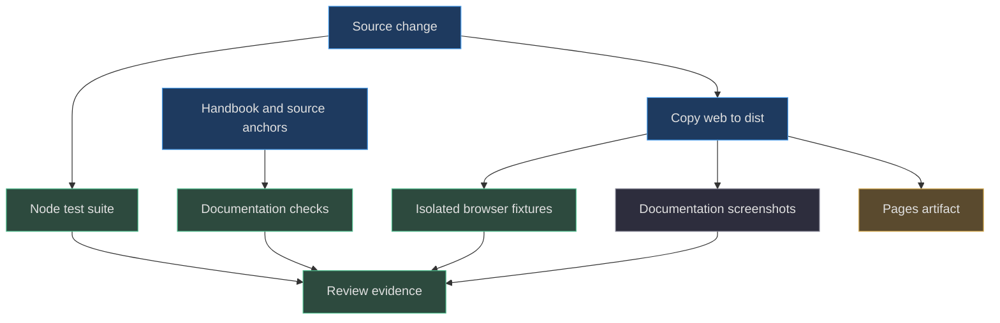
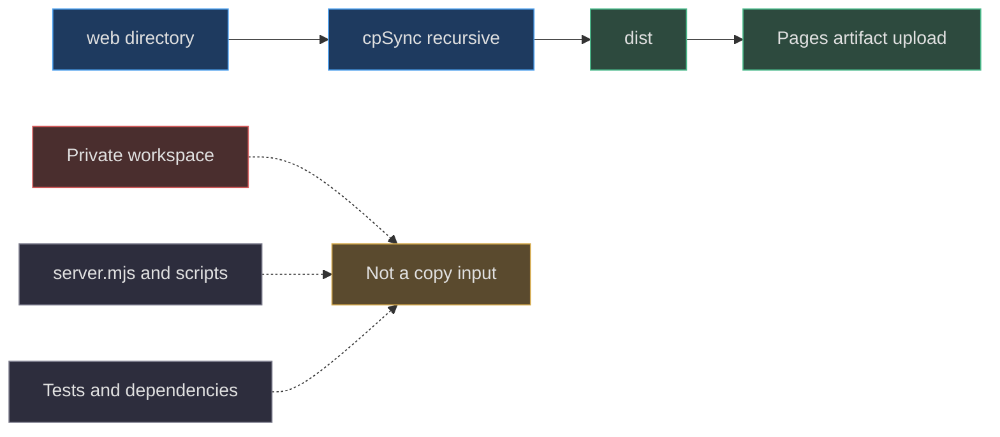

# 10. Testing, deployment, and contribution

[Book home](../../README.md) · [Previous: GIF quantization](../09-gif-quantization/README.md) · [Next: character branding](../11-character-branding/README.md)

## TL;DR

Node 22+ runs the development tooling; the shipped app is plain browser
JavaScript with no runtime package dependency.
Build copies `web` into `dist`.
Node tests, isolated browser fixtures, documentation screenshots, and
documentation checks serve different purposes.
The live bridge's default port **4173 is not a test target**.
([package.json:4](../../../package.json#L4-L23),
[scripts/build.mjs:1](../../../scripts/build.mjs#L1-L14),
[playwright.config.js:15](../../../playwright.config.js#L15-L18))



This diagram is a recommended contributor evidence flow, not a claim that
every branch runs every step in CI. The Pages workflow explicitly runs
`npm test`, build and a post-deployment browser smoke check against the public
site. It does not run the entire isolated browser suite or documentation capture.
([.github/workflows/pages.yml:20](../../../.github/workflows/pages.yml#L20-L58))

## 1. Scripts and dependency boundary

| Command | Configured implementation | Purpose |
|---|---|---|
| `npm start` | `node server.mjs` | Optional local studio and collaboration bridge |
| `npm run build` | `node scripts/build.mjs` | Produce static `dist` content |
| `npm test` | `node --test tests/*.test.mjs` | Top-level Node test modules |
| `npm run test:browser` | `playwright test` | Browser workflows with configured fixtures |
| `npm run test:pages` | Playwright with `playwright.pages.config.js` | Real published editor, persistence, export and deployment fingerprint |
| `npm run agent -- ...` | `node scripts/agent.mjs` | Local handoffs, previews, feedback, and proposals |
| `npm run brand` | `node scripts/build-brand.mjs` | Public branding generation entry point |
| `npm run reference` | `node scripts/create-reference.mjs` | Public reference generation entry point |
| `npm run docs:screenshots` | Build then Playwright with docs config | Reproduce documentation screenshots |
| `npm run docs:check` | `node scripts/check-docs.mjs` | Validate documentation artifacts |

This table documents configured commands, not commands executed by the
handbook writer.
([package.json:7](../../../package.json#L7-L17))

The package is an ES module package (`"type": "module"`), requires Node
`>=22`, and lists Playwright under `devDependencies`.
There is no `dependencies` runtime package list.
Browser modules import repository-local JavaScript, rather than downloading
an editor framework at runtime.
([package.json:5](../../../package.json#L5-L23),
[web/app.js:1](../../../web/app.js#L1-L8))

For a fresh contributor checkout, dependency provisioning is normally
`npm ci`; the workflow uses that command.
Browser binaries must also be available for Playwright before browser work.
Provision tools only in an authorized development environment—do not treat
documentation examples as permission to modify an active artwork machine.
([.github/workflows/pages.yml:31](../../../.github/workflows/pages.yml#L31-L39),
[playwright.config.js:1](../../../playwright.config.js#L1-L18))

## 2. Node tests are not all pure tests

`npm test` discovers all top-level `tests/*.test.mjs`.
The model, review, and GIF modules contain direct assertions over data and
binary output. The bridge test module starts a real child server in an
isolated temporary directory.
([package.json:10](../../../package.json#L10-L10),
[tests/model.test.mjs:1](../../../tests/model.test.mjs#L1-L20),
[tests/bridge.test.mjs:32](../../../tests/bridge.test.mjs#L32-L57))

| Test module | Source-grounded examples |
|---|---|
| `model.test.mjs` | Validation, selection clipping, fill boundaries, source-over blending, independent cels |
| `review.test.mjs` | Feedback identity, reference bytes/type checks, latest exact replacement ID |
| `gif.test.mjs` | Exact colors, deterministic palette, alpha, metadata, scaling, limit failures |
| `bridge.test.mjs` | Real HTTP save/propose/accept, stale revisions, browser boundary checks, feedback durability |

Sources: ([tests/model.test.mjs:11](../../../tests/model.test.mjs#L11-L123),
[tests/review.test.mjs:12](../../../tests/review.test.mjs#L12-L49),
[tests/gif.test.mjs:94](../../../tests/gif.test.mjs#L94-L215),
[tests/bridge.test.mjs:58](../../../tests/bridge.test.mjs#L58-L179)).

The bridge fixture obtains an ephemeral loopback port and uses
`mkdtempSync` under the OS temporary directory.
Cleanup terminates its own child process and removes its own workspace.
It does not use the live `.spritecanvas/workspace.json`.
([tests/bridge.test.mjs:32](../../../tests/bridge.test.mjs#L32-L57))

For a permitted pure-algorithm check that must not start a bridge:

```powershell
node --test tests/model.test.mjs tests/review.test.mjs tests/gif.test.mjs
```

For the full configured Node suite in an authorized test session:

```powershell
npm test
```

Do not describe the first command as coverage of bridge behavior.
The separation matters whenever a task prohibits server tests.

## 3. Browser fixture isolation

Playwright uses one worker, disables full parallelism, and configures:

| Address | Role | Data root |
|---|---|---|
| `127.0.0.1:4173` | Default live bridge | Default `.spritecanvas`; protect existing art |
| `127.0.0.1:4273` | Browser-test bridge | `test-results/bridge-workspace` |
| `127.0.0.1:4274/SpriteCanvas/` | Static Pages-like fixture | `dist`, no bridge API |

Both Playwright web servers set `reuseExistingServer: false`.
An occupied test port should be resolved deliberately, not by falling back to
an existing live session or changing tests to hit port 4173.
([server.mjs:12](../../../server.mjs#L12-L16),
[playwright.config.js:3](../../../playwright.config.js#L3-L18))

```powershell
npm run build
npm run test:browser
```

Build first because the static fixture reads `dist`, while the test bridge
serves `web`. Otherwise local-bridge checks might inspect current code and
static checks inspect an older copy.
([scripts/static-test-server.mjs:6](../../../scripts/static-test-server.mjs#L6-L18),
[server.mjs:15](../../../server.mjs#L15-L15))

The configured viewport is 1440 × 1000, timeout 45 seconds, and expectation
timeout 8 seconds. Traces are retained on failure and screenshots are captured
only on failure for this browser-test config.
Those failure artifacts are distinct from deliberately authored documentation
screenshots.
([playwright.config.js:6](../../../playwright.config.js#L6-L14))

## 4. Build copy allowlist—and its caveat



The build creates `dist` if needed and recursively copies `web`.
That is a **directory-level input allowlist**, not a filename sanitizer.
Anything placed in `web` is eligible for publication.
([scripts/build.mjs:9](../../../scripts/build.mjs#L9-L10))

The build additionally writes `build-info.json` containing a format/version and
the CI `GITHUB_SHA`. Local builds without that environment variable record
`null`; they do not invent a deployed revision. The post-deployment check uses
this public commit fingerprint to reject a cached older artifact.
([scripts/build.mjs:5](../../../scripts/build.mjs#L5-L13))

The script does **not** clean existing `dist` first.
It also does not transpile, minify, rewrite URLs, or build the handbook into
a separate site. Existing stray files in a manually modified `dist` can remain.
Keep private data out of both `web` and deployment staging; do not claim the
copy step scrubs an already contaminated directory.
([scripts/build.mjs:1](../../../scripts/build.mjs#L1-L14),
[AGENTS.md:37](../../../AGENTS.md#L37-L40))

## 5. Pages subpaths and the optional API

The HTML references `./app.js` and relative stylesheets.
Browser module imports are relative, and the API helper constructs
`./api/<route>` relative to `document.baseURI`.
These choices preserve the repository subpath instead of assuming hosting
at a domain root.
([web/index.html:9](../../../web/index.html#L9-L13),
[web/lib/storage.js:25](../../../web/lib/storage.js#L25-L29))

The fixture deliberately serves only under `/SpriteCanvas/` and has no bridge
API. Browser initialization probes a bridge only on localhost/127.0.0.1;
when no API is available it can operate in browser-only mode.
Static project/proposal file exchange remains the collaboration path.
([scripts/static-test-server.mjs:6](../../../scripts/static-test-server.mjs#L6-L23),
[web/app.js:1095](../../../web/app.js#L1095-L1120),
[web/app.js:734](../../../web/app.js#L734-L743))

Do not introduce `/assets/...` or `/api/...` browser URLs casually:
those root-relative paths can escape a repository subpath.
The Node CLI's root API URLs are different because it targets the root of
the local bridge, not Pages.
([scripts/agent.mjs:24](../../../scripts/agent.mjs#L24-L24))

## 6. What the Pages workflow actually does

The workflow triggers on pushes to `main` and manual dispatch.
It uses read permission for contents, write for Pages and OIDC tokens, and
a `github-pages` concurrency group with cancellation of in-progress runs.
([.github/workflows/pages.yml:1](../../../.github/workflows/pages.yml#L1-L12))

Its deployment job first requires Pages `build_type: workflow`. This prevents
a root-branch README/Jekyll publisher from competing with the studio deployment.
The repository README stays in place; it is not the website's entry point.

The job sets up Node22, runs `npm ci`, `npm test`, and build, installs Chromium,
configures Pages, uploads **`dist`**, then deploys it. A final browser check uses
the actual deployment URL and expected commit SHA. Failure traces/screenshots
are retained as Actions artifacts.
([.github/workflows/pages.yml:14](../../../.github/workflows/pages.yml#L14-L58))

The [live check](../../../tests/pages/site.spec.js) waits for the build fingerprint,
opens the canonical URL, verifies a working editor in STATIC mode, draws into an
isolated16x16 fixture, reloads browser persistence and exports a PNG. It also
checks responsive layout, asset/runtime errors, absence of network writes and
exclusion of README/private context paths from the artifact.

`npm run test:pages` defaults to `https://zanark.github.io/SpriteCanvas/`.
`SPRITECANVAS_SITE_URL` can override the HTTP(S) root, including its trailing
slash. `SPRITECANVAS_EXPECTED_SHA` can require a full commit. The workflow sets
both from deployment outputs. The [configuration](../../../playwright.pages.config.js)
starts no local server and uses a fresh browser context, so it does not modify
the user's existing artwork or browser profile.

A workflow definition is still not a successful deployment. Inspect the run's
deploy **and verification** results; a stale fingerprint, README page, broken
module or failed draw/export causes the live check to fail.

## 7. Reproducible documentation commands

From the repository root:

```powershell
npm run build
npm run docs:screenshots
npm run docs:check
```

The screenshot command itself currently includes build before invoking its
dedicated Playwright configuration. The explicit first build makes the
prerequisite visible in a contributor recipe.
Use the documentation fixture, not a manual capture of private live artwork.
([package.json:14](../../../package.json#L14-L15))

Screenshot evidence answers “what did the documented scenario look like?”
It does not prove layer editability, persisted feedback, or stale-revision
rejection. Pair screenshots with source anchors and behavioral assertions.
The model and bridge tests exercise those nonvisual contracts directly.
([tests/model.test.mjs:101](../../../tests/model.test.mjs#L101-L115),
[tests/bridge.test.mjs:80](../../../tests/bridge.test.mjs#L80-L92))

## 8. Contribution recipes

For a **drawing algorithm change**, add a tiny exact-grid test first.
Check selection and bounds, then a browser gesture scenario.
For a **review change**, test both identity races and non-destructive behavior;
ensure static import still uses the shared helper.
([tests/model.test.mjs:43](../../../tests/model.test.mjs#L43-L68),
[tests/review.test.mjs:35](../../../tests/review.test.mjs#L35-L49),
[web/app.js:510](../../../web/app.js#L510-L535))

For an **export change**, distinguish native cells from scaled output and
exercise alpha, frame timing, and resource limits.
For a **deployment change**, inspect what enters `web`/`dist` and test the
subpath fixture without an API.
([tests/gif.test.mjs:141](../../../tests/gif.test.mjs#L141-L215),
[scripts/static-test-server.mjs:6](../../../scripts/static-test-server.mjs#L6-L23))

The repository contract disallows public AI keys, automatic cloud upload,
third-party tracking, and external asset dependencies.
Preserve explicit errors, review snapshots, and revision checks.
([AGENTS.md:36](../../../AGENTS.md#L36-L40))

Use the [source-map evidence matrix](../../appendices/source-map.md) to choose
the smallest relevant tests. Report commands actually run and failures
actually observed; never convert a test file's existence into a passing result.
