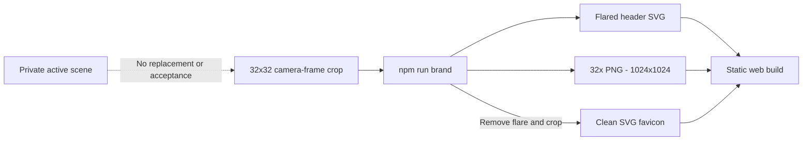
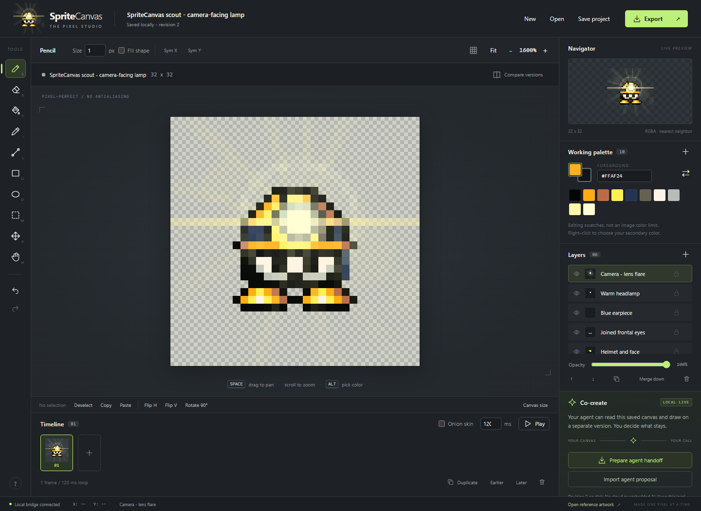

# 11 - The scout: anatomy, pose and editable branding

> **TL;DR:** The logo is an exact32x32 crop of the original camera-facing pose from the latest character GIF, not a newly invented pose. The application and32x README image keep the warm lens flare; the favicon alone removes it. Six editable layers preserve the original character, lamp and optical effect.

[Book home](../../README.md) | [Previous: Testing and deployment](../10-testing-deployment/README.md) | [Next: Editable pixels](../12-design-principles/editable-pixels.md)

## Source, not a sticker



The source is [`spritecanvas-logo.spritecanvas.json`](../../../web/assets/spritecanvas-logo.spritecanvas.json). Its project ID is `spritecanvas-character-logo`. It contains one frame, six editable layers and ten chosen working swatches. [Provenance](../../../web/assets/spritecanvas-logo-provenance.json) records the source GIF hash, frame index, crop and per-layer pixel hashes.

The public logo is distinct from both the bundled50x50 reference reconstruction and any later private scene. Opening the logo in a workspace changes that workspace's active document; regenerating the tool assets from its source file does not.

## Inspect the actual layers



**Figure 1 - The logo is editable artwork.** This capture opens the public logo in an isolated documentation workspace. The transparency checkerboard is the editor's backdrop, not pixels baked into the character.

| Layer | Role | Why it stays separate |
| --- | --- | --- |
| Equal frontal boots | The two equal, level foot shapes | Preserve the exact accepted frontal anatomy |
| Helmet and face | Cap, forward-facing grooves, dark face and silhouette | Preserve the original camera pose without reposing |
| Joined eyes | Full-width eye geometry and pupils | Refine gaze without repainting helmet or earpiece |
| Blue earpiece | Narrow side component | It is an anatomical accessory, not general helmet shading |
| Warm headlamp | Lens and lamp highlights | Keep lamp color/style independent of the cap surface |
| Camera - lens flare | Original warm ring, rays, streak and nearby ghost | Include in app/README; exclude only from favicon |

Layer order in the JSON is bottom-to-top. The UI displays its stack accordingly; do not infer storage order from a screenshot's topmost visible row alone.

## What changed in the pose

The newly invented hopping pose was rejected. The current logo instead uses **frame8 (`lookaround-8`)** from `finished-character-candidate.gif` and its editable companion project. It is the open-eyed camera pause, not the blink.

The crop starts at source coordinate(34,30) and measures32x32. Character, lamp and flare pixels are copied without rotation, leaning, translation of individual body parts, resampling or recoloring. Separating anatomy into layers does not change the composite.

The icon framing retains the central ring, rays, streak and nearby optical ghost. The full-scene flare beyond the crop boundary is outside the icon; no replacement flare is drawn.

The application displays a64x64, integer2x view. The README PNG is **32x native scale:1024x1024**, with matching HTML width/height rather than the previous96px thumbnail. A Markdown host can still fit the image to its reading column.

The favicon uses the same source with only `camera-lens-flare` excluded, then tightly crops the character with two native pixels of transparent padding. Its current native frame is20x20. It does not use another pose or alter the actual headlamp.

## Anatomy invariants

### Gold and orange, not a new green helmet

The recognizable palette consists of near-black, orange, warm brown, gold, ivory, grays, blue for the earpiece and warm lamp colors. A new pose is not permission to redesign the color identity.

The Working palette is still only an editing set. Some existing lamp pixels can contain other RGBA values; changing swatches alone does not remap those pixels.

### Eyes retain their structure

The two eyes share joined inner edges. Dark pupils remain2x2 blocks in this source. Do not erase dark pixels as "background", shrink pupils to one pixel, or insert an unrelated gap as a posing shortcut.

A change in direction can warrant a deliberate new eye layout, but inspect its pixel dimensions and appearance rather than relying only on scaled preview impressions.

### The earpiece is a component

The blue side piece should read as an earpiece. In the frontal family of poses, it is a narrow visible edge rather than a broad forward-facing gray pad.

Keeping it on its own layer makes that intention discoverable to future artists and agents.

### The front-facing feet stay equal and level

The two boots use the same shape and corresponding colors at the exact camera-frame positions. There is no raised foot, bent leg or invented hop in this logo.

Current template placement is left origin(8,22), right origin(16,22), with an8x3 source region per boot. Tests compare both regions and the recorded extraction hashes; a plausible screenshot is not enough to prove the source pose was preserved.

### Transparent does not mean black is disposable

Transparency is alpha/null. Black is a color used in the face, outline, pupils and leg. Remove backgrounds by selecting the intended layers, not by deleting all pixels near a background color.

There is no sewer, frame, floor or opaque backdrop. The main logo deliberately includes translucent camera-flare pixels, which can reach the crop's edge. Only the tightly cropped favicon has a completely clear padded border.

## Editing and regenerating

1. Download your current scene if it needs a separate saved copy.
2. Open `web\assets\spritecanvas-logo.spritecanvas.json` in the studio.
3. Edit the appropriate layer; keep source dimensions and anatomy deliberate.
4. Download the editable project and replace the **logo source file**, not `.spritecanvas\workspace.json`.
5. Regenerate the derivatives and build.

```powershell
npm run brand
npm run build
```

The [pure brand generator](../../../scripts/brand.mjs) validates the source and composites it into pixel rectangles for SVG and a32x PNG. It derives the separate favicon after removing the flare layer. The [build entry point](../../../scripts/build-brand.mjs#L1) writes all three assets.

The generator requires a square single-frame source with a visible camera-flare layer. It does not author a pose, accept a scene proposal, extract arbitrary screenshots or read private workspace art. Keep the recorded camera-pose pixels intact unless a later explicit request authorizes a change.

For an authorized artwork change, update the provenance and corresponding anatomy expectations honestly. Changed pixels must not retain a claim that they are an unchanged extraction from the original GIF.

## Asset surfaces and accessibility

The header uses a local relative **flared** SVG URL. The favicon is a different, **flare-free** local SVG, so both resolve under a repository subpath such as `/SpriteCanvas/`.

The brand link already has the accessible name **SpriteCanvas home**. Its decorative image uses empty alt text to avoid repeating that name. Documentation images, by contrast, have descriptive alt text and explanatory captions.

Do not replace the transparent source with an external logo URL, a generated screenshot overlay or a cloud-hosted image. The static application must not acquire an asset-network dependency.

## Validation that checks the actual requirement

The [brand tests](../../../tests/brand.test.mjs#L1) inspect camera-frame provenance/pixel hashes, dimensions, six editable layers, pupil blocks, earpiece colors and equal level boots. They verify the warm flare is present in the main source but absent from the favicon and check the PNG and README's actual32x dimensions.

They also regenerate assets and compare them to the shipped SVG/PNG/favicon. Text comparisons tolerate checkout line-ending normalization; binary PNG comparisons remain exact.

Browser coverage loads assets under the Pages subpath, checks alpha and premultiplied color against the appropriate flared/clean composite, and confirms the64px header image at desktop and narrow viewports. Premultiplied comparison accounts for browser rounding of very translucent flare pixels without hiding a missing flare.

```powershell
node --test tests\brand.test.mjs
npm run build
npm run test:browser -- --grep "character branding|GitHub Pages subpath"
npm run docs:screenshots
npm run docs:check
```

Those checks establish specific source and browser properties. They cannot decide whether a new pose is artistically preferable; inspect enlarged, header-sized and favicon-sized views, then get the user's review.

## Failure cases to avoid

| Shortcut | Why it is wrong |
| --- | --- |
| Delete all dark pixels | Destroys face, pupils, outline and leg |
| Resize one boot to fit a pose | Changes anatomy instead of position |
| Paste a screenshot over the canvas | Loses editable source and can hide broken rendering |
| Add every generated shade to the palette | Confuses swatches with RGBA image contents |
| Change the live scene while regenerating a logo | Crosses the separate-project boundary |
| Update only the header, not favicon/source | Leaves inconsistent assets with no reproducible provenance |

[Editable-pixels principle](../12-design-principles/editable-pixels.md) | [User guide](../01-using-studio/README.md)
