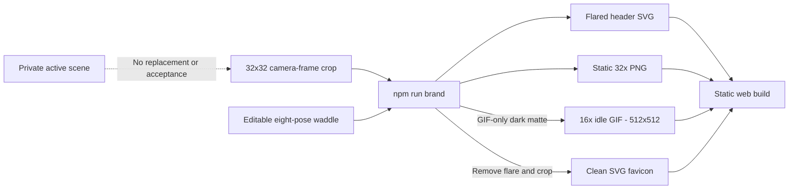

# 11 - The scout: anatomy, pose and editable branding

> **TL;DR:** The application keeps the exact camera-facing static logo. The README shows a16x,512px reference-inspired waddle with alternating boots, body bob, subtle helmet lean and a moving warm flare. The static logo has six editable layers; the eight-frame animation has eight, adding legs and a grounding shadow. The favicon still omits flare.

[Book home](../../README.md) | [Previous: Testing and deployment](../10-testing-deployment/README.md) | [Next: Editable pixels](../12-design-principles/editable-pixels.md)

## Source, not a sticker



The source is [`spritecanvas-logo.spritecanvas.json`](../../../web/assets/spritecanvas-logo.spritecanvas.json). Its project ID is `spritecanvas-character-logo`. It contains one frame, six editable layers and ten chosen working swatches. [Provenance](../../../web/assets/spritecanvas-logo-provenance.json) records the source GIF hash, frame index, crop and per-layer pixel hashes.

The public logo is distinct from both the bundled50x50 reference reconstruction and any later private scene. Opening the logo in a workspace changes that workspace's active document; regenerating the tool assets from its source file does not.

## Inspect the actual layers


**Figure 1 - The logo is editable artwork.** This capture opens the public logo in an isolated documentation workspace. The transparency checkerboard is the editor's backdrop, not pixels baked into the character.

| Layer | Role | Why it stays separate |
| --- | --- | --- |
| Equal frontal boots | The two equal, level foot shapes | Preserve the exact accepted frontal anatomy |
| Helmet and face | Cap, forward-facing grooves, dark face and silhouette | Preserve the original camera pose without reposing |
| Joined eyes | Full-width eye geometry and pupils | Refine gaze without repainting helmet or earpiece |
| Blue earpiece | Narrow side component | It is an anatomical accessory, not general helmet shading |
| Warm headlamp | Lens and lamp highlights | Keep lamp color/style independent of the cap surface |
| Camera - lens flare | Original warm ring, rays, streak and nearby ghost | Include in app/README; exclude only from favicon |

Layer order in the JSON is bottom-to-top. The UI displays its stack accordingly; do not infer storage order from a screenshot's topmost visible row alone.

## What changed in the pose

The newly invented hopping pose was rejected. The current logo instead uses **frame8 (`lookaround-8`)** from `finished-character-candidate.gif` and its editable companion project. It is the open-eyed camera pause, not the blink.

The crop starts at source coordinate(34,30) and measures32x32. Character, lamp and flare pixels are copied without rotation, leaning, translation of individual body parts, resampling or recoloring. Separating anatomy into layers does not change the composite.

The icon framing retains the central ring, rays, streak and nearby optical ghost. The full-scene flare beyond the crop boundary is outside the icon; no replacement flare is drawn.

The application displays a64x64, integer2x view. The README now uses a **16x idle GIF:512x512**, with matching HTML width/height. A transparent32x PNG remains a still-image alternative, not the README hero. A Markdown host can fit the image to its reading column.

The favicon uses the same source with only `camera-lens-flare` excluded, then tightly crops the character with two native pixels of transparent padding. Its current native frame is20x20. It does not use another pose or alter the actual headlamp.

## The README pose-animation loop

The user rejected the blink-only idle as too weak and supplied a motion reference. The revised [`spritecanvas-logo-idle.spritecanvas.json`](../../../web/assets/spritecanvas-logo-idle.spritecanvas.json) is a separate eight-frame, eight-layer editable project. It adapts the reference's footwork, body bob and weight shifts to the original scout; it does not copy the reference character's pixels or design.


**Figure 2 - The README animation.** This is the actual16x GIF, with an export-only dark backdrop. Each pose lasts110ms, matching the eight-frame reference's880ms rhythm.

| Pose | Body offset | Planted boot | Forward sole |
| --- | --- | --- | --- |
| Left plant | Left1, neutral height | Left | Right, low |
| Left rise | Left1, up1 | Left | Right, rising |
| Right pass | Center, up2 | Left | Right, high |
| Right reach | Right1, up1 | Left | Right, lowering |
| Right plant | Right1, neutral height | Right | Left, low |
| Right rise | Right1, up1 | Right | Left, rising |
| Left pass | Center, up2 | Right | Left, high |
| Left reach | Left1, up1 | Right | Left, lowering |

Helmet, eyes, earpiece and lamp use the original pixel colors. Integer translations and a restrained row-wise helmet lean create motion without resampling or shrinking the2x2 pupils. Both boots reuse the same8x3 planted template and the same8x5 forward-sole template. Apparent differences are views/poses, not differently sized matching boots. Short legs connect the body to the boots, and a separate translucent shadow keeps the step grounded.

The original optical flare translates with the lamp, including its ring and streak; it is not pinned to the old screen position. RGB and alpha are unchanged. Cropping happens after translation using the original optical layer, avoiding artificial gaps at the crop boundary.

[Animation provenance](../../../web/assets/spritecanvas-logo-idle-provenance.json) records the supplied reference's filename/hash, observed eight110ms frames, authored scout poses, shared boot templates, transforms and output frame hashes. The reference file is not shipped or loaded by the application.

GIF supports binary transparency, not the partial alpha used by the warm optical effect. The [idle exporter](../../../scripts/brand-idle.mjs) adds a `#1E2125` **export-only matte**, then uses the existing animation-wide GIF quantizer at16x. The matte is not inserted into either editable source or the app/favicon assets. Without it, the low-alpha flare would disappear or acquire a white fringe. This is a display-format tradeoff, not a restored sewer background.

## Anatomy invariants

### Gold and orange, not a new green helmet

The recognizable palette consists of near-black, orange, warm brown, gold, ivory, grays, blue for the earpiece and warm lamp colors. A new pose is not permission to redesign the color identity.

The Working palette is still only an editing set. Some existing lamp pixels can contain other RGBA values; changing swatches alone does not remap those pixels.

### Eyes retain their structure

The two eyes share joined inner edges. Dark pupils remain2x2 blocks in this source. Do not erase dark pixels as "background", shrink pupils to one pixel, or insert an unrelated gap as a posing shortcut.

A change in direction can warrant a deliberate new eye layout, but inspect its pixel dimensions and appearance rather than relying only on scaled preview impressions.

### The earpiece is a component

The blue side piece should read as an earpiece. In the frontal family of poses, it is a narrow visible edge rather than a broad forward-facing gray pad.

Keeping it on its own layer makes that intention discoverable to future artists and agents.

### The front-facing feet stay equal and level

The **static logo** keeps both boots equal and level at the exact camera-frame positions. The README animation now deliberately uses alternating foot plants and lifted soles, as requested through the supplied pose reference.

Static template placement is left origin(8,22), right origin(16,22), with an8x3 region per boot. Animation tests separately verify shared templates for both feet in each view and a fixed planted-boot ground line. Do not confuse a lifted sole with a mismatched frontal boot.

### Transparent does not mean black is disposable

Transparency is alpha/null. Black is a color used in the face, outline, pupils and leg. Remove backgrounds by selecting the intended layers, not by deleting all pixels near a background color.

Neither editable source contains a sewer, frame, floor or opaque backdrop. The main logo deliberately includes translucent camera-flare pixels, which can reach the crop's edge. Only the tightly cropped favicon has a completely clear padded border. The README GIF alone has the explicitly documented presentation matte.

## Editing and regenerating

1. Download your current scene if it needs a separate saved copy.
2. Open `web\assets\spritecanvas-logo.spritecanvas.json` in the studio.
3. Edit the appropriate layer; keep source dimensions and anatomy deliberate.
4. Download the editable project and replace the **logo source file**, not `.spritecanvas\workspace.json`.
5. Regenerate the derivatives and build.

```powershell
npm run brand
npm run build
```

The [static generator](../../../scripts/brand.mjs) creates the SVG,32x PNG and cropped clean favicon. The [idle generator](../../../scripts/brand-idle.mjs) creates the16x GIF from the animated source. The [build entry point](../../../scripts/build-brand.mjs#L1) writes all four assets without reading the private workspace.

The generator requires a square single-frame source with a visible camera-flare layer. It does not author a pose, accept a scene proposal, extract arbitrary screenshots or read private workspace art. Keep the recorded camera-pose pixels intact unless a later explicit request authorizes a change.

For an authorized artwork change, update the provenance and corresponding anatomy expectations honestly. Changed pixels must not retain a claim that they are an unchanged extraction from the original GIF.

## Asset surfaces and accessibility

The header uses a local relative **flared** SVG URL. The favicon is a different, **flare-free** local SVG, so both resolve under a repository subpath such as `/SpriteCanvas/`.

The brand link already has the accessible name **SpriteCanvas home**. Its decorative image uses empty alt text to avoid repeating that name. Documentation images, by contrast, have descriptive alt text and explanatory captions.

Do not replace the transparent source with an external logo URL, a generated screenshot overlay or a cloud-hosted image. The static application must not acquire an asset-network dependency.

## Validation that checks the actual requirement

The [static tests](../../../tests/brand.test.mjs#L1) inspect unchanged source hashes, anatomy, asset reproduction and32x PNG pixels. The [animation tests](../../../tests/brand-idle.test.mjs) verify all eight poses,880ms timing, original component pixels,2x2 pupils, matching boot views, grounded support feet, body displacement, lamp/flare tracking, frame hashes and the export-only matte. Merely changing a blink or glow cannot satisfy these checks.

They also regenerate assets and compare them to the shipped SVG/PNG/favicon. Text comparisons tolerate checkout line-ending normalization; binary PNG comparisons remain exact.

Browser coverage loads assets under the Pages subpath, checks alpha and premultiplied color against the appropriate flared/clean composite, and confirms the64px header image at desktop and narrow viewports. Premultiplied comparison accounts for browser rounding of very translucent flare pixels without hiding a missing flare.

```powershell
node --test tests\brand.test.mjs tests\brand-idle.test.mjs
npm run build
npm run test:browser -- --grep "character branding|GitHub Pages subpath|README idle"
npm run docs:screenshots
npm run docs:check
```

Those checks establish specific source and browser properties. They cannot decide whether a new pose is artistically preferable; inspect enlarged, header-sized and favicon-sized views, then get the user's review.

## Failure cases to avoid

| Shortcut | Why it is wrong |
| --- | --- |
| Delete all dark pixels | Destroys face, pupils, outline and leg |
| Resize one boot to fit a pose | Changes anatomy instead of position |
| Paste a screenshot over the canvas | Loses editable source and can hide broken rendering |
| Add every generated shade to the palette | Confuses swatches with RGBA image contents |
| Change the live scene while regenerating a logo | Crosses the separate-project boundary |
| Update only the header, not favicon/source | Leaves inconsistent assets with no reproducible provenance |

[Editable-pixels principle](../12-design-principles/editable-pixels.md) | [User guide](../01-using-studio/README.md)
