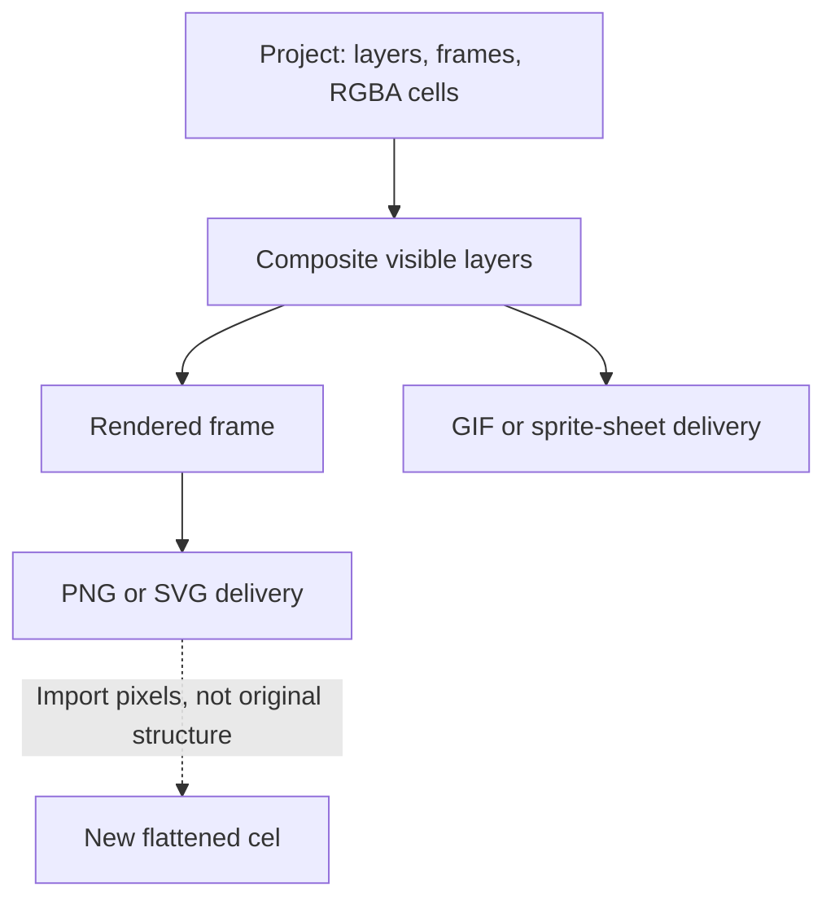

# 12 - Editable pixels are the source of truth

> **TL;DR:** A good-looking preview is not the complete artifact. SpriteCanvas preserves layers, frames, RGBA cells, palette metadata and review snapshots so the next change remains possible. Rendered images are derived outputs with different tradeoffs.

[Book home](../../README.md) | [Static-first](static-first.md) | [Review-first](review-first.md) | [Character branding](../11-character-branding/README.md)

## The distinction in one picture

The same final image can be produced by many different layer arrangements. A single opaque background with a character painted into it may look identical to separate background and character layers.

Those projects are not equivalent for editing. One lets you move the character independently; the other requires extracting or redrawing it. This is why the application retains source structure rather than treating screenshots as interchangeable with projects.

## Representation carries future choices

The [project model](../03-project-model/README.md) stores a cel for every layer in every frame. Visibility, layer opacity and animation durations remain explicit data.

That allows a later edit to change only a lamp, one eye pose or a background layer. A flattened export no longer contains the original boundaries needed to make those changes safely.

The practical rule is simple: keep project JSON as source, then generate whatever delivery format is required.

## Palette metadata is not pixel data

A working swatch can be removed without erasing all pixels painted with that color. Conversely, an imported image can contain colors absent from the chosen working palette.

Conflating these concerns leads to two mistakes:

1. Claiming an image became limited-color merely because the palette UI contains fewer buttons.
2. Adding every incidental alpha/shading value as a swatch instead of keeping a useful working selection.

SpriteCanvas uses RGBA cells. GIF quantization creates a separate output palette later; see [the GIF chapter](../09-gif-quantization/README.md).

## Transparency is semantic data

An opaque dark pupil and an empty background can look similar against a dark checkerboard. They mean different things.

Null/alpha determines whether underlying layers are visible. The color black does not automatically mean transparency. A background-removal workflow that deletes dark anatomy destroys source information while potentially leaving a plausible dark-background preview.

The [logo source](../../../web/assets/spritecanvas-logo.spritecanvas.json) deliberately retains dark face/pupil pixels and transparent outer padding. Its tests check both.

## A snapshot is more than its visible composite

Two projects can render the same pixels while differing in hidden layers, palette, duration or editable structure. A proposal review must not treat a zero rendered-pixel difference as proof that nothing changed.

This is why comparison presents structural information separately and retains complete before/after projects. The rendered difference is a useful view, not the whole change set.

Read the [comparison implementation](../../../web/app.js#L666-L711) and [review protocol](../06-review-protocol/README.md) for the division between visual inspection and baseline validation.

## Derived outputs have honest losses

PNG keeps rendered RGBA but not original layers. SVG describes crisp rectangles for one composite. GIF has a limited output palette and threshold/matting rules for alpha. A sprite sheet stores multiple rendered frames with metadata but does not preserve the original layer organization.

None is a universal replacement for source JSON. The correct export depends on the consumer: a game pipeline may prefer a sheet; a chat preview may prefer GIF; a future artist needs the editable project.

The goal is not to call every format lossless. The goal is to describe exactly which information survives.

## Practical consequences for contributors

- Make sample art and branding genuinely editable.
- Keep native data dimensions distinct from display/export scale.
- Do not hide a broken canvas implementation beneath a screenshot overlay.
- Keep layer/frame changes explicit in proposals and documentation.
- Validate pixel invariants directly when a visual requirement is measurable.
- Use real UI screenshots to explain the interface, with provenance and captions.

For example, equal boot geometry should be tested by comparing the source regions. A transparent logo should be tested for actual alpha, not merely photographed on a checkerboard. A16x GIF regression should exercise the UI download path, not only call a lower-level encoder.

## Tradeoffs

Full cel arrays are straightforward to inspect and share, but consume memory as width, height, layer count and frame count multiply. The project therefore has an explicit editable-cell budget.

Keeping full snapshots makes review and undo understandable, but history must be bounded. The application does not claim unlimited historical storage or a cloud asset library.

These limits are deliberate constraints on a simple source representation. A more elaborate sparse or tiled design would need its own correctness, editing and persistence tradeoffs; it is not already implemented.

[Next reference: Source map](../../appendices/source-map.md) | [Back to the book](../../README.md)
