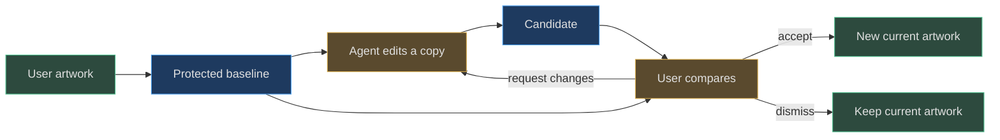
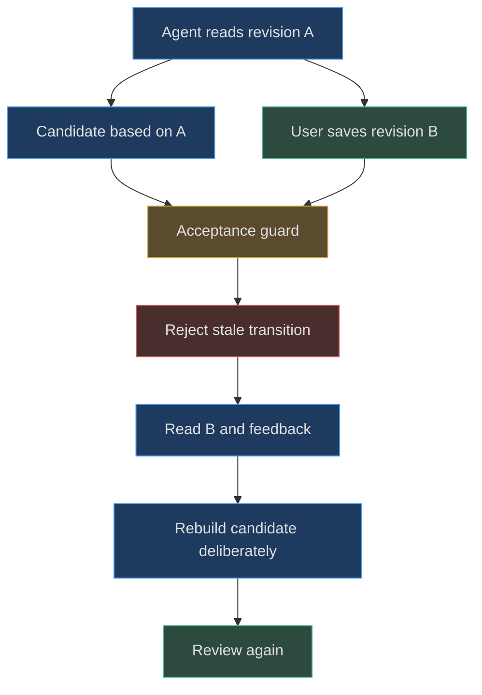

# Review-first preserves user authority

[Book home](../../README.md) · [Companion: static-first](static-first.md) · [Protocol reference](../06-review-protocol/README.md)

## TL;DR

The agent may suggest a new document; that is not permission to install it.
Review-first makes user authority concrete through a separate candidate,
an unchanged baseline, explicit acceptance, and inspectable historical
before/after snapshots.
Revision checks prevent stale transitions, but cannot determine whether the
agent's creative choices respect the user's intent.
([server.mjs:103](../../../server.mjs#L103-L128),
[AGENTS.md:18](../../../AGENTS.md#L18-L25))

## 1. An edit is a claim about intent

An agent might correctly serialize a project while erasing marks the user
wanted to keep. Structural validity cannot settle that disagreement.
The validator checks legal fields, colors, dimensions, and cel arrays; it does
not judge whether the composition follows a request.
([web/lib/model.js:42](../../../web/lib/model.js#L42-L87))

Separating candidate from baseline creates a place for that judgment.
Submission leaves current artwork unchanged, while a comparison shows the
agent's proposed outcome. A “successful proposal” is therefore a delivery
event, not a creative approval or an accepted edit.
([server.mjs:108](../../../server.mjs#L108-L114),
[scripts/agent.mjs:77](../../../scripts/agent.mjs#L77-L77))

The agent contract asks for additive work on agent-owned layers when
appropriate, respect for locks, and genuine rebasing.
These are workflow obligations in addition to mechanical validation.
Raw candidate validation does not enforce an immutable subset of the old
document.
([AGENTS.md:18](../../../AGENTS.md#L18-L25),
[server.mjs:105](../../../server.mjs#L105-L106))

## 2. Review the document, not just the image

The difference image compares rendered RGBA at one frame position.
It cannot reveal every palette reorder, timing change, hidden pixel edit,
or layer rename. `sameProject` includes those fields because it normalizes
the complete project before comparison.
([web/lib/model.js:88](../../../web/lib/model.js#L88-L90),
[web/lib/model.js:119](../../../web/lib/model.js#L119-L136))

This explains the requirement to describe non-pixel changes in a proposal.
A candidate that looks identical may still alter how the user edits or exports
the document. “Zero changed pixels” is useful visual evidence, not a complete
change summary.
([AGENTS.md:26](../../../AGENTS.md#L26-L26))

## 3. Why no automatic merge is a meaningful choice

The acceptance path performs no three-way merge or per-pixel conflict
resolution. It rejects a stale baseline and installs the candidate only when
the guarded conditions hold.
This sacrifices automatic progress in favor of a clear review target.
([server.mjs:121](../../../server.mjs#L121-L127))

An automatic merge could combine technically non-overlapping pixels while
violating a composition request—for example, retaining a background after
the user explicitly requested a clean canvas.
That is design reasoning, not an observed repository bug.
The implemented contract instead allows replacement composition in the
**candidate** while protecting the active baseline until the user accepts.
([AGENTS.md:31](../../../AGENTS.md#L31-L31))

## 4. Feedback identity is part of authority

Feedback does not advance the canvas revision.
If the user adds a second note without drawing anything, a candidate answering
only the first note must not silently replace the review slot.
`replacementDetails` therefore requires both the current proposal ID and
the exact latest open feedback ID.
([server.mjs:115](../../../server.mjs#L115-L118),
[web/lib/review.js:51](../../../web/lib/review.js#L51-L60))

Open feedback blocks acceptance.
Replacement marks open entries addressed by the new proposal, but “addressed”
means a revision responded to the request—not that the user has approved
its quality. The revised candidate still needs review.
([web/lib/review.js:62](../../../web/lib/review.js#L62-L65),
[server.mjs:112](../../../server.mjs#L112-L127))

The protocol tests make these distinctions executable:
old feedback IDs conflict, base artwork remains unchanged through revision,
and feedback on the superseded candidate is rejected.
([tests/bridge.test.mjs:146](../../../tests/bridge.test.mjs#L146-L179))

## 5. Reversibility is useful but not authorization

The browser preserves the accepted proposal as a historical comparison and
pushes the pre-accept project onto its undo stack.
That makes deliberate decisions easier to inspect and reverse.
It does not justify an agent accepting first and expecting the user to undo
an unwanted change.
([web/app.js:704](../../../web/app.js#L704-L720),
[AGENTS.md:23](../../../AGENTS.md#L23-L24))

Undo history is session-local and bounded, while the accepted comparison is
part of cached workspace state. Neither is an unlimited audit log.
Keep explicit acceptance as the primary ownership boundary rather than
treating rollback as a substitute.
([web/app.js:53](../../../web/app.js#L53-L58),
[web/app.js:81](../../../web/app.js#L81-L83))

## 6. Limits of the trust mechanism

The bridge has an acceptance endpoint and no collaborator authentication.
Its loopback/browser-origin restrictions are transport boundaries, not proof
that a particular request came from an authorized human.
The CLI's lack of an accept command and the agent contract express intended
authority; trusted local callers must still respect it.
([server.mjs:81](../../../server.mjs#L81-L99),
[server.mjs:119](../../../server.mjs#L119-L128),
[scripts/agent.mjs:20](../../../scripts/agent.mjs#L20-L23))

Likewise, feedback text and reference images are drawing guidance, not
authorization to execute unrelated commands. Saving feedback does not invoke
the agent; the UI asks the user to contact it explicitly.
([AGENTS.md:29](../../../AGENTS.md#L29-L32),
[web/app.js:657](../../../web/app.js#L657-L660))

For the precise state machine and wire fields, use
[review protocol](../06-review-protocol/README.md).
For how these boundaries survive file-based collaboration, read
[static-first](static-first.md).
