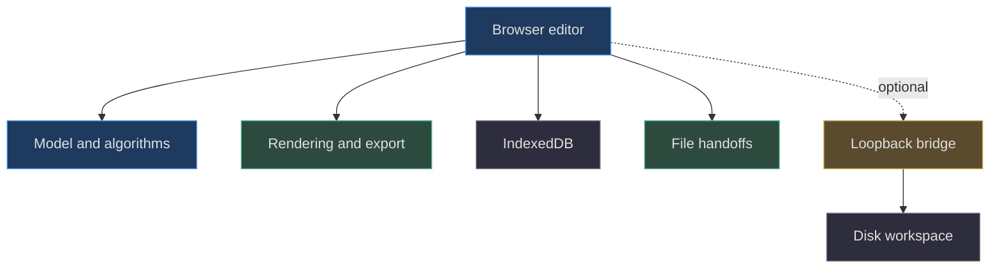
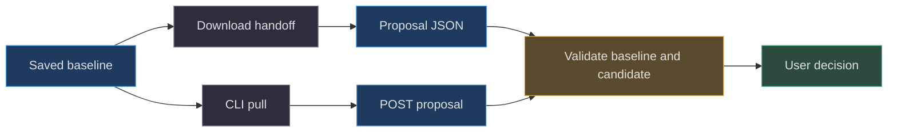

# Static-first is an architectural boundary

[Book home](../../README.md) · [Companion: review-first](review-first.md) · [Deployment](../10-testing-deployment/README.md)

## TL;DR

The application must remain an editor when its collaboration API is absent.
Rendering, editing, validation, browser storage, and export are local browser
capabilities. The bridge adds a convenient shared disk handoff, not the core
document model. Static-first is therefore a dependency rule, not simply
“the home page can load.”
([web/app.js:1](../../../web/app.js#L1-L8),
[web/app.js:1091](../../../web/app.js#L1091-L1120),
[AGENTS.md:1](../../../AGENTS.md#L1-L4))

## 1. Start from a complete local document

The model has no network calls.
Validation, paint, fill, transforms, compositing, and operation application
work on project data. Export derives files from that data.
This allows the same model to serve browser, CLI, and bridge without making
the browser dependent on server-owned rendering.
([web/lib/model.js:42](../../../web/lib/model.js#L42-L264),
[web/lib/export.js:32](../../../web/lib/export.js#L32-L75),
[scripts/agent.mjs:3](../../../scripts/agent.mjs#L3-L5))

The practical consequence is important for contributors: a new drawing tool
should normally transform the local project, not require an API round trip
to discover which pixels it changed.
That is a design recommendation derived from the existing dependency
direction, not a claim that a future tool already exists.

## 2. Static hosting does not mean server-backed storage

The build copies `web` into `dist`, and Pages uploads `dist`.
There is no deployed `server.mjs` process in that artifact path.
The static fixture makes this constraint concrete by serving the repository
subpath without implementing `/api`.
([scripts/build.mjs:9](../../../scripts/build.mjs#L9-L14),
[.github/workflows/pages.yml:40](../../../.github/workflows/pages.yml#L40-L46),
[scripts/static-test-server.mjs:6](../../../scripts/static-test-server.mjs#L6-L23))

Browser-only work is saved through IndexedDB and can be downloaded as project
JSON. This is local browser persistence, not an account-based cloud backup.
An exported project is therefore a meaningful portability and recovery
artifact, not merely a convenience attachment.
([web/lib/storage.js:1](../../../web/lib/storage.js#L1-L23),
[web/lib/export.js:34](../../../web/lib/export.js#L34-L36))

Static-first also does not mean a guaranteed offline-installable application.
The inspected initialization still loads application assets and, on a fresh
browser-only start, the reference project. The documented contract is
**no collaboration API dependency**, not an invented service-worker cache
or offline availability guarantee.
([web/app.js:1091](../../../web/app.js#L1091-L1120))

## 3. Two transports, one review idea

The transports are not byte-for-byte identical protocols.
Static proposal import requires the supplied unchanged `baseProject`.
The bridge instead captures its own baseline after checking the supplied
saved revision. Both preserve the active canvas until acceptance.
([web/app.js:510](../../../web/app.js#L510-L535),
[server.mjs:103](../../../server.mjs#L103-L114))

The API helper uses URLs relative to `document.baseURI`, and initialization
only probes for a bridge on loopback hostnames.
Those details keep optional integration from becoming a broken dependency
on a static repository-subpath host.
([web/lib/storage.js:25](../../../web/lib/storage.js#L25-L29),
[web/app.js:1095](../../../web/app.js#L1095-L1102))

## 4. Tradeoffs versus a server-centric product

A hosted server can coordinate accounts, centralized persistence, and background
jobs. This implementation instead chooses explicit local files and a single
optional disk workspace. The benefit is a deployable static editor; the cost
is that collaborators must exchange snapshots or run a local bridge.
([scripts/build.mjs:9](../../../scripts/build.mjs#L9-L14),
[scripts/agent.mjs:36](../../../scripts/agent.mjs#L36-L42),
[web/app.js:734](../../../web/app.js#L734-L743))

There is no automatic cloud upload or agent wake-up in the feedback path.
The UI tells the user to contact the agent or share the downloaded review
packet. Do not market this deliberate explicit handoff as background
orchestration.
([web/app.js:653](../../../web/app.js#L653-L660),
[AGENTS.md:32](../../../AGENTS.md#L32-L32))

Local-first persistence also has costs: browser storage may fail, disk may
become unavailable, and two local copies may disagree.
The application exposes those failures instead of quietly declaring one copy
authoritative. Read [persistence](../07-persistence-concurrency/README.md)
before changing recovery behavior.
([web/lib/storage.js:16](../../../web/lib/storage.js#L16-L23),
[web/app.js:108](../../../web/app.js#L108-L128))

## 5. A practical design test

For a proposed feature, ask: “Can a user on the static subpath still open a
document, make real editable changes, save a project file, and review a returned
candidate without a successful API request?”
The isolated static fixture is the place to exercise that scenario.
([scripts/static-test-server.mjs:6](../../../scripts/static-test-server.mjs#L6-L23),
[playwright.config.js:15](../../../playwright.config.js#L15-L18))

If the answer becomes no, the change crosses the existing architectural
boundary and needs an explicit product decision, not a silent fallback.
This is a review criterion derived from the repository contract; it is not
a promised future implementation.
([AGENTS.md:1](../../../AGENTS.md#L1-L4))

Read next: [review-first authority](review-first.md) and
[deployment boundaries](../10-testing-deployment/README.md).
